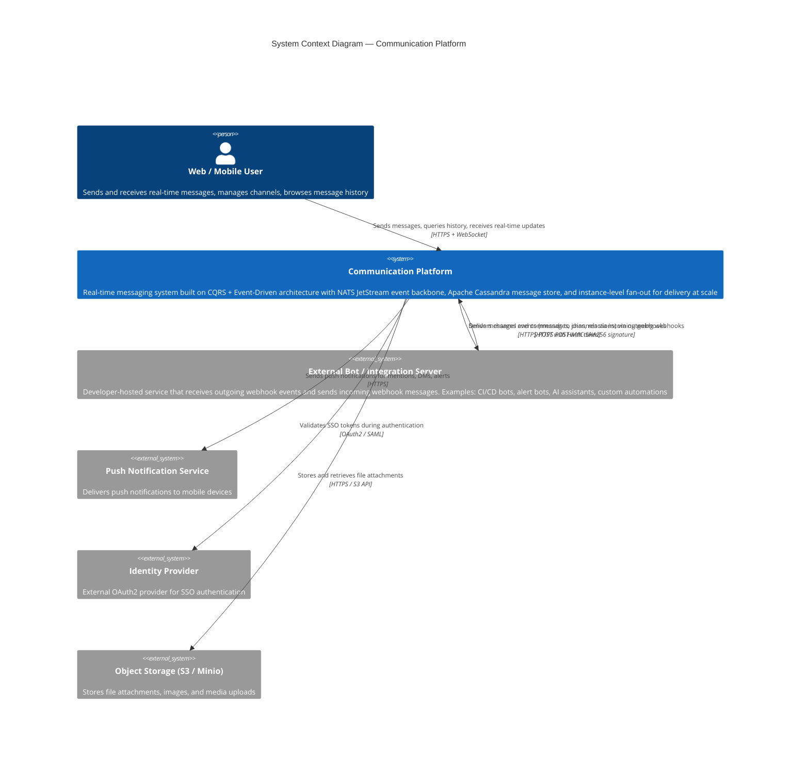
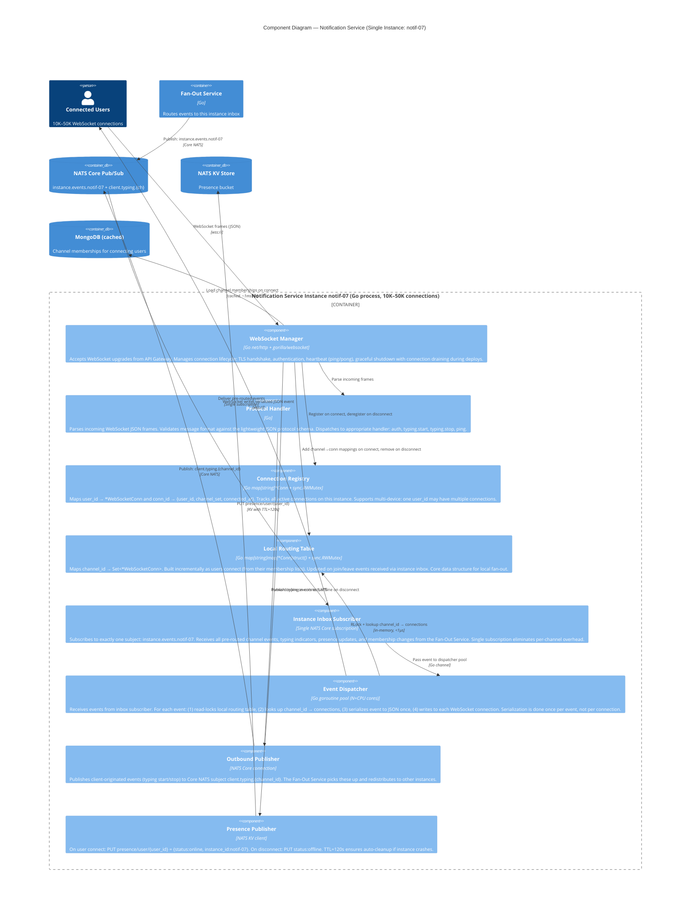

# C4 Architecture Diagrams

This document contains the C4 model diagrams for the Communication Platform architecture.

**Related Documents:**
- [Detailed Design](../detailed-design.md) — Component specifications
- [Architecture Overview](../overview.md) — High-level architecture

---

## 1. System Context Diagram

The highest-level view showing the Communication Platform and its external dependencies.



### Key External Systems

| System | Purpose | Protocol |
|--------|---------|----------|
| External Bot Server | Bi-directional webhook integration | HTTPS with HMAC-SHA256 |
| Push Notification Service | Mobile push (APNs, FCM) | HTTPS |
| Identity Provider | SSO authentication | OAuth2 / SAML |
| Object Storage | File attachments | S3 API |

---

## 2. Container Diagram

Shows the major containers (services, databases) within the platform boundary.

```mermaid
C4Container
    title Container Diagram — Communication Platform

    Person(user, "User", "Web, mobile, or desktop client application")
    System_Ext(botServer, "External Bot Server", "Developer-hosted, receives outgoing webhooks, sends incoming webhooks")

    System_Boundary(platform, "Communication Platform") {

        Container(gateway, "API Gateway", "Envoy / Istio", "JWT validation, rate limiting, route splitting. Routes incoming webhooks to Command Service after token validation.")

        Container(cmdSvc, "Command Service", "Go", "Validates write requests (send message, create channel, etc.) and incoming webhook payloads. Publishes domain events to NATS JetStream. Returns HTTP 202 Accepted. Never writes to a database directly.")

        Container(querySvc, "Query Service", "Go", "Serves all REST read endpoints: message history from Cassandra, metadata from MongoDB, search from Elasticsearch. Cursor-based pagination.")

        Container(fanoutSvc, "Fan-Out Service", "Go", "Core routing engine. Maintains in-memory channel-to-instance routing table (~2GB). Consumes channel events from JetStream, publishes to Notification Service instance inboxes via Core NATS. Watches NATS KV for presence changes.")

        Container(notifSvc, "Notification Service", "Go", "Manages WebSocket connections. Subscribes NATS subjects. Routes events to local WebSocket connections via in-memory channel-to-connection map.")

        Container(msgWriter, "Message Writer Pool", "Go, Pull Consumer", "Durable pull consumer on MESSAGES stream. Fetches batches, persists to Cassandra, ACKs. Idempotent writes by message_id.")
        Container(metaWriter, "Meta Writer Pool", "Go, Pull Consumer", "Durable pull consumer on META stream. Persists channel/user lifecycle events to MongoDB.")
        Container(searchIdx, "Search Indexer Pool", "Go, Pull Consumer", "Durable pull consumer on MESSAGES stream (independent cursor). Bulk-indexes message content to Elasticsearch.")
        Container(pushWorker, "Push Worker Pool", "Go, Pull Consumer", "Durable pull consumer on NOTIFICATIONS stream. Delivers push notifications via APNs and FCM.")
        Container(webhookWorker, "Webhook Dispatcher Pool (Bot Platform)", "Go, Pull Consumer", "Durable pull consumer on WEBHOOKS stream. Matches events to registered webhook subscriptions. Delivers outgoing HTTP POST with HMAC-SHA256 signature. Exponential backoff retry (up to 5 attempts). Logs delivery results to Cassandra.")

        ContainerDb(nats, "NATS JetStream + Core NATS", "NATS Server Cluster", "Event backbone. JetStream streams: MESSAGES, META, NOTIFICATIONS, WEBHOOKS, SYSTEM. Core pub/sub: instance inboxes, typing indicators. KV Store: presence, typing, permissions cache, instance registry.")

        ContainerDb(cassandra, "Apache Cassandra", "Cassandra 4.x", "Message history + webhook delivery log. Partitioned by (channel_id, daily_bucket) for messages, by (webhook_id, daily_bucket) for delivery log. TWCS compaction.")

        ContainerDb(mongo, "MongoDB", "MongoDB 6.x", "Metadata: users, channels, permissions, settings, roles, webhook registrations.")

        ContainerDb(elastic, "Elasticsearch", "Elasticsearch 8.x", "Full-text search index for message content.")
    }

    System_Ext(push, "Push Services", "APNs + FCM")

    Rel(user, gateway, "HTTPS, WebSocket", "")
    Rel(botServer, gateway, "Incoming Webhook: POST /api/v1/hooks.incoming/{token}", "HTTPS")
    Rel(gateway, cmdSvc, "POST / PUT / DELETE + incoming webhooks", "HTTP")
    Rel(gateway, querySvc, "GET", "HTTP")
    Rel(gateway, notifSvc, "WebSocket Upgrade", "WS")

    Rel(cmdSvc, nats, "Publish domain events", "JetStream publish with Nats-Msg-Id dedup")

    Rel(nats, fanoutSvc, "Pull: messages.>, channels.member.>", "JetStream durable consumer")
    Rel(nats, msgWriter, "Pull: messages.send/edit/delete.>", "JetStream durable consumer")
    Rel(nats, metaWriter, "Pull: channels.>, users.>", "JetStream durable consumer")
    Rel(nats, searchIdx, "Pull: messages.send/edit.>", "JetStream durable consumer")
    Rel(nats, pushWorker, "Pull: notifications.push.>", "JetStream durable consumer")
    Rel(nats, webhookWorker, "Pull: webhooks.outgoing.>", "JetStream durable consumer")

    Rel(fanoutSvc, nats, "Publish to instance.events.{id}", "Core NATS pub/sub")
    Rel(nats, notifSvc, "Deliver on instance.events.{self.id}", "Core NATS subscription (1 per instance)")

    Rel(msgWriter, cassandra, "Batch INSERT", "CQL")
    Rel(metaWriter, mongo, "Upsert documents", "MongoDB driver")
    Rel(searchIdx, elastic, "Bulk index", "REST")
    Rel(pushWorker, push, "Send notifications", "HTTP/2")
    Rel(webhookWorker, botServer, "Outgoing Webhook POST with HMAC-SHA256", "HTTPS")
    Rel(webhookWorker, cassandra, "Log delivery attempts", "CQL")

    Rel(querySvc, cassandra, "Read message history", "CQL token-aware")
    Rel(querySvc, mongo, "Read metadata", "MongoDB driver")
    Rel(querySvc, elastic, "Full-text search", "REST")

    Rel(notifSvc, user, "Real-time events", "WebSocket JSON")

    UpdateLayoutConfig($c4ShapeInRow="4", $c4BoundaryInRow="1")
```



### Container Summary

| Layer | Containers |
|-------|------------|
| **Edge** | API Gateway |
| **Services** | Command Service, Query Service, Fan-Out Service, Notification Service |
| **Workers** | Message Writer, Meta Writer, Search Indexer, Push Worker, Webhook Dispatcher |
| **Data** | NATS JetStream, Cassandra, MongoDB, Elasticsearch |

---

## 3. Component Diagram — Notification Service

Detailed view of components within a single Notification Service instance.



### Key Components

| Component | Responsibility |
|-----------|---------------|
| WebSocket Manager | Connection lifecycle, heartbeat |
| Protocol Handler | Message parsing, validation |
| Connection Registry | User-to-connection mapping |
| Local Routing Table | Channel-to-connection mapping |
| Instance Inbox Subscriber | Single NATS subscription |
| Event Dispatcher | Fan-out to WebSocket connections |
| Presence Publisher | Online/offline status to KV |

---

## 4. Component Diagram — Fan-Out Service

Detailed view of the Fan-Out Service showing its internal routing mechanisms.

```mermaid
C4Component
    title Component Diagram — Fan-Out Service

    Container_Boundary(fanout, "Fan-Out Service (Go process, ~2GB memory)") {

        Component(eventConsumer, "Event Consumer", "Go goroutine pool + NATS pull subscription", "Durable pull consumer 'fan-out-pool' on MESSAGES stream. Calls Fetch(batch=200, timeout=5s). For each event, performs routing table lookup and triggers instance-level publishes.")

        Component(memberConsumer, "Membership Consumer", "Go goroutine pool + NATS pull subscription", "Durable pull consumer 'fan-out-meta' on META stream, filter: channels.member.>. Processes MemberJoined and MemberLeft events. Updates routing table for online users only.")

        Component(presenceWatcher, "Presence Watcher", "Go goroutine + NATS KV Watch", "Watches NATS KV bucket 'presence' with Watch(\"user/>\"). On user online: loads channel memberships, populates routing table. On user offline or TTL expiry: evicts user from routing table.")

        Component(channelIndex, "Channel → Instance Index", "Go map[string]map[string]*InstanceEntry + sync.RWMutex", "Primary routing structure. Maps channel_id → {instance_id → Set<user_id>}. Read path is lock-free under RWMutex (concurrent reads). Write path acquires write lock (rare, <1% of operations).")

        Component(userIndex, "User → Channels Index", "Go map[string]*UserEntry + sync.RWMutex", "Secondary index. Maps user_id → {instance_id, Set<channel_id>}. Enables O(1) eviction of a user from all channel entries on disconnect, avoiding full table scan.")

        Component(membershipCache, "Membership Cache", "In-memory LRU, TTL=5min", "Caches user → channel_id[] mappings loaded from MongoDB. Avoids repeated MongoDB queries when users rapidly reconnect. Invalidated on MemberJoined/MemberLeft events.")

        Component(instancePublisher, "Instance Publisher", "NATS Core connection, batched flush", "Publishes routed events to Core NATS subjects: instance.events.{instance_id}. One publish per target instance per event. Batched flush for throughput. Fire-and-forget (Core NATS, no persistence).")

        Component(typingHandler, "Typing Handler", "Go goroutine + NATS Core subscription", "Subscribes to Core NATS wildcard: client.typing.>. Routes typing indicators through the same channel→instance lookup path, excluding the originating instance.")
    }

    ContainerDb(natsJS, "NATS JetStream", "", "MESSAGES + META streams")
    ContainerDb(natsKV, "NATS KV Store", "", "Presence bucket (TTL=120s)")
    ContainerDb(natsPubSub, "NATS Core Pub/Sub", "", "Instance inbox subjects + typing subjects")
    ContainerDb(mongo, "MongoDB", "", "Channel memberships collection")
    Container(notifSvc, "Notification Service Instances", "Go", "Receives pre-routed events on instance inbox")

    Rel(natsJS, eventConsumer, "Pull consume: messages.>", "JetStream")
    Rel(natsJS, memberConsumer, "Pull consume: channels.member.>", "JetStream")
    Rel(natsKV, presenceWatcher, "Watch: user/>", "KV watcher callback")

    Rel(eventConsumer, channelIndex, "RLock + lookup channel_id", "in-memory, <1μs")
    Rel(eventConsumer, instancePublisher, "Publish to N instance inboxes", "")
    Rel(memberConsumer, channelIndex, "WLock + update entry", "in-memory")
    Rel(memberConsumer, userIndex, "WLock + update entry", "in-memory")
    Rel(presenceWatcher, channelIndex, "WLock + add/remove user", "in-memory")
    Rel(presenceWatcher, userIndex, "WLock + add/remove user", "in-memory")
    Rel(presenceWatcher, membershipCache, "Load channels for online user", "")
    Rel(membershipCache, mongo, "Query on cache miss", "MongoDB driver")

    Rel(natsPubSub, typingHandler, "Subscribe: client.typing.>", "Core NATS")
    Rel(typingHandler, channelIndex, "RLock + lookup channel_id", "in-memory")
    Rel(typingHandler, instancePublisher, "Publish typing to instances", "")

    Rel(instancePublisher, natsPubSub, "Publish: instance.events.{id}", "Core NATS")
    Rel(natsPubSub, notifSvc, "Deliver to subscribed instance", "Core NATS")

    UpdateLayoutConfig($c4ShapeInRow="3", $c4BoundaryInRow="1")
```

### Key Data Structures

| Structure | Size (100K users) | Purpose |
|-----------|-------------------|---------|
| Channel → Instance Index | ~2GB | Primary routing lookup |
| User → Channels Index | ~200MB | Fast user eviction |
| Membership Cache | ~500MB | Reduce MongoDB queries |
