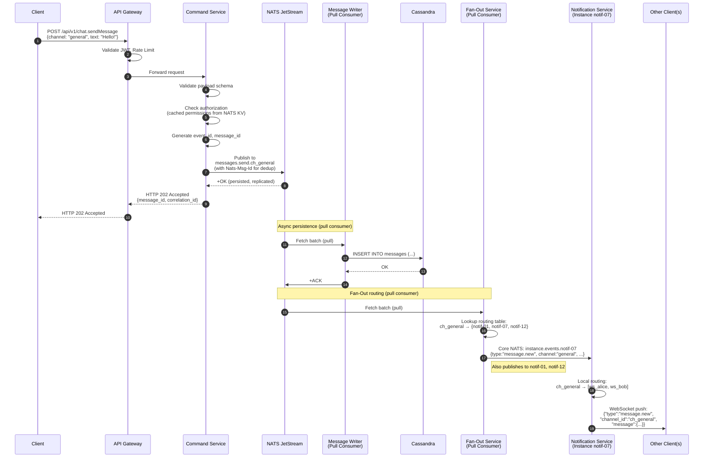
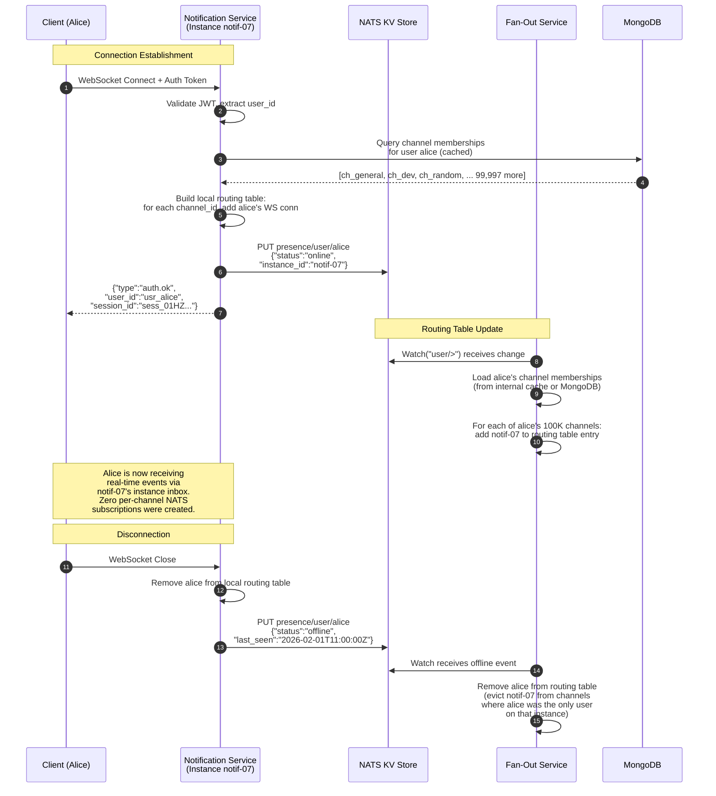
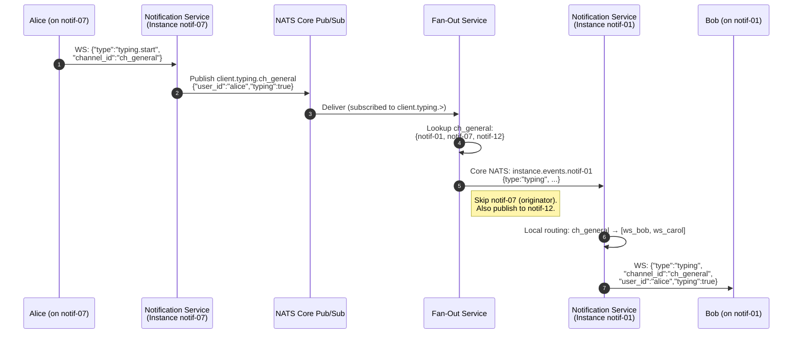
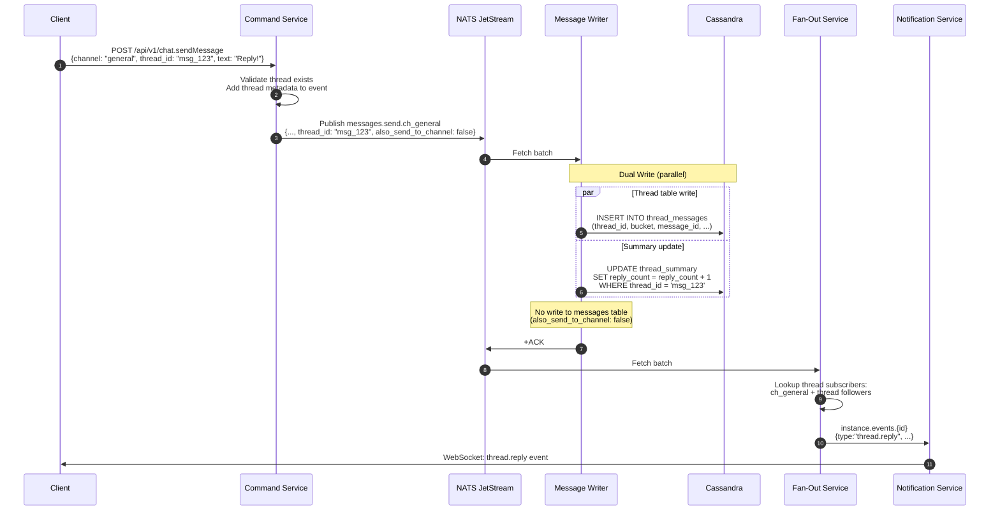
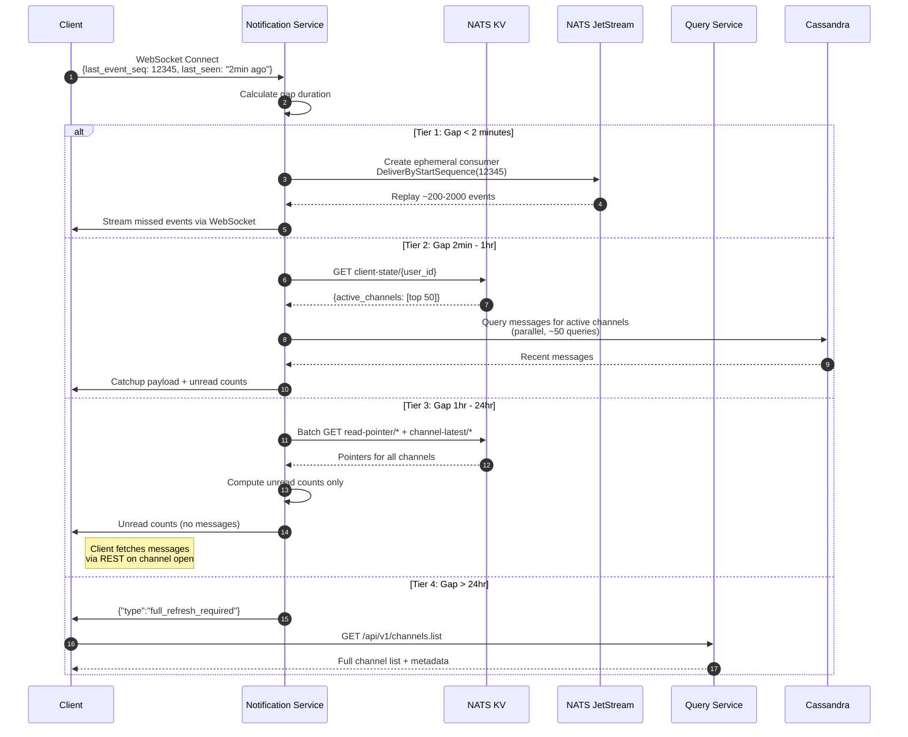
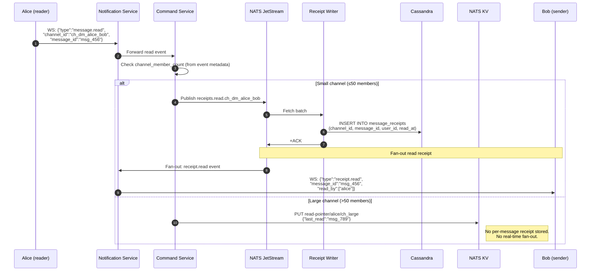
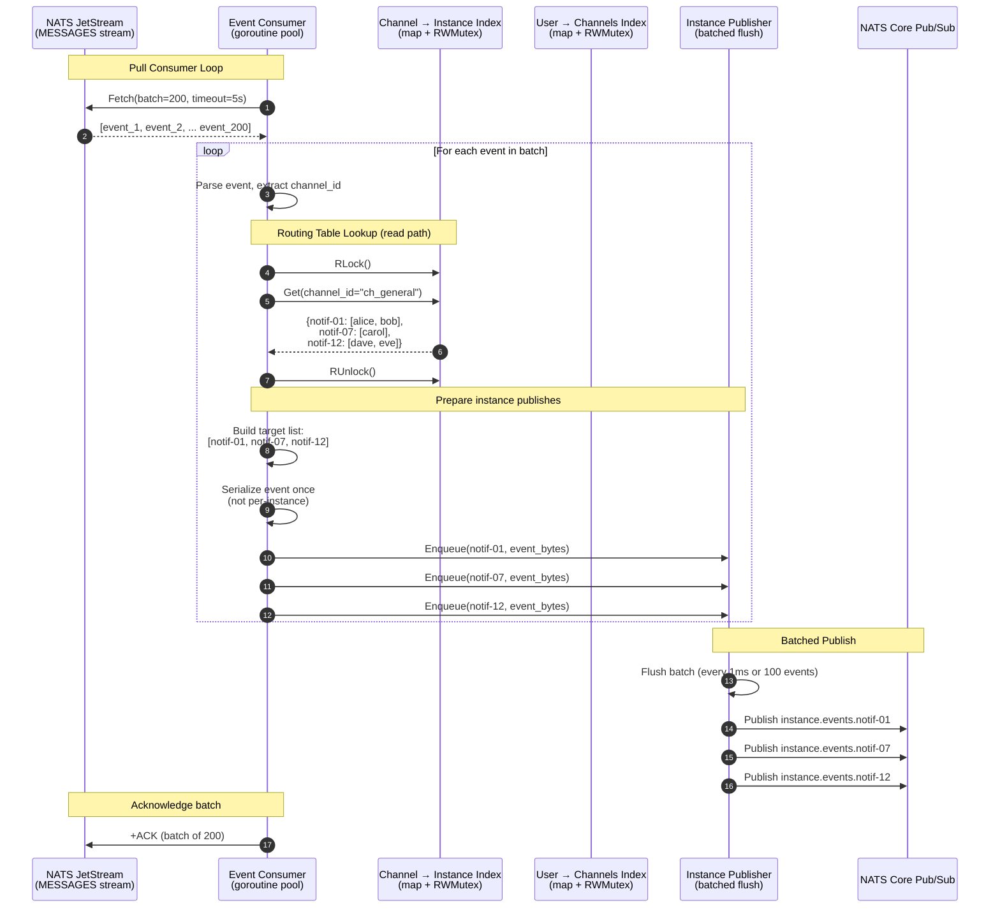
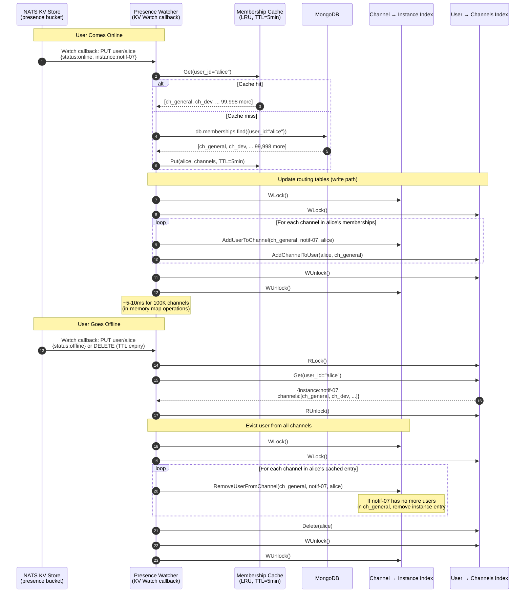
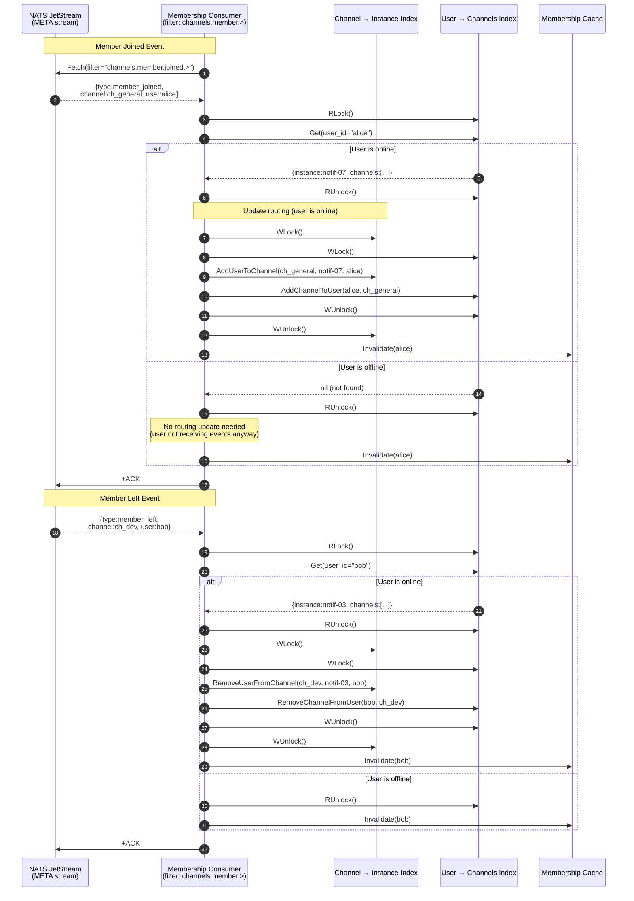
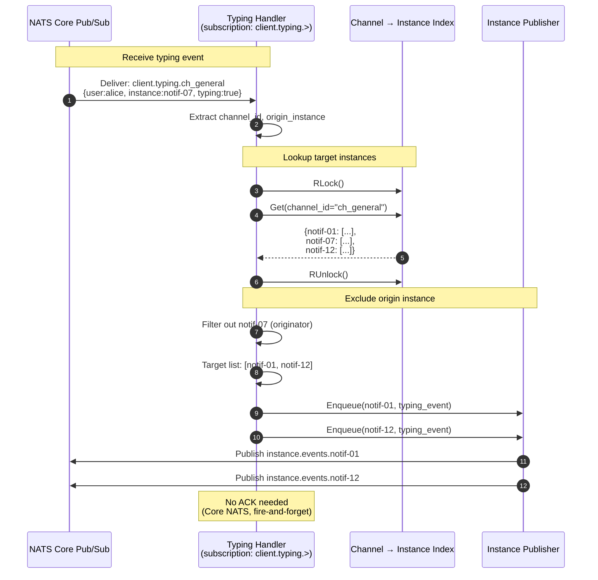

# Sequence Diagrams

This document contains the key sequence diagrams showing message flows through the Communication Platform.

**Related Documents:**
- [Detailed Design](../detailed-design.md) — Component specifications
- [C4 Diagrams](./c4-diagrams.md) — Architecture views

---

## 1. Send Message Flow

The primary write path showing how a message flows from client to persistence and fan-out.

### Key Properties

1. **Non-blocking write:** Client receives `202 Accepted` as soon as NATS acknowledges (~5ms)
2. **Guaranteed persistence:** NATS RAFT replication (R=3) ensures durability before ACK
3. **Instance-level fan-out:** One NATS publish per instance, not per user
4. **Idempotent writes:** `Nats-Msg-Id` enables publisher deduplication

---

## 2. User Connection & Subscription Flow

Shows what happens when a user connects via WebSocket, including presence and routing table updates.

### Key Properties

1. **Zero per-channel subscriptions:** 100K memberships = zero NATS subscriptions created
2. **In-memory routing update:** ~5-10ms for 100K channel insertions
3. **Graceful crash handling:** KV TTL (120s) auto-expires stale presence

---

## 3. Typing Indicator Flow (Ephemeral)

Shows how typing indicators flow without persistence overhead.

### Key Properties

1. **No persistence:** Core NATS pub/sub, not JetStream
2. **Origin exclusion:** Originating instance is skipped
3. **Same routing path:** Uses channel → instance lookup

---

## 4. Thread Reply Flow

Shows dual-write strategy for thread messages.

### Thread Write Scenarios

| Scenario | `messages` table | `thread_messages` table |
|----------|------------------|------------------------|
| Thread-only reply | No | Yes |
| Also send to channel | Yes | Yes |

---

## 5. Client Reconnection Flow

Shows tiered catchup strategy based on disconnection duration.

### Tier Summary

| Tier | Gap Duration | Data Source | Latency |
|------|-------------|-------------|---------|
| 1 | < 2 min | JetStream replay | < 1s |
| 2 | 2 min - 1 hr | Cassandra (active channels) | ~500ms |
| 3 | 1 hr - 24 hr | NATS KV (unread only) | < 100ms |
| 4 | > 24 hr | Full REST refresh | Varies |

---

## 6. Read Receipt Flow

Shows hybrid receipt handling based on channel size.

### Receipt Threshold

| Channel Type | Members | Storage | Real-time Update |
|--------------|---------|---------|------------------|
| DM | 2 | Per-message | Yes |
| Small group | ≤50 | Per-message | Yes |
| Large channel | >50 | Pointer only | No |

---

## 7. Fan-Out Service Internal Flow

Detailed view of how the Fan-Out Service processes events internally, showing all components working together.

### 7.1 Message Event Processing

Shows the internal flow when a channel message arrives for fan-out.

### 7.2 Presence Change Processing

Shows how the Fan-Out Service updates its routing table when users come online or go offline.

### 7.3 Membership Change Processing

Shows how the Fan-Out Service handles channel join/leave events.

### 7.4 Typing Indicator Routing

Shows how ephemeral typing events are routed through the Fan-Out Service.

### Key Internal Patterns

| Pattern | Purpose | Performance |
|---------|---------|-------------|
| **RWMutex on indexes** | Concurrent reads, exclusive writes | Reads are lock-free under RLock |
| **Batched fetch** | Reduce JetStream round-trips | 200 events per fetch |
| **Batched publish** | Reduce Core NATS overhead | Flush every 1ms or 100 events |
| **Single serialization** | Avoid redundant JSON encoding | Serialize once, publish N times |
| **User index for eviction** | O(1) user removal | Avoids full channel scan |
| **Membership cache** | Reduce MongoDB queries | LRU with 5-min TTL |

### Data Structure Sizes (100K Online Users)

| Structure | Entries | Memory |
|-----------|---------|--------|
| Channel → Instance Index | ~5M channels | ~1.5 GB |
| User → Channels Index | ~100K users | ~500 MB |
| Membership Cache | ~50K users (LRU) | ~200 MB |
| **Total** | — | **~2.2 GB**
