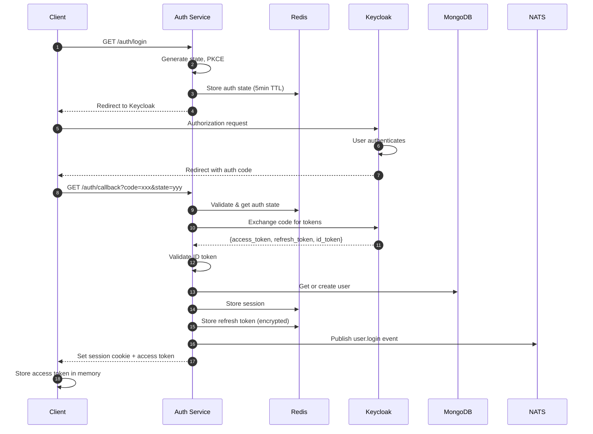
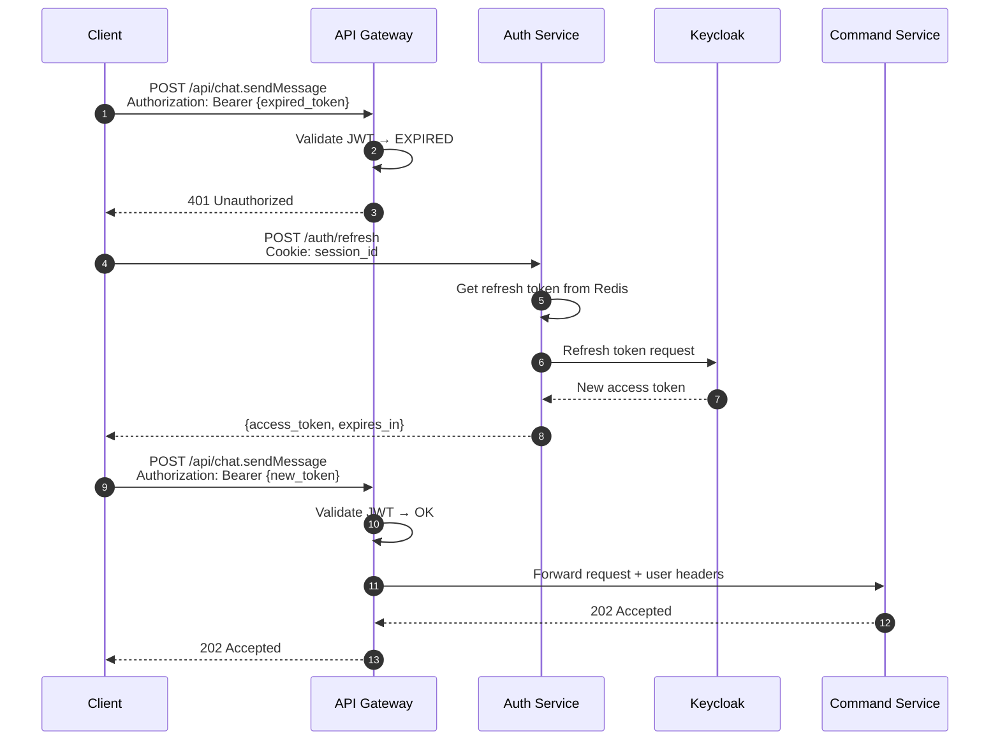
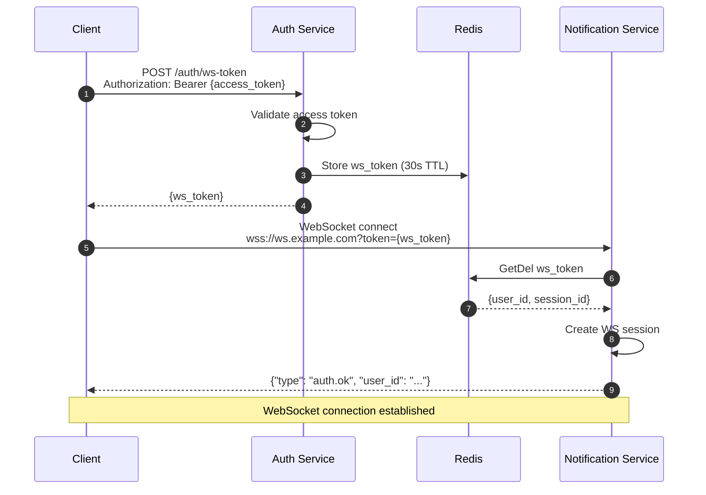

# Authentication & User Login

**Author:** Architecture Team
**Status:** Draft
**Last Updated:** 2026-02-01

---

## Table of Contents

1. [Overview](#1-overview)
2. [Architecture](#2-architecture)
3. [OIDC Integration](#3-oidc-integration)
4. [Login Flow](#4-login-flow)
5. [Token Management](#5-token-management)
6. [Session Management](#6-session-management)
7. [API Authentication](#7-api-authentication)
8. [WebSocket Authentication](#8-websocket-authentication)
9. [User Provisioning](#9-user-provisioning)
10. [Logout Flow](#10-logout-flow)
11. [Multi-Device Support](#11-multi-device-support)
12. [Security Considerations](#12-security-considerations)
13. [Sequence Diagrams](#13-sequence-diagrams)

---

## 1. Overview

Authentication is handled via **external OIDC (OpenID Connect) providers**. The platform does not store user passwords — all authentication is delegated to trusted identity providers.

### Identity Provider

| Provider | Protocol | Use Case |
|----------|----------|----------|
| Keycloak | OIDC | Self-hosted enterprise SSO |

The platform integrates exclusively with **Keycloak** for identity management, providing full control over user authentication, authorization, and federation capabilities.

### Design Principles

1. **Stateless API authentication** — JWT tokens validated at API Gateway, no session lookups
2. **External identity source** — Users managed in OIDC provider, synced to platform
3. **Short-lived access tokens** — 15-minute access tokens, refresh via refresh token
4. **Secure token storage** — Refresh tokens stored server-side, not exposed to client
5. **WebSocket auth** — One-time auth token exchanged for session

---

## 2. Architecture

```
┌─────────────────────────────────────────────────────────────────────────────┐
│                        Authentication Architecture                           │
│                                                                              │
│  ┌──────────┐                                          ┌─────────────────┐  │
│  │  Client  │◄────────────────────────────────────────►│    Keycloak     │  │
│  │  (Web/   │         Authorization Code Flow          │                 │  │
│  │  Mobile) │                                          │                 │  │
│  └────┬─────┘                                          └────────┬────────┘  │
│       │                                                         │           │
│       │ Access Token (JWT)                                      │           │
│       │                                                         │           │
│       ▼                                                         │           │
│  ┌─────────────────────────────────────────────────────────────────────┐   │
│  │                         API Gateway (Envoy)                          │   │
│  │                                                                      │   │
│  │  ┌────────────────────────────────────────────────────────────────┐ │   │
│  │  │                    JWT Validation Filter                        │ │   │
│  │  │  • Verify signature (JWKS from OIDC provider)                  │ │   │
│  │  │  • Check expiration                                             │ │   │
│  │  │  • Validate issuer, audience                                    │ │   │
│  │  │  • Extract user_id, roles → request headers                     │ │   │
│  │  └────────────────────────────────────────────────────────────────┘ │   │
│  └──────────────────────────────┬───────────────────────────────────────┘   │
│                                 │                                           │
│       ┌─────────────────────────┼─────────────────────────┐                │
│       │                         │                         │                │
│       ▼                         ▼                         ▼                │
│  ┌──────────┐            ┌──────────┐            ┌──────────────┐          │
│  │ Command  │            │  Query   │            │ Notification │          │
│  │ Service  │            │ Service  │            │   Service    │          │
│  └──────────┘            └──────────┘            └──────────────┘          │
│                                                                             │
│  ┌─────────────────────────────────────────────────────────────────────┐   │
│  │                          Auth Service                                │   │
│  │  • Token exchange (auth code → tokens)                              │   │
│  │  • Refresh token management                                          │   │
│  │  • Session management                                                │   │
│  │  • User provisioning                                                 │   │
│  └─────────────────────────────────────────────────────────────────────┘   │
└─────────────────────────────────────────────────────────────────────────────┘
```

### Components

| Component | Responsibility |
|-----------|---------------|
| **Keycloak** | User authentication, identity management, federation |
| **API Gateway** | JWT validation, rate limiting |
| **Auth Service** | Token exchange, session management, user provisioning |
| **Redis** | Session storage, refresh tokens, auth state |
| **MongoDB** | User profiles (synced from Keycloak) |

---

## 3. Keycloak Integration

### 3.1 Keycloak Configuration

```yaml
# config/auth.yaml
oidc:
  provider: "keycloak"

  # Keycloak OIDC Discovery
  issuer: "https://auth.example.com/realms/chat"
  discovery_url: "https://auth.example.com/realms/chat/.well-known/openid-configuration"

  # Client credentials
  client_id: "chat-platform"
  client_secret: "${OIDC_CLIENT_SECRET}"  # from environment

  # Scopes
  scopes:
    - "openid"
    - "profile"
    - "email"
    - "offline_access"  # for refresh tokens

  # Token settings
  access_token_lifetime: 900      # 15 minutes
  refresh_token_lifetime: 604800  # 7 days

  # Redirect URIs
  redirect_uri: "https://chat.example.com/auth/callback"
  post_logout_redirect_uri: "https://chat.example.com/logged-out"

  # Claim mappings
  claims:
    user_id: "sub"
    email: "email"
    name: "name"
    picture: "picture"
    roles: "realm_access.roles"
    groups: "groups"
```

### 3.2 JWKS Caching

The API Gateway caches the OIDC provider's JWKS (JSON Web Key Set) for token validation:

```go
type JWKSCache struct {
    keys      map[string]*rsa.PublicKey
    expiresAt time.Time
    mu        sync.RWMutex
}

func (c *JWKSCache) GetKey(kid string) (*rsa.PublicKey, error) {
    c.mu.RLock()
    if time.Now().Before(c.expiresAt) {
        if key, ok := c.keys[kid]; ok {
            c.mu.RUnlock()
            return key, nil
        }
    }
    c.mu.RUnlock()

    // Refresh JWKS
    return c.refresh(kid)
}

func (c *JWKSCache) refresh(kid string) (*rsa.PublicKey, error) {
    c.mu.Lock()
    defer c.mu.Unlock()

    // Fetch from OIDC provider
    resp, _ := http.Get(c.jwksURL)
    var jwks JWKS
    json.NewDecoder(resp.Body).Decode(&jwks)

    // Parse and cache keys
    c.keys = make(map[string]*rsa.PublicKey)
    for _, key := range jwks.Keys {
        publicKey, _ := parseJWK(key)
        c.keys[key.Kid] = publicKey
    }
    c.expiresAt = time.Now().Add(1 * time.Hour)

    return c.keys[kid], nil
}
```

### 3.3 Supported OIDC Flows

| Flow | Use Case | Security |
|------|----------|----------|
| **Authorization Code + PKCE** | Web apps, SPAs | Recommended |
| **Authorization Code** | Server-side web apps | Good |
| **Device Code** | CLI tools, TV apps | Good |
| **Refresh Token** | Token renewal | Required |

---

## 4. Login Flow

### 4.1 Authorization Code Flow with PKCE

```
┌──────────┐                              ┌──────────────┐                    ┌─────────────┐
│  Client  │                              │ Auth Service │                    │  Keycloak   │
│          │                              │              │                    │             │
└────┬─────┘                              └──────┬───────┘                    └──────┬──────┘
     │                                           │                                   │
     │ 1. Generate code_verifier, code_challenge │                                   │
     │                                           │                                   │
     │ 2. GET /auth/login?redirect=/app          │                                   │
     │──────────────────────────────────────────►│                                   │
     │                                           │                                   │
     │                                           │ 3. Store state + code_verifier    │
     │                                           │    in Redis (5min TTL)            │
     │                                           │                                   │
     │ 4. Redirect to Keycloak authorize endpoint │                                   │
     │◄──────────────────────────────────────────│                                   │
     │                                           │                                   │
     │ 5. Redirect to Keycloak                   │                                   │
     │──────────────────────────────────────────────────────────────────────────────►│
     │                                           │                                   │
     │                                           │                    6. User login  │
     │                                           │                       (username/  │
     │                                           │                        password)  │
     │                                           │                                   │
     │ 7. Redirect back with auth code           │                                   │
     │◄──────────────────────────────────────────────────────────────────────────────│
     │                                           │                                   │
     │ 8. GET /auth/callback?code=xxx&state=yyy  │                                   │
     │──────────────────────────────────────────►│                                   │
     │                                           │                                   │
     │                                           │ 9. Validate state                 │
     │                                           │    Retrieve code_verifier         │
     │                                           │                                   │
     │                                           │ 10. Exchange code for tokens      │
     │                                           │────────────────────────────────────►
     │                                           │                                   │
     │                                           │◄───────────────────────────────────│
     │                                           │    {access_token, refresh_token,  │
     │                                           │     id_token}                     │
     │                                           │                                   │
     │                                           │ 11. Create/update user profile    │
     │                                           │     Store refresh token           │
     │                                           │     Create session                │
     │                                           │                                   │
     │ 12. Set session cookie                    │                                   │
     │     Return access token                   │                                   │
     │◄──────────────────────────────────────────│                                   │
     │                                           │                                   │
     │ 13. Redirect to /app with tokens          │                                   │
     │                                           │                                   │
```

### 4.2 Auth Service: Login Initiation

```go
func (s *AuthService) InitiateLogin(ctx context.Context, req *LoginRequest) (*LoginResponse, error) {
    // 1. Generate PKCE code verifier and challenge
    codeVerifier := generateCodeVerifier()
    codeChallenge := sha256Base64URL(codeVerifier)

    // 2. Generate state for CSRF protection
    state := generateSecureToken()

    // 3. Store auth state in Redis (5 minute TTL)
    authState := &AuthState{
        State:         state,
        CodeVerifier:  codeVerifier,
        RedirectURI:   req.RedirectURI,
        ClientType:    req.ClientType,  // "web", "mobile", "desktop"
        CreatedAt:     time.Now(),
    }
    s.redis.Set(ctx, "auth_state:"+state, authState, 5*time.Minute)

    // 4. Build OIDC authorization URL
    authURL := s.buildAuthURL(state, codeChallenge)

    return &LoginResponse{
        AuthURL: authURL,
        State:   state,
    }, nil
}

func (s *AuthService) buildAuthURL(state, codeChallenge string) string {
    params := url.Values{
        "client_id":             {s.config.ClientID},
        "response_type":         {"code"},
        "scope":                 {strings.Join(s.config.Scopes, " ")},
        "redirect_uri":          {s.config.RedirectURI},
        "state":                 {state},
        "code_challenge":        {codeChallenge},
        "code_challenge_method": {"S256"},
    }
    return s.config.AuthorizationEndpoint + "?" + params.Encode()
}
```

### 4.3 Auth Service: Callback Handler

```go
func (s *AuthService) HandleCallback(ctx context.Context, req *CallbackRequest) (*AuthResult, error) {
    // 1. Validate state and retrieve auth state from Redis
    authState, err := s.redis.Get(ctx, "auth_state:"+req.State)
    if err != nil {
        return nil, fmt.Errorf("invalid or expired state")
    }
    s.redis.Del(ctx, "auth_state:"+req.State)

    // 2. Exchange authorization code for tokens
    tokenResp, err := s.exchangeCode(ctx, req.Code, authState.CodeVerifier)
    if err != nil {
        return nil, fmt.Errorf("token exchange failed: %w", err)
    }

    // 3. Validate and parse ID token
    idToken, err := s.validateIDToken(tokenResp.IDToken)
    if err != nil {
        return nil, fmt.Errorf("invalid ID token: %w", err)
    }

    // 4. Extract user info from ID token
    userInfo := s.extractUserInfo(idToken)

    // 5. Provision or update user
    user, err := s.provisionUser(ctx, userInfo)
    if err != nil {
        return nil, fmt.Errorf("user provisioning failed: %w", err)
    }

    // 6. Create session and store refresh token
    session, err := s.createSession(ctx, user.UserID, tokenResp.RefreshToken, authState.ClientType)
    if err != nil {
        return nil, fmt.Errorf("session creation failed: %w", err)
    }

    return &AuthResult{
        AccessToken:  tokenResp.AccessToken,
        ExpiresIn:    tokenResp.ExpiresIn,
        SessionID:    session.SessionID,
        User:         user,
        RedirectURI:  authState.RedirectURI,
    }, nil
}

func (s *AuthService) exchangeCode(ctx context.Context, code, codeVerifier string) (*TokenResponse, error) {
    data := url.Values{
        "grant_type":    {"authorization_code"},
        "client_id":     {s.config.ClientID},
        "client_secret": {s.config.ClientSecret},
        "code":          {code},
        "redirect_uri":  {s.config.RedirectURI},
        "code_verifier": {codeVerifier},
    }

    resp, err := http.PostForm(s.config.TokenEndpoint, data)
    if err != nil {
        return nil, err
    }
    defer resp.Body.Close()

    var tokenResp TokenResponse
    json.NewDecoder(resp.Body).Decode(&tokenResp)
    return &tokenResp, nil
}
```

---

## 5. Token Management

### 5.1 Token Types

| Token | Lifetime | Storage | Purpose |
|-------|----------|---------|---------|
| **Access Token** | 15 min | Client memory | API authentication |
| **Refresh Token** | 7 days | Server-side (Redis) | Obtain new access tokens |
| **ID Token** | 15 min | Not stored | User identity claims |
| **Session Token** | 7 days | HTTP-only cookie | Identify session for refresh |

### 5.2 Access Token Structure (JWT)

```json
{
  "header": {
    "alg": "RS256",
    "typ": "JWT",
    "kid": "key-id-123"
  },
  "payload": {
    "iss": "https://auth.example.com/realms/chat",
    "sub": "usr_01HZ3K4M5N",
    "aud": "chat-platform",
    "exp": 1706789100,
    "iat": 1706788200,
    "auth_time": 1706788100,
    "nonce": "abc123",

    "email": "alice@example.com",
    "name": "Alice Smith",
    "picture": "https://example.com/alice.jpg",

    "realm_access": {
      "roles": ["user", "admin"]
    },
    "resource_access": {
      "chat-platform": {
        "roles": ["channel_admin"]
      }
    }
  }
}
```

### 5.3 Refresh Token Storage (Redis)

```
Key:    refresh_token:{session_id}
Type:   Hash
Value:  {
  "token": "encrypted_refresh_token",
  "user_id": "usr_01HZ3K4M5N",
  "client_type": "web",
  "created_at": "2026-02-01T10:30:00Z",
  "last_used_at": "2026-02-01T11:45:00Z",
  "ip_address": "192.168.1.1",
  "user_agent": "Mozilla/5.0..."
}
TTL: 7 days
```

### 5.4 Token Refresh Flow

```go
func (s *AuthService) RefreshTokens(ctx context.Context, sessionID string) (*TokenResponse, error) {
    // 1. Get refresh token from Redis
    refreshData, err := s.redis.HGetAll(ctx, "refresh_token:"+sessionID)
    if err != nil {
        return nil, fmt.Errorf("session not found")
    }

    // 2. Decrypt refresh token
    refreshToken, err := s.decrypt(refreshData["token"])
    if err != nil {
        return nil, fmt.Errorf("invalid refresh token")
    }

    // 3. Exchange refresh token with OIDC provider
    data := url.Values{
        "grant_type":    {"refresh_token"},
        "client_id":     {s.config.ClientID},
        "client_secret": {s.config.ClientSecret},
        "refresh_token": {refreshToken},
    }

    resp, err := http.PostForm(s.config.TokenEndpoint, data)
    if err != nil {
        return nil, err
    }
    defer resp.Body.Close()

    if resp.StatusCode != http.StatusOK {
        // Refresh token expired or revoked
        s.redis.Del(ctx, "refresh_token:"+sessionID)
        return nil, fmt.Errorf("refresh token invalid")
    }

    var tokenResp TokenResponse
    json.NewDecoder(resp.Body).Decode(&tokenResp)

    // 4. Update stored refresh token if rotated
    if tokenResp.RefreshToken != "" {
        s.redis.HSet(ctx, "refresh_token:"+sessionID,
            "token", s.encrypt(tokenResp.RefreshToken),
            "last_used_at", time.Now().Format(time.RFC3339),
        )
    }

    return &tokenResp, nil
}
```

### 5.5 Client-Side Token Management

```javascript
// Token refresh interceptor
class AuthManager {
  constructor() {
    this.accessToken = null;
    this.expiresAt = null;
    this.refreshPromise = null;
  }

  async getAccessToken() {
    // If token is still valid (with 1 min buffer), return it
    if (this.accessToken && Date.now() < this.expiresAt - 60000) {
      return this.accessToken;
    }

    // Avoid concurrent refresh requests
    if (this.refreshPromise) {
      return this.refreshPromise;
    }

    this.refreshPromise = this.refreshToken();
    try {
      return await this.refreshPromise;
    } finally {
      this.refreshPromise = null;
    }
  }

  async refreshToken() {
    const response = await fetch('/api/v1/auth/refresh', {
      method: 'POST',
      credentials: 'include', // Send session cookie
    });

    if (!response.ok) {
      // Refresh failed, redirect to login
      window.location.href = '/auth/login';
      throw new Error('Token refresh failed');
    }

    const data = await response.json();
    this.accessToken = data.access_token;
    this.expiresAt = Date.now() + (data.expires_in * 1000);
    return this.accessToken;
  }
}
```

---

## 6. Session Management

### 6.1 Session Structure (Redis)

```
Key:    session:{session_id}
Type:   Hash
Value:  {
  "user_id": "usr_01HZ3K4M5N",
  "client_type": "web",
  "device_id": "device_abc123",
  "ip_address": "192.168.1.1",
  "user_agent": "Mozilla/5.0...",
  "created_at": "2026-02-01T10:30:00Z",
  "last_active_at": "2026-02-01T11:45:00Z",
  "oidc_session_id": "oidc_sess_xyz"
}
TTL: 7 days (sliding)
```

### 6.2 Session Cookie

```go
func (s *AuthService) SetSessionCookie(w http.ResponseWriter, sessionID string) {
    cookie := &http.Cookie{
        Name:     "session_id",
        Value:    sessionID,
        Path:     "/",
        Domain:   s.config.CookieDomain,
        MaxAge:   7 * 24 * 60 * 60,  // 7 days
        HttpOnly: true,               // Not accessible via JavaScript
        Secure:   true,               // HTTPS only
        SameSite: http.SameSiteStrictMode,
    }
    http.SetCookie(w, cookie)
}
```

### 6.3 Active Sessions List

Track all active sessions per user:

```
Key:    user_sessions:{user_id}
Type:   Set
Value:  [session_id_1, session_id_2, ...]
TTL:    none (cleaned up on session expiry)
```

### 6.4 Session Validation

```go
func (s *AuthService) ValidateSession(ctx context.Context, sessionID string) (*Session, error) {
    // 1. Get session from Redis
    sessionData, err := s.redis.HGetAll(ctx, "session:"+sessionID)
    if err != nil || len(sessionData) == 0 {
        return nil, fmt.Errorf("session not found")
    }

    session := &Session{
        SessionID:    sessionID,
        UserID:       sessionData["user_id"],
        ClientType:   sessionData["client_type"],
        CreatedAt:    parseTime(sessionData["created_at"]),
        LastActiveAt: parseTime(sessionData["last_active_at"]),
    }

    // 2. Update last active timestamp (sliding expiry)
    s.redis.HSet(ctx, "session:"+sessionID,
        "last_active_at", time.Now().Format(time.RFC3339),
    )
    s.redis.Expire(ctx, "session:"+sessionID, 7*24*time.Hour)

    return session, nil
}
```

---

## 7. API Authentication

### 7.1 API Gateway JWT Validation (Envoy)

```yaml
# envoy.yaml
http_filters:
- name: envoy.filters.http.jwt_authn
  typed_config:
    "@type": type.googleapis.com/envoy.extensions.filters.http.jwt_authn.v3.JwtAuthentication
    providers:
      oidc_provider:
        issuer: "https://auth.example.com/realms/chat"
        audiences:
          - "chat-platform"
        remote_jwks:
          http_uri:
            uri: "https://auth.example.com/realms/chat/protocol/openid-connect/certs"
            cluster: oidc_cluster
            timeout: 5s
          cache_duration: 3600s
        forward_payload_header: "x-jwt-payload"
        forward: true
        claim_to_headers:
          - header_name: "x-user-id"
            claim_name: "sub"
          - header_name: "x-user-email"
            claim_name: "email"
          - header_name: "x-user-roles"
            claim_name: "realm_access.roles"

    rules:
      # Public endpoints (no auth required)
      - match:
          prefix: "/api/v1/auth/"
      - match:
          prefix: "/health"

      # Protected endpoints
      - match:
          prefix: "/api/"
        requires:
          provider_name: oidc_provider
```

### 7.2 Service-Level Authorization

After JWT validation, services receive user info in headers:

```go
func (h *Handler) SendMessage(w http.ResponseWriter, r *http.Request) {
    // Extract user info from headers (set by API Gateway)
    userID := r.Header.Get("X-User-ID")
    userEmail := r.Header.Get("X-User-Email")
    userRoles := strings.Split(r.Header.Get("X-User-Roles"), ",")

    // Check channel permission
    if !h.authz.CanSendMessage(r.Context(), userID, req.ChannelID) {
        http.Error(w, "forbidden", http.StatusForbidden)
        return
    }

    // Process request...
}
```

### 7.3 API Request with Token

```javascript
// Client API request
async function sendMessage(channelId, text) {
  const token = await authManager.getAccessToken();

  const response = await fetch('/api/v1/chat.sendMessage', {
    method: 'POST',
    headers: {
      'Authorization': `Bearer ${token}`,
      'Content-Type': 'application/json',
    },
    body: JSON.stringify({ channel_id: channelId, text }),
  });

  if (response.status === 401) {
    // Token expired, trigger refresh
    await authManager.refreshToken();
    return sendMessage(channelId, text); // Retry
  }

  return response.json();
}
```

---

## 8. WebSocket Authentication

### 8.1 Auth Token Exchange

WebSocket connections use a one-time auth token (not the access token directly):

```
┌──────────┐                    ┌──────────────┐                    ┌─────────────┐
│  Client  │                    │ Auth Service │                    │   Notif     │
│          │                    │              │                    │   Service   │
└────┬─────┘                    └──────┬───────┘                    └──────┬──────┘
     │                                 │                                   │
     │ 1. POST /auth/ws-token          │                                   │
     │    {access_token}               │                                   │
     │────────────────────────────────►│                                   │
     │                                 │                                   │
     │                                 │ 2. Validate access token          │
     │                                 │    Generate one-time ws_token     │
     │                                 │    Store in Redis (30s TTL)       │
     │                                 │                                   │
     │ 3. {ws_token}                   │                                   │
     │◄────────────────────────────────│                                   │
     │                                 │                                   │
     │ 4. WebSocket connect            │                                   │
     │    wss://ws.example.com?token=xxx                                   │
     │─────────────────────────────────────────────────────────────────────►
     │                                 │                                   │
     │                                 │ 5. Validate ws_token in Redis     │
     │                                 │    Delete token (one-time use)    │
     │                                 │    Create WS session              │
     │                                 │                                   │
     │ 6. WS: {"type": "auth.ok", "user_id": "..."}                        │
     │◄─────────────────────────────────────────────────────────────────────
```

### 8.2 WebSocket Token Generation

```go
func (s *AuthService) GenerateWSToken(ctx context.Context, accessToken string) (*WSTokenResponse, error) {
    // 1. Validate access token
    claims, err := s.validateAccessToken(accessToken)
    if err != nil {
        return nil, fmt.Errorf("invalid access token")
    }

    // 2. Generate one-time WebSocket token
    wsToken := generateSecureToken()

    // 3. Store in Redis with short TTL
    wsTokenData := &WSTokenData{
        UserID:    claims.Subject,
        SessionID: claims.SessionID,
        CreatedAt: time.Now(),
    }
    s.redis.Set(ctx, "ws_token:"+wsToken, wsTokenData, 30*time.Second)

    return &WSTokenResponse{
        Token:     wsToken,
        ExpiresIn: 30,
    }, nil
}
```

### 8.3 Notification Service: WebSocket Auth

```go
func (ns *NotificationService) HandleWebSocket(w http.ResponseWriter, r *http.Request) {
    // 1. Get token from query parameter
    wsToken := r.URL.Query().Get("token")
    if wsToken == "" {
        http.Error(w, "missing token", http.StatusUnauthorized)
        return
    }

    // 2. Validate and consume token (one-time use)
    tokenData, err := ns.redis.GetDel(r.Context(), "ws_token:"+wsToken)
    if err != nil {
        http.Error(w, "invalid or expired token", http.StatusUnauthorized)
        return
    }

    // 3. Upgrade to WebSocket
    conn, err := ns.upgrader.Upgrade(w, r, nil)
    if err != nil {
        return
    }

    // 4. Create WebSocket session
    wsSession := &WSSession{
        Conn:      conn,
        UserID:    tokenData.UserID,
        SessionID: tokenData.SessionID,
        ConnID:    generateConnID(),
    }

    // 5. Register connection
    ns.registerConnection(wsSession)

    // 6. Send auth confirmation
    conn.WriteJSON(AuthOKMessage{
        Type:      "auth.ok",
        UserID:    tokenData.UserID,
        SessionID: tokenData.SessionID,
    })

    // 7. Start message handling
    ns.handleMessages(wsSession)
}
```

---

## 9. User Provisioning

### 9.1 First-Time Login (JIT Provisioning)

When a user logs in for the first time, their profile is created:

```go
func (s *AuthService) provisionUser(ctx context.Context, oidcUser *OIDCUserInfo) (*User, error) {
    // 1. Check if user exists
    existingUser, err := s.mongo.FindOne(ctx, "users", bson.M{
        "oidc_subject": oidcUser.Subject,
        "oidc_issuer":  oidcUser.Issuer,
    })

    if existingUser != nil {
        // 2a. Update existing user
        return s.updateUser(ctx, existingUser, oidcUser)
    }

    // 2b. Create new user
    user := &User{
        UserID:       generateUserID(),
        OIDCSubject:  oidcUser.Subject,
        OIDCIssuer:   oidcUser.Issuer,
        Email:        oidcUser.Email,
        Username:     s.generateUsername(oidcUser),
        DisplayName:  oidcUser.Name,
        AvatarURL:    oidcUser.Picture,
        Roles:        s.mapRoles(oidcUser.Roles),
        Status:       "active",
        CreatedAt:    time.Now(),
        LastLoginAt:  time.Now(),
    }

    // 3. Insert user
    if err := s.mongo.Insert(ctx, "users", user); err != nil {
        return nil, err
    }

    // 4. Publish user.created event
    s.nats.Publish("users.created", UserCreatedEvent{
        UserID: user.UserID,
        Email:  user.Email,
    })

    // 5. Add to default channels
    s.addToDefaultChannels(ctx, user.UserID)

    return user, nil
}
```

### 9.2 User Profile Sync

Sync user profile on each login:

```go
func (s *AuthService) updateUser(ctx context.Context, user *User, oidcUser *OIDCUserInfo) (*User, error) {
    updates := bson.M{
        "$set": bson.M{
            "email":         oidcUser.Email,
            "display_name":  oidcUser.Name,
            "avatar_url":    oidcUser.Picture,
            "roles":         s.mapRoles(oidcUser.Roles),
            "last_login_at": time.Now(),
        },
    }

    if _, err := s.mongo.UpdateOne(ctx, "users",
        bson.M{"user_id": user.UserID},
        updates,
    ); err != nil {
        return nil, err
    }

    // Update in-memory fields
    user.Email = oidcUser.Email
    user.DisplayName = oidcUser.Name
    user.AvatarURL = oidcUser.Picture
    user.Roles = s.mapRoles(oidcUser.Roles)
    user.LastLoginAt = time.Now()

    return user, nil
}
```

### 9.3 MongoDB: User Schema

```javascript
// MongoDB collection: users
{
  _id: ObjectId,
  user_id: "usr_01HZ3K4M5N",

  // OIDC identity
  oidc_subject: "auth0|123456789",
  oidc_issuer: "https://auth.example.com/realms/chat",

  // Profile
  email: "alice@example.com",
  username: "alice",
  display_name: "Alice Smith",
  avatar_url: "https://example.com/alice.jpg",

  // Authorization
  roles: ["user", "admin"],
  status: "active",  // "active" | "suspended" | "deleted"

  // Settings
  preferences: {
    theme: "dark",
    notifications: {
      desktop: true,
      mobile: true,
      email_digest: "daily"
    }
  },

  // Timestamps
  created_at: ISODate("2026-02-01T10:30:00Z"),
  updated_at: ISODate("2026-02-01T11:45:00Z"),
  last_login_at: ISODate("2026-02-01T11:45:00Z")
}

// Indexes
{ user_id: 1 }                          // unique
{ oidc_subject: 1, oidc_issuer: 1 }     // unique
{ email: 1 }                            // unique
{ username: 1 }                         // unique
```

---

## 10. Logout Flow

### 10.1 Local Logout

Terminates the session on the platform only:

```go
func (s *AuthService) Logout(ctx context.Context, sessionID string) error {
    // 1. Get session data
    session, err := s.redis.HGetAll(ctx, "session:"+sessionID)
    if err != nil {
        return nil  // Already logged out
    }

    // 2. Delete session
    s.redis.Del(ctx, "session:"+sessionID)

    // 3. Delete refresh token
    s.redis.Del(ctx, "refresh_token:"+sessionID)

    // 4. Remove from user's session list
    s.redis.SRem(ctx, "user_sessions:"+session["user_id"], sessionID)

    // 5. Disconnect WebSocket connections for this session
    s.nats.Publish("session.logout", SessionLogoutEvent{
        SessionID: sessionID,
        UserID:    session["user_id"],
    })

    return nil
}
```

### 10.2 Global Logout (All Devices)

Terminates all sessions for the user:

```go
func (s *AuthService) LogoutAllDevices(ctx context.Context, userID string) error {
    // 1. Get all sessions for user
    sessionIDs, _ := s.redis.SMembers(ctx, "user_sessions:"+userID)

    // 2. Delete each session
    for _, sessionID := range sessionIDs {
        s.Logout(ctx, sessionID)
    }

    // 3. Revoke refresh tokens at OIDC provider (if supported)
    // This depends on provider capabilities

    return nil
}
```

### 10.3 OIDC Logout (Single Sign-Out)

Redirect to OIDC provider's logout endpoint:

```go
func (s *AuthService) OIDCLogout(ctx context.Context, sessionID string) (string, error) {
    // 1. Local logout
    s.Logout(ctx, sessionID)

    // 2. Build OIDC logout URL
    logoutURL := s.config.EndSessionEndpoint + "?" + url.Values{
        "client_id":                {s.config.ClientID},
        "post_logout_redirect_uri": {s.config.PostLogoutRedirectURI},
    }.Encode()

    return logoutURL, nil
}
```

### 10.4 Logout Notification to WebSocket

```json
// WebSocket event when session is terminated
{
  "type": "session.logout",
  "reason": "logout",  // or "expired", "revoked", "security"
  "message": "Your session has been terminated"
}
```

---

## 11. Multi-Device Support

### 11.1 Device Registration

Each device gets a unique identifier:

```go
func (s *AuthService) RegisterDevice(ctx context.Context, userID string, deviceInfo *DeviceInfo) (*Device, error) {
    device := &Device{
        DeviceID:    generateDeviceID(),
        UserID:      userID,
        Name:        deviceInfo.Name,
        Type:        deviceInfo.Type,  // "web", "ios", "android", "desktop"
        PushToken:   deviceInfo.PushToken,
        LastActiveAt: time.Now(),
        CreatedAt:   time.Now(),
    }

    s.mongo.Insert(ctx, "devices", device)

    return device, nil
}
```

### 11.2 Session-Device Binding

Sessions are bound to devices:

```
Key:    session:{session_id}
Value:  {
  ...
  "device_id": "device_abc123",
  ...
}
```

### 11.3 Active Sessions View

Users can see and manage their active sessions:

```
GET /api/v1/auth/sessions
Authorization: Bearer <token>

Response:
{
  "sessions": [
    {
      "session_id": "sess_01HZ3K...",
      "device": {
        "device_id": "device_abc123",
        "name": "Chrome on MacOS",
        "type": "web"
      },
      "ip_address": "192.168.1.1",
      "location": "San Francisco, CA",
      "created_at": "2026-02-01T10:30:00Z",
      "last_active_at": "2026-02-01T11:45:00Z",
      "current": true
    },
    {
      "session_id": "sess_01HZ4L...",
      "device": {
        "device_id": "device_def456",
        "name": "iPhone 15",
        "type": "ios"
      },
      "ip_address": "10.0.0.5",
      "location": "San Francisco, CA",
      "created_at": "2026-01-15T08:00:00Z",
      "last_active_at": "2026-02-01T09:00:00Z",
      "current": false
    }
  ]
}
```

### 11.4 Revoke Specific Session

```
DELETE /api/v1/auth/sessions/{session_id}
Authorization: Bearer <token>
```

---

## 12. Security Considerations

### 12.1 Token Security

| Threat | Mitigation |
|--------|------------|
| **Token theft** | Short-lived access tokens (15 min) |
| **XSS token access** | Refresh tokens stored server-side, not in browser |
| **CSRF** | SameSite cookies, state parameter in OIDC |
| **Token replay** | One-time WebSocket tokens, token binding |
| **Refresh token theft** | Encrypted storage, rotation on use |

### 12.2 Session Security

| Threat | Mitigation |
|--------|------------|
| **Session hijacking** | HTTP-only, Secure, SameSite cookies |
| **Session fixation** | Generate new session ID on login |
| **Concurrent sessions** | Limit sessions per user (configurable) |
| **Stale sessions** | Sliding expiry, activity tracking |

### 12.3 OIDC Security

| Threat | Mitigation |
|--------|------------|
| **Auth code interception** | PKCE (code_challenge) |
| **State tampering** | Cryptographically secure state parameter |
| **Token substitution** | Validate ID token claims (sub, aud, iss) |
| **Malicious redirect** | Strict redirect URI validation |

### 12.4 Rate Limiting

```yaml
rate_limits:
  login_initiate:
    requests: 10
    period: 60s
    by: ip

  token_refresh:
    requests: 30
    period: 60s
    by: user

  ws_token:
    requests: 5
    period: 60s
    by: user
```

---

## 13. Sequence Diagrams

### 13.1 Complete Login Flow



### 13.2 API Request with Token Refresh



### 13.3 WebSocket Authentication



---

## Related Documents

- [Detailed Design](../detailed-design.md) — Service specifications
- [API Gateway](../detailed-design.md#11-api-gateway) — JWT validation configuration
- [Notification Service](../detailed-design.md#15-notification-service) — WebSocket handling
