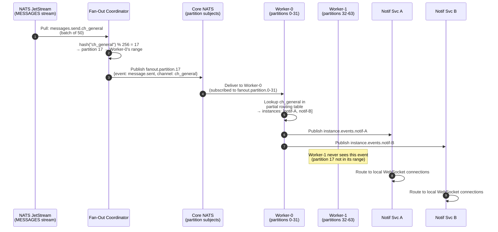

# Fan-Out Service Partitioning at Extreme Scale

**Author:** Architecture Team
**Status:** Proposed (activate when >500K online users)
**Last Updated:** 2026-02-01

---

## Table of Contents

1. [Problem: Memory Ceiling](#1-problem-memory-ceiling)
2. [Design Options](#2-design-options)
3. [Recommended Design: Coordinator + Partitioned Workers](#3-recommended-design)
4. [Consistent Hashing Scheme](#4-consistent-hashing-scheme)
5. [Partition Registry](#5-partition-registry)
6. [Rebalancing Protocol](#6-rebalancing-protocol)
7. [Failure Handling](#7-failure-handling)
8. [When to Activate](#8-when-to-activate)
9. [Sequence Diagram](#9-sequence-diagram)

---

## 1. Problem: Memory Ceiling

The current Fan-Out Service design replicates the full routing table on every worker instance:

| Scale | Active Channels | Online Users | Routing Table Size | Per Worker |
|-------|-----------------|--------------|-------------------|------------|
| Normal (100K users) | 500K | 100K | ~2 GB | ~2 GB |
| Large (500K users) | 2M | 500K | ~8 GB | ~8 GB |
| **Extreme (2M+ users)** | **5M+** | **2M** | **~40 GB** | **~40 GB** ❌ |

At extreme scale, each worker needing 40GB of memory is impractical. The routing table must be **partitioned** across workers.

---

## 2. Design Options

| Option | Description | Pros | Cons |
|--------|-------------|------|------|
| **A: Subject-Based Partitioning** | Embed partition ID in NATS subject | Simple NATS routing | Couples subject hierarchy to partitioning |
| **B: Application-Level Filter** | Workers pull and discard non-matching | No infrastructure change | Wasteful at scale |
| **C: Coordinator + Partitioned Workers** | Coordinator routes to partition subjects | Clean separation, minimal reshuffling | Additional coordinator component |

**Recommendation: Option C** — Coordinator + Partitioned Workers

---

## 3. Recommended Design

```
┌─────────────────┐
│  MESSAGES Stream │
│  (JetStream)     │
└────────┬────────┘
         │ Pull Consumer: fan-out-coordinator-pool
         ▼
┌─────────────────────┐
│  Fan-Out Coordinator │  (stateless, N instances)
│  - hash(channel_id)  │
│  - publish to        │
│    partition subject  │
└──┬──────┬──────┬────┘
   │      │      │
   ▼      ▼      ▼     Core NATS subjects
┌──────┐┌──────┐┌──────┐
│part.0││part.1││part.2│ ...  fanout.partition.{id}
└──┬───┘└──┬───┘└──┬───┘
   │       │       │
   ▼       ▼       ▼
┌──────┐┌──────┐┌──────┐
│Wkr-0 ││Wkr-1 ││Wkr-2 │ ...  Partitioned Fan-Out Workers
│      ││      ││      │
│Routing││Routing││Routing│    Each maintains partial routing table
│ Table ││ Table ││ Table │    (only assigned channels)
└──────┘└──────┘└──────┘
```

### Fan-Out Coordinator

The coordinator is **stateless** — it has no routing table. Its only job is:

1. Pull batch of events from the `fan-out-coordinator-pool` consumer
2. For each event, compute `partition = jumpHash(xxhash(channel_id), 256)`
3. Publish to `fanout.partition.{partition}` (Core NATS)
4. ACK the JetStream message

**Performance:** The coordinator does no lookups — just hash + publish. A single Go instance can process 200K+ msg/sec.

### Partitioned Workers

Each worker subscribes to its partition range:

```go
type PartitionedFanOutWorker struct {
    workerID     string
    partitions   []int               // e.g., [0, 1, 2, ..., 31]
    routing      *ChannelRouting     // only channels hashing to assigned partitions
    userIndex    *UserPartialIndex   // only users present in assigned channels
}

func (w *PartitionedFanOutWorker) Start() {
    for _, p := range w.partitions {
        subject := fmt.Sprintf("fanout.partition.%d", p)
        w.natsConn.Subscribe(subject, w.handleEvent)
    }
}
```

---

## 4. Consistent Hashing Scheme

**Hash function:** xxHash64 (fast, good distribution) with **jump consistent hash** for partition assignment.

```go
import "github.com/cespare/xxhash/v2"

// jumpHash from Google's paper — O(ln n) time, perfectly uniform
func jumpHash(key uint64, numBuckets int) int {
    var b, j int64 = -1, 0
    for j < int64(numBuckets) {
        b = j
        key = key*2862933555777941757 + 1
        j = int64(float64(b+1) * (float64(int64(1)<<31) / float64((key>>33)+1)))
    }
    return int(b)
}

func channelPartition(channelID string, numPartitions int) int {
    h := xxhash.Sum64String(channelID)
    return jumpHash(h, numPartitions)
}
```

**Partition count:** Fixed at **256 partitions**. Workers are assigned contiguous ranges:

| Workers | Partitions per Worker | Memory per Worker (at extreme scale) |
|---------|----------------------|--------------------------------------|
| 4 | 64 | ~10 GB |
| 8 | 32 | ~5 GB |
| 16 | 16 | ~2.5 GB |
| 32 | 8 | ~1.25 GB |

---

## 5. Partition Registry

### NATS KV Bucket: `partition-registry`

```
Key:    config/current
Value:  {
  "num_partitions": 256,
  "assignments": {
    "worker-0": [0, 1, 2, ..., 31],
    "worker-1": [32, 33, ..., 63],
    ...
  },
  "version": 7,
  "updated_at": "2026-02-01T12:00:00Z"
}
TTL: none (persistent)
```

**Updated by:** An operator or auto-scaler when workers are added/removed. Workers watch this key and react to changes.

---

## 6. Rebalancing Protocol

When a worker is added or removed:

```
1. Operator/auto-scaler updates partition-registry
2. All workers receive KV watch notification
3. Workers that LOST partitions:
   - Stop accepting events for lost partitions
   - Evict routing entries for channels in lost partitions
4. Workers that GAINED partitions:
   - Start loading routing entries for new channels
   - Subscribe to new partition subjects
5. Coordinator continues routing — events for
   transitioning partitions buffer at the new worker
   until its routing table is loaded (30-60s)
6. During this window: events are delayed, not lost
```

**Minimal reshuffling:** Jump consistent hash guarantees that adding a worker only moves `1/N` of partitions.

**Zero-downtime rebalance:** If multiple workers temporarily subscribe to the same partition during transition, both receive the event and both perform fan-out. The Notification Service de-duplicates (using `event_id`).

---

## 7. Failure Handling

### Worker Crash

1. Worker-2 crashes → partitions 64–95 are unserved
2. **Mitigation:** Use a JetStream stream for partition subjects:
   ```
   Stream: FANOUT-PARTITIONS
     Subjects: fanout.partition.>
     Retention: Limits (max age: 5 minutes)
     Replicas: 1
   ```
   This gives a 5-minute buffer for worker recovery or rebalancing.
3. Auto-scaler detects the crash (via NATS KV heartbeat expiry)
4. Option A: Restart the crashed worker (K8s will do this automatically)
5. Option B: Redistribute partitions to surviving workers

### Coordinator Crash

- Multiple coordinator instances share the `fan-out-coordinator-pool` pull consumer
- If one crashes, the others continue processing
- NATS JetStream redelivers unacknowledged messages

---

## 8. When to Activate

Partitioning adds operational complexity. Activate only when needed:

| Scale | Routing Table | Recommendation |
|-------|--------------|----------------|
| < 200K online users | < 4 GB | **Replicated** (current design) |
| 200K–500K | 4–10 GB | **Replicated** with larger instances (32GB+ RAM) |
| > 500K | > 10 GB | **Partitioned** — activate coordinator + partitioned workers |

### Migration Path

The system can start with the replicated design and migrate to partitioned by:

1. Deploying the coordinator
2. Deploying partitioned workers
3. Switching the MESSAGES stream consumer from `fan-out-pool` to `fan-out-coordinator-pool`
4. Draining the old replicated workers

This is a zero-downtime migration.

---

## 9. Sequence Diagram



---

## Related ADR

- [ADR-009: Fan-Out Consistent Hash Partitioning](../adrs/ADR-009-fanout-partitioning.md)
