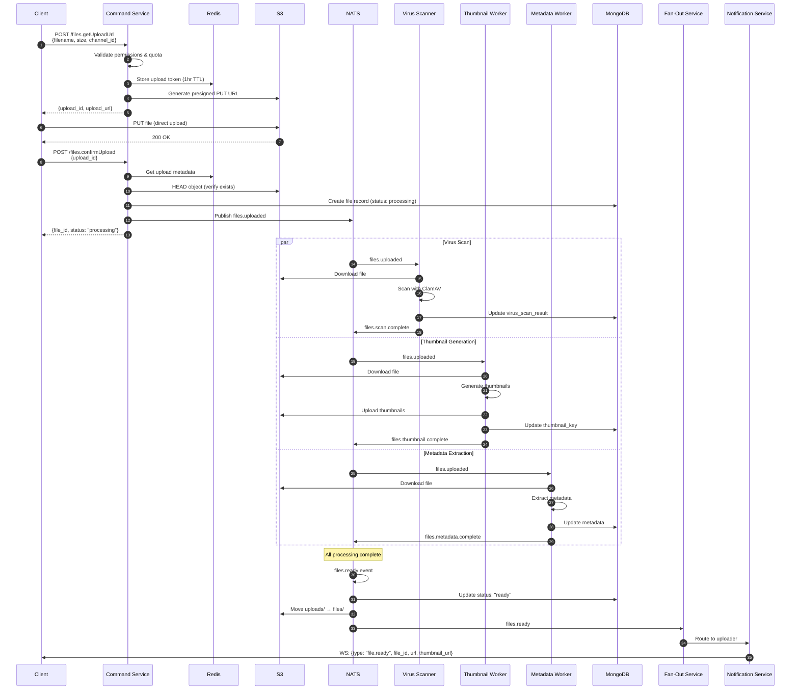
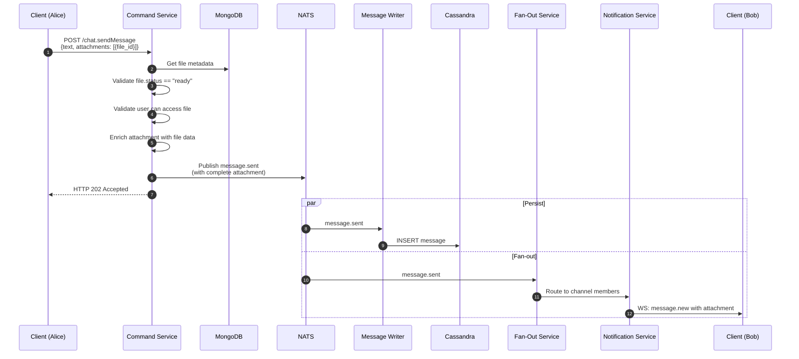

# File Uploads

**Author:** Architecture Team
**Status:** Draft
**Last Updated:** 2026-02-01

---

## Table of Contents

1. [Overview](#1-overview)
2. [Architecture](#2-architecture)
3. [Upload Flow — Direct to S3](#3-upload-flow--direct-to-s3)
4. [File Metadata Storage](#4-file-metadata-storage)
5. [File Attachments in Messages](#5-file-attachments-in-messages)
6. [File Processing Pipeline](#6-file-processing-pipeline)
7. [Download & Access Control](#7-download--access-control)
8. [Security Considerations](#8-security-considerations)
9. [Quota & Limits](#9-quota--limits)
10. [Multi-Region File Access](#10-multi-region-file-access)
11. [Sequence Diagrams](#11-sequence-diagrams)

---

## 1. Overview

Files are stored in **S3-compatible object storage** (AWS S3 or MinIO for self-hosted deployments). The platform uses **presigned URLs** for direct client-to-S3 uploads, avoiding file data passing through application servers.

### Design Goals

| Goal | Approach |
|------|----------|
| **Scalability** | Direct S3 upload bypasses app servers |
| **Low latency** | Presigned URLs, CDN for downloads |
| **Security** | Short-lived presigned URLs, virus scanning |
| **Flexibility** | Support images, videos, documents, any file type |
| **Processing** | Async thumbnail generation, virus scan, metadata extraction |

### Supported File Types

| Category | Extensions | Max Size | Processing |
|----------|------------|----------|------------|
| Images | jpg, png, gif, webp, svg | 20 MB | Thumbnail, EXIF strip |
| Videos | mp4, webm, mov | 100 MB | Thumbnail, transcode preview |
| Audio | mp3, wav, ogg, m4a | 50 MB | Waveform, duration |
| Documents | pdf, doc, docx, xls, xlsx, ppt | 50 MB | Preview image, page count |
| Archives | zip, tar, gz | 100 MB | File listing |
| Other | * | 100 MB | None |

---

## 2. Architecture

```
┌─────────────────────────────────────────────────────────────────────────────┐
│                           File Upload Architecture                           │
│                                                                              │
│  ┌──────────┐  1. Request    ┌─────────────┐  2. Generate   ┌────────────┐ │
│  │  Client  │───────────────►│   Command   │───────────────►│   Redis    │ │
│  │          │  upload URL    │   Service   │  upload token  │  (tokens)  │ │
│  └────┬─────┘                └─────────────┘                └────────────┘ │
│       │                                                                     │
│       │ 3. Direct upload                                                    │
│       │    (presigned PUT)                                                  │
│       ▼                                                                     │
│  ┌──────────────────────────────────────────────────────────────────────┐  │
│  │                        S3 / MinIO                                     │  │
│  │  ┌────────────────┐  ┌────────────────┐  ┌────────────────────────┐  │  │
│  │  │ uploads/       │  │ files/         │  │ thumbnails/            │  │  │
│  │  │ (temp, 1hr TTL)│  │ (permanent)    │  │ (generated)            │  │  │
│  │  └───────┬────────┘  └────────────────┘  └────────────────────────┘  │  │
│  └──────────┼───────────────────────────────────────────────────────────┘  │
│             │                                                               │
│             │ 4. S3 Event                                                   │
│             ▼                                                               │
│  ┌─────────────────┐  5. Publish   ┌─────────────┐                         │
│  │  S3 Event       │──────────────►│    NATS     │                         │
│  │  Handler        │               │  JetStream  │                         │
│  └─────────────────┘               └──────┬──────┘                         │
│                                           │                                 │
│       ┌───────────────────────────────────┼──────────────────────┐         │
│       │                                   │                      │         │
│       ▼                                   ▼                      ▼         │
│  ┌──────────────┐                ┌──────────────┐        ┌──────────────┐  │
│  │ Virus Scan   │                │  Thumbnail   │        │   Metadata   │  │
│  │   Worker     │                │   Worker     │        │    Worker    │  │
│  └──────────────┘                └──────────────┘        └──────────────┘  │
│                                                                             │
│  6. File ready → Update MongoDB → Notify user via WebSocket                │
└─────────────────────────────────────────────────────────────────────────────┘
```

### Components

| Component | Responsibility |
|-----------|---------------|
| **Command Service** | Generate presigned upload URLs, validate requests |
| **S3/MinIO** | Object storage, lifecycle policies |
| **S3 Event Handler** | Receive S3 notifications, publish to NATS |
| **File Processing Workers** | Virus scan, thumbnails, metadata extraction |
| **MongoDB** | File metadata storage |
| **Redis** | Upload tokens, rate limiting |

---

## 3. Upload Flow — Direct to S3

### 3.1 Step 1: Request Upload URL

Client requests a presigned upload URL before uploading:

**Request:**
```
POST /api/v1/files.getUploadUrl
Authorization: Bearer <token>
Content-Type: application/json

{
  "filename": "screenshot.png",
  "content_type": "image/png",
  "size": 1048576,
  "channel_id": "ch_general"
}
```

**Response:**
```json
{
  "upload_id": "upl_01HZ3K4M5N",
  "upload_url": "https://s3.amazonaws.com/bucket/uploads/upl_01HZ3K4M5N/screenshot.png?X-Amz-Algorithm=AWS4-HMAC-SHA256&X-Amz-Credential=...&X-Amz-Signature=...",
  "expires_at": "2026-02-01T10:45:00Z",
  "max_size": 20971520,
  "fields": {}
}
```

### 3.2 Step 2: Command Service Logic

```go
func (s *FileService) GetUploadURL(ctx context.Context, req *UploadURLRequest) (*UploadURLResponse, error) {
    // 1. Validate user has permission to upload to channel
    if err := s.authz.CheckPermission(ctx, req.UserID, req.ChannelID, "upload_file"); err != nil {
        return nil, err
    }

    // 2. Check user quota
    if err := s.quota.CheckUploadQuota(ctx, req.UserID, req.Size); err != nil {
        return nil, fmt.Errorf("quota exceeded: %w", err)
    }

    // 3. Validate file type and size
    if err := s.validateFileRequest(req); err != nil {
        return nil, err
    }

    // 4. Generate upload ID and token
    uploadID := generateUploadID()
    token := generateSecureToken()

    // 5. Store upload metadata in Redis (expires in 1 hour)
    uploadMeta := &UploadMeta{
        UploadID:    uploadID,
        UserID:      req.UserID,
        ChannelID:   req.ChannelID,
        Filename:    req.Filename,
        ContentType: req.ContentType,
        Size:        req.Size,
        Token:       token,
        CreatedAt:   time.Now(),
    }
    s.redis.Set(ctx, "upload:"+uploadID, uploadMeta, 1*time.Hour)

    // 6. Generate presigned PUT URL
    s3Key := fmt.Sprintf("uploads/%s/%s", uploadID, sanitizeFilename(req.Filename))
    presignedURL, err := s.s3.PresignPutObject(ctx, &s3.PutObjectInput{
        Bucket:        aws.String(s.bucket),
        Key:           aws.String(s3Key),
        ContentType:   aws.String(req.ContentType),
        ContentLength: aws.Int64(req.Size),
    }, s3.WithPresignExpires(15*time.Minute))

    return &UploadURLResponse{
        UploadID:  uploadID,
        UploadURL: presignedURL.URL,
        ExpiresAt: time.Now().Add(15 * time.Minute),
        MaxSize:   s.getMaxSizeForType(req.ContentType),
    }, nil
}
```

### 3.3 Step 3: Direct Upload to S3

Client uploads directly to S3 using the presigned URL:

```javascript
// Client-side upload
async function uploadFile(file, uploadResponse) {
  const { upload_url, upload_id } = uploadResponse;

  // Upload directly to S3
  const response = await fetch(upload_url, {
    method: 'PUT',
    headers: {
      'Content-Type': file.type,
      'Content-Length': file.size,
    },
    body: file,
  });

  if (!response.ok) {
    throw new Error('Upload failed');
  }

  // Confirm upload with server
  return confirmUpload(upload_id);
}
```

### 3.4 Step 4: Confirm Upload

After successful S3 upload, client confirms with the server:

**Request:**
```
POST /api/v1/files.confirmUpload
Authorization: Bearer <token>

{
  "upload_id": "upl_01HZ3K4M5N"
}
```

**Response:**
```json
{
  "file_id": "file_01HZ3K4M5N",
  "url": "https://cdn.example.com/files/file_01HZ3K4M5N/screenshot.png",
  "thumbnail_url": null,
  "status": "processing",
  "filename": "screenshot.png",
  "size": 1048576,
  "content_type": "image/png"
}
```

### 3.5 Command Service: Confirm Upload

```go
func (s *FileService) ConfirmUpload(ctx context.Context, req *ConfirmUploadRequest) (*File, error) {
    // 1. Get upload metadata from Redis
    uploadMeta, err := s.redis.Get(ctx, "upload:"+req.UploadID)
    if err != nil {
        return nil, fmt.Errorf("upload not found or expired")
    }

    // 2. Verify user owns this upload
    if uploadMeta.UserID != req.UserID {
        return nil, fmt.Errorf("unauthorized")
    }

    // 3. Verify file exists in S3
    s3Key := fmt.Sprintf("uploads/%s/%s", req.UploadID, uploadMeta.Filename)
    headResult, err := s.s3.HeadObject(ctx, &s3.HeadObjectInput{
        Bucket: aws.String(s.bucket),
        Key:    aws.String(s3Key),
    })
    if err != nil {
        return nil, fmt.Errorf("file not found in storage")
    }

    // 4. Verify size matches
    if *headResult.ContentLength != uploadMeta.Size {
        return nil, fmt.Errorf("file size mismatch")
    }

    // 5. Create file record in MongoDB
    file := &File{
        FileID:      generateFileID(),
        UploadID:    req.UploadID,
        UserID:      uploadMeta.UserID,
        ChannelID:   uploadMeta.ChannelID,
        Filename:    uploadMeta.Filename,
        ContentType: uploadMeta.ContentType,
        Size:        uploadMeta.Size,
        S3Key:       s3Key,
        Status:      FileStatusProcessing,
        CreatedAt:   time.Now(),
    }

    if err := s.mongo.Insert(ctx, "files", file); err != nil {
        return nil, err
    }

    // 6. Publish file.uploaded event for processing
    s.nats.Publish("files.uploaded", FileUploadedEvent{
        FileID:      file.FileID,
        S3Key:       s3Key,
        ContentType: file.ContentType,
        Size:        file.Size,
    })

    // 7. Delete Redis upload token
    s.redis.Del(ctx, "upload:"+req.UploadID)

    return file, nil
}
```

---

## 4. File Metadata Storage

### 4.1 MongoDB: `files` Collection

```javascript
// MongoDB collection: files
{
  _id: ObjectId,
  file_id: "file_01HZ3K4M5N",
  upload_id: "upl_01HZ3K4M5N",
  user_id: "usr_alice",
  channel_id: "ch_general",

  // File info
  filename: "screenshot.png",
  content_type: "image/png",
  size: 1048576,
  extension: "png",

  // S3 storage
  s3_bucket: "chat-files",
  s3_key: "files/2026/02/01/file_01HZ3K4M5N/screenshot.png",
  s3_region: "us-east-1",

  // Processing status
  status: "ready",  // "processing" | "ready" | "failed" | "quarantined"
  processing_error: null,

  // Generated assets
  thumbnail_key: "thumbnails/file_01HZ3K4M5N/thumb_256.jpg",
  preview_key: "previews/file_01HZ3K4M5N/preview.jpg",

  // Extracted metadata
  metadata: {
    width: 1920,
    height: 1080,
    duration: null,        // for video/audio
    pages: null,           // for documents
    exif: null,            // stripped for privacy
  },

  // Security
  virus_scanned: true,
  virus_scan_result: "clean",
  virus_scanned_at: ISODate("2026-02-01T10:31:00Z"),

  // Access control
  access: "channel",       // "channel" | "public" | "private"
  allowed_users: [],       // for private files

  // Timestamps
  created_at: ISODate("2026-02-01T10:30:00Z"),
  updated_at: ISODate("2026-02-01T10:31:00Z"),
  expires_at: null         // for temporary files
}

// Indexes
{ file_id: 1 }              // unique
{ user_id: 1, created_at: -1 }
{ channel_id: 1, created_at: -1 }
{ status: 1 }
{ s3_key: 1 }
```

### 4.2 S3 Bucket Structure

```
chat-files/
├── uploads/                    # Temporary uploads (1hr TTL)
│   └── {upload_id}/
│       └── {filename}
│
├── files/                      # Permanent storage
│   └── {year}/{month}/{day}/
│       └── {file_id}/
│           └── {filename}
│
├── thumbnails/                 # Generated thumbnails
│   └── {file_id}/
│       ├── thumb_64.jpg
│       ├── thumb_128.jpg
│       └── thumb_256.jpg
│
├── previews/                   # Document previews
│   └── {file_id}/
│       └── preview.jpg
│
└── quarantine/                 # Virus-detected files
    └── {file_id}/
        └── {filename}
```

### 4.3 S3 Lifecycle Policies

```json
{
  "Rules": [
    {
      "ID": "DeleteTempUploads",
      "Status": "Enabled",
      "Filter": { "Prefix": "uploads/" },
      "Expiration": { "Days": 1 }
    },
    {
      "ID": "DeleteQuarantined",
      "Status": "Enabled",
      "Filter": { "Prefix": "quarantine/" },
      "Expiration": { "Days": 30 }
    },
    {
      "ID": "TransitionToIA",
      "Status": "Enabled",
      "Filter": { "Prefix": "files/" },
      "Transitions": [
        { "Days": 90, "StorageClass": "STANDARD_IA" },
        { "Days": 365, "StorageClass": "GLACIER" }
      ]
    }
  ]
}
```

---

## 5. File Attachments in Messages

### 5.1 Attachment Schema

Messages can include file attachments:

```json
{
  "message_id": "msg_01HZ3K...",
  "channel_id": "ch_general",
  "message_type": "rich_text",
  "content": {
    "raw": "Here's the screenshot",
    "blocks": [{"type": "text", "text": "Here's the screenshot"}]
  },
  "attachments": [
    {
      "type": "file",
      "file_id": "file_01HZ3K4M5N",
      "filename": "screenshot.png",
      "content_type": "image/png",
      "size": 1048576,
      "url": "https://cdn.example.com/files/file_01HZ3K4M5N/screenshot.png",
      "thumbnail_url": "https://cdn.example.com/thumbnails/file_01HZ3K4M5N/thumb_256.jpg",
      "metadata": {
        "width": 1920,
        "height": 1080
      }
    }
  ]
}
```

### 5.2 Cassandra: Updated `messages` Table

```sql
ALTER TABLE messages ADD (
    attachments list<frozen<attachment>>
);

CREATE TYPE attachment (
    type            text,       -- 'file', 'image', 'video', 'audio'
    file_id         text,
    filename        text,
    content_type    text,
    size            bigint,
    url             text,
    thumbnail_url   text,
    metadata        map<text, text>
);
```

### 5.3 Send Message with Attachment

```
POST /api/v1/chat.sendMessage
Authorization: Bearer <token>

{
  "channel_id": "ch_general",
  "text": "Here's the screenshot",
  "attachments": [
    { "file_id": "file_01HZ3K4M5N" }
  ]
}
```

The Command Service:
1. Validates file exists and is ready (`status: "ready"`)
2. Validates user has access to the file
3. Enriches attachment with file metadata from MongoDB
4. Publishes message with complete attachment data

---

## 6. File Processing Pipeline

### 6.1 NATS Streams for File Processing

```
Stream: FILES
  Subjects: files.>
  Retention: WorkQueue
  Max Age: 24 hours
  Replicas: 3

Subjects:
  files.uploaded          → New file uploaded, needs processing
  files.scan.request      → Virus scan request
  files.scan.complete     → Virus scan completed
  files.thumbnail.request → Thumbnail generation request
  files.thumbnail.complete→ Thumbnail generated
  files.metadata.request  → Metadata extraction request
  files.metadata.complete → Metadata extracted
  files.ready             → File fully processed and ready
  files.failed            → File processing failed
```

### 6.2 Processing Workers

#### Virus Scan Worker

```go
type VirusScanWorker struct {
    s3       *s3.Client
    scanner  VirusScanner  // ClamAV or cloud service
    nats     *nats.Conn
    mongo    *mongo.Collection
}

func (w *VirusScanWorker) Process(event FileUploadedEvent) error {
    // 1. Download file from S3
    obj, err := w.s3.GetObject(ctx, &s3.GetObjectInput{
        Bucket: aws.String(event.Bucket),
        Key:    aws.String(event.S3Key),
    })
    if err != nil {
        return err
    }
    defer obj.Body.Close()

    // 2. Scan file
    result, err := w.scanner.Scan(obj.Body)
    if err != nil {
        return err
    }

    // 3. Update file status
    update := bson.M{
        "$set": bson.M{
            "virus_scanned":     true,
            "virus_scanned_at":  time.Now(),
            "virus_scan_result": result.Status,
        },
    }

    if result.Status == "infected" {
        // Move to quarantine
        w.moveToQuarantine(event.FileID, event.S3Key)
        update["$set"].(bson.M)["status"] = "quarantined"
    }

    w.mongo.UpdateOne(ctx, bson.M{"file_id": event.FileID}, update)

    // 4. Publish result
    w.nats.Publish("files.scan.complete", FileScanResult{
        FileID:  event.FileID,
        Status:  result.Status,
        Threats: result.Threats,
    })

    return nil
}
```

#### Thumbnail Worker

```go
type ThumbnailWorker struct {
    s3     *s3.Client
    nats   *nats.Conn
    mongo  *mongo.Collection
}

var thumbnailSizes = []int{64, 128, 256}

func (w *ThumbnailWorker) Process(event FileUploadedEvent) error {
    // Only process images and videos
    if !isImageOrVideo(event.ContentType) {
        return nil
    }

    // 1. Download original file
    obj, _ := w.s3.GetObject(ctx, &s3.GetObjectInput{
        Bucket: aws.String(event.Bucket),
        Key:    aws.String(event.S3Key),
    })

    // 2. Generate thumbnails for each size
    for _, size := range thumbnailSizes {
        thumb, err := generateThumbnail(obj.Body, size, event.ContentType)
        if err != nil {
            continue
        }

        thumbKey := fmt.Sprintf("thumbnails/%s/thumb_%d.jpg", event.FileID, size)
        w.s3.PutObject(ctx, &s3.PutObjectInput{
            Bucket:      aws.String(event.Bucket),
            Key:         aws.String(thumbKey),
            Body:        thumb,
            ContentType: aws.String("image/jpeg"),
        })
    }

    // 3. Update file with thumbnail key
    w.mongo.UpdateOne(ctx,
        bson.M{"file_id": event.FileID},
        bson.M{"$set": bson.M{
            "thumbnail_key": fmt.Sprintf("thumbnails/%s/thumb_256.jpg", event.FileID),
        }},
    )

    // 4. Publish completion
    w.nats.Publish("files.thumbnail.complete", FileThumbnailResult{
        FileID:       event.FileID,
        ThumbnailKey: fmt.Sprintf("thumbnails/%s/thumb_256.jpg", event.FileID),
    })

    return nil
}
```

#### Metadata Extraction Worker

```go
func (w *MetadataWorker) Process(event FileUploadedEvent) error {
    metadata := make(map[string]interface{})

    switch {
    case isImage(event.ContentType):
        // Extract dimensions, format
        img, _ := decodeImage(event.S3Key)
        metadata["width"] = img.Bounds().Dx()
        metadata["height"] = img.Bounds().Dy()
        // Note: EXIF is stripped for privacy

    case isVideo(event.ContentType):
        // Extract duration, dimensions, codec
        probe, _ := ffprobe(event.S3Key)
        metadata["duration"] = probe.Duration
        metadata["width"] = probe.Width
        metadata["height"] = probe.Height
        metadata["codec"] = probe.VideoCodec

    case isAudio(event.ContentType):
        // Extract duration, bitrate
        probe, _ := ffprobe(event.S3Key)
        metadata["duration"] = probe.Duration
        metadata["bitrate"] = probe.Bitrate

    case isPDF(event.ContentType):
        // Extract page count
        info, _ := pdfinfo(event.S3Key)
        metadata["pages"] = info.Pages
    }

    w.mongo.UpdateOne(ctx,
        bson.M{"file_id": event.FileID},
        bson.M{"$set": bson.M{"metadata": metadata}},
    )

    return nil
}
```

### 6.3 Processing Orchestrator

Coordinates all processing steps:

```go
func (o *FileOrchestrator) OnFileUploaded(event FileUploadedEvent) {
    // Start all processing in parallel
    o.nats.Publish("files.scan.request", event)
    o.nats.Publish("files.thumbnail.request", event)
    o.nats.Publish("files.metadata.request", event)
}

func (o *FileOrchestrator) CheckCompletion(fileID string) {
    file, _ := o.mongo.FindOne(ctx, bson.M{"file_id": fileID})

    // Check if all processing is complete
    if file.VirusScanned && file.ThumbnailKey != "" && file.Metadata != nil {
        if file.VirusScanResult == "clean" {
            // Move from uploads/ to files/
            o.moveToPermStorage(file)

            // Update status to ready
            o.mongo.UpdateOne(ctx,
                bson.M{"file_id": fileID},
                bson.M{"$set": bson.M{"status": "ready"}},
            )

            // Notify user
            o.nats.Publish("files.ready", FileReadyEvent{
                FileID:    fileID,
                UserID:    file.UserID,
                ChannelID: file.ChannelID,
            })
        }
    }
}
```

### 6.4 Notify User When File Ready

Fan-Out Service routes `files.ready` event to the uploader:

```json
// WebSocket event: Server → Client
{
  "type": "file.ready",
  "file_id": "file_01HZ3K4M5N",
  "url": "https://cdn.example.com/files/file_01HZ3K4M5N/screenshot.png",
  "thumbnail_url": "https://cdn.example.com/thumbnails/file_01HZ3K4M5N/thumb_256.jpg",
  "status": "ready"
}
```

---

## 7. Download & Access Control

### 7.1 Download URL Generation

Files are served via **CDN with signed URLs** or **presigned S3 URLs**:

```go
func (s *FileService) GetDownloadURL(ctx context.Context, fileID string, userID string) (string, error) {
    // 1. Get file metadata
    file, err := s.mongo.FindOne(ctx, bson.M{"file_id": fileID})
    if err != nil {
        return "", fmt.Errorf("file not found")
    }

    // 2. Check access permission
    if !s.canAccess(ctx, userID, file) {
        return "", fmt.Errorf("access denied")
    }

    // 3. Generate signed URL
    switch s.config.DeliveryMethod {
    case "cdn":
        // CloudFront signed URL
        return s.cdn.SignURL(file.S3Key, 1*time.Hour)

    case "s3":
        // S3 presigned URL
        return s.s3.PresignGetObject(ctx, &s3.GetObjectInput{
            Bucket: aws.String(file.S3Bucket),
            Key:    aws.String(file.S3Key),
        }, s3.WithPresignExpires(1*time.Hour))
    }

    return "", nil
}

func (s *FileService) canAccess(ctx context.Context, userID string, file *File) bool {
    switch file.Access {
    case "public":
        return true

    case "channel":
        // Check if user is member of channel
        return s.membership.IsMember(ctx, userID, file.ChannelID)

    case "private":
        // Check if user is in allowed list
        return contains(file.AllowedUsers, userID) || file.UserID == userID

    default:
        return false
    }
}
```

### 7.2 Inline vs Download

```
# Inline (view in browser)
GET /api/v1/files/{file_id}/view
→ Redirect to signed URL with Content-Disposition: inline

# Download (save file)
GET /api/v1/files/{file_id}/download
→ Redirect to signed URL with Content-Disposition: attachment
```

### 7.3 Thumbnail URL

Thumbnails use public CDN URLs (no auth needed, content is derived):

```
https://cdn.example.com/thumbnails/{file_id}/thumb_256.jpg
```

---

## 8. Security Considerations

### 8.1 Upload Security

| Threat | Mitigation |
|--------|------------|
| **Malware upload** | ClamAV virus scanning before file is accessible |
| **Oversized files** | Size validation in presigned URL + server-side check |
| **Wrong content type** | Content-Type validation + magic byte verification |
| **Path traversal** | Sanitize filenames, use UUIDs for storage paths |
| **Unauthorized upload** | Short-lived presigned URLs (15 min), upload tokens |
| **Quota abuse** | Per-user upload quotas, rate limiting |

### 8.2 Download Security

| Threat | Mitigation |
|--------|------------|
| **Unauthorized access** | Channel membership check, signed URLs |
| **URL sharing** | Short expiry (1 hour), user-specific signatures |
| **Hotlinking** | Referer validation, signed URLs |
| **SSRF via file URLs** | No server-side fetching of user-provided URLs |

### 8.3 Content Security

```go
// Content-Type validation
var allowedTypes = map[string][]string{
    "image":    {"image/jpeg", "image/png", "image/gif", "image/webp"},
    "video":    {"video/mp4", "video/webm", "video/quicktime"},
    "audio":    {"audio/mpeg", "audio/wav", "audio/ogg"},
    "document": {"application/pdf", "application/msword", ...},
}

// Magic byte verification
func verifyMagicBytes(reader io.Reader, declaredType string) error {
    magic := make([]byte, 512)
    reader.Read(magic)

    detected := http.DetectContentType(magic)
    if !isCompatible(detected, declaredType) {
        return fmt.Errorf("content type mismatch: declared %s, detected %s",
            declaredType, detected)
    }
    return nil
}
```

### 8.4 EXIF Stripping

Remove potentially sensitive metadata from images:

```go
func stripEXIF(input io.Reader, output io.Writer) error {
    // Decode image
    img, format, _ := image.Decode(input)

    // Re-encode without EXIF
    switch format {
    case "jpeg":
        return jpeg.Encode(output, img, &jpeg.Options{Quality: 95})
    case "png":
        return png.Encode(output, img)
    }
    return nil
}
```

---

## 9. Quota & Limits

### 9.1 Default Limits

| Limit | Default | Configurable |
|-------|---------|--------------|
| Max file size (image) | 20 MB | Yes |
| Max file size (video) | 100 MB | Yes |
| Max file size (other) | 100 MB | Yes |
| Max files per message | 10 | Yes |
| User storage quota | 5 GB | Yes (per plan) |
| Channel storage quota | 50 GB | Yes (per plan) |
| Upload rate limit | 10/minute | Yes |

### 9.2 Quota Tracking

```javascript
// MongoDB collection: storage_quotas
{
  _id: ObjectId,
  entity_type: "user",      // "user" | "channel" | "workspace"
  entity_id: "usr_alice",
  quota_bytes: 5368709120,  // 5 GB
  used_bytes: 1073741824,   // 1 GB used
  file_count: 42,
  updated_at: ISODate("2026-02-01T10:30:00Z")
}
```

### 9.3 Quota Check

```go
func (s *QuotaService) CheckUploadQuota(ctx context.Context, userID string, fileSize int64) error {
    quota, _ := s.mongo.FindOne(ctx, bson.M{
        "entity_type": "user",
        "entity_id":   userID,
    })

    if quota.UsedBytes + fileSize > quota.QuotaBytes {
        return fmt.Errorf("storage quota exceeded: %d + %d > %d",
            quota.UsedBytes, fileSize, quota.QuotaBytes)
    }

    return nil
}
```

---

## 10. Multi-Region File Access

### 10.1 S3 Cross-Region Replication

For multi-region deployments, enable S3 Cross-Region Replication:

```
┌─────────────────┐          ┌─────────────────┐
│  US-East S3     │ ────────►│  EU-West S3     │
│  (Primary)      │   CRR    │  (Replica)      │
└─────────────────┘          └─────────────────┘
         │                            │
         ▼                            ▼
┌─────────────────┐          ┌─────────────────┐
│  CloudFront     │          │  CloudFront     │
│  US Edge        │          │  EU Edge        │
└─────────────────┘          └─────────────────┘
```

### 10.2 CDN Configuration

Use CloudFront or similar CDN with multiple origins:

```json
{
  "Origins": [
    {
      "Id": "S3-US-East",
      "DomainName": "chat-files-us-east.s3.amazonaws.com",
      "OriginPath": ""
    },
    {
      "Id": "S3-EU-West",
      "DomainName": "chat-files-eu-west.s3.amazonaws.com",
      "OriginPath": ""
    }
  ],
  "OriginGroups": {
    "Items": [
      {
        "Id": "S3-Failover",
        "Members": ["S3-US-East", "S3-EU-West"],
        "FailoverCriteria": {
          "StatusCodes": [500, 502, 503, 504]
        }
      }
    ]
  }
}
```

---

## 11. Sequence Diagrams

### 11.1 Complete Upload Flow



### 11.2 Send Message with Attachment



---

## Related Documents

- [Detailed Design](../detailed-design.md) — Service specifications
- [Message Formats](./message-formats.md) — Attachment schema in messages
- [Multi-Region](./multi-region.md) — Cross-region file replication
