# Message Formats and Preprocessing

**Author:** Architecture Team
**Status:** Draft
**Last Updated:** 2026-02-01

---

## Table of Contents

1. [Overview](#1-overview)
2. [Message Types](#2-message-types)
3. [Rich Text (Markdown & Links)](#3-rich-text-markdown--links)
4. [Adaptive Cards](#4-adaptive-cards)
5. [Ephemeral Messages](#5-ephemeral-messages)
6. [Preprocessing Pipeline](#6-preprocessing-pipeline)
7. [Data Model Extensions](#7-data-model-extensions)
8. [Event Model Extensions](#8-event-model-extensions)
9. [Sequence Diagrams](#9-sequence-diagrams)

---

## 1. Overview

Messages support multiple formats and rendering modes:

| Format | Description | Persisted | Example Use Case |
|--------|-------------|-----------|------------------|
| **Plain Text** | Simple unformatted text | Yes | Basic messages |
| **Rich Text** | Markdown with parsed links, mentions, emoji | Yes | Formatted messages |
| **Adaptive Card** | Structured interactive cards | Yes | Bot responses, forms, notifications |
| **Ephemeral** | Visible only to sender, not persisted | No | Slash command responses, tips |

### Design Principles

1. **Preprocess Once:** Parse markdown, extract links/mentions once in Command Service — not per recipient
2. **Store Processed:** Persist both raw and processed content for flexibility
3. **Ephemeral = No Persistence:** Ephemeral messages skip the Message Writer, go directly to Fan-Out
4. **Client Agnostic:** Preprocessing produces a structured AST that any client can render

---

## 2. Message Types

### 2.1 Message Type Enum

```go
type MessageType string

const (
    MessageTypePlain     MessageType = "plain"
    MessageTypeRichText  MessageType = "rich_text"
    MessageTypeCard      MessageType = "adaptive_card"
    MessageTypeEphemeral MessageType = "ephemeral"
)
```

### 2.2 Message Payload Structure

```json
{
  "message_id": "msg_01HZ3K...",
  "channel_id": "ch_general",
  "message_type": "rich_text",
  "content": {
    "raw": "Check out https://example.com and @alice!",
    "processed": {
      "blocks": [
        {"type": "text", "text": "Check out "},
        {"type": "link", "url": "https://example.com", "text": "https://example.com"},
        {"type": "text", "text": " and "},
        {"type": "mention", "user_id": "usr_alice", "display": "@alice"},
        {"type": "text", "text": "!"}
      ],
      "mentions": ["usr_alice"],
      "links": [{"url": "https://example.com", "title": null, "preview": null}]
    }
  },
  "ephemeral": false,
  "ephemeral_user_id": null
}
```

---

## 3. Rich Text (Markdown & Links)

### 3.1 Supported Markdown Syntax

| Syntax | Rendered | Notes |
|--------|----------|-------|
| `**bold**` | **bold** | Strong emphasis |
| `*italic*` | *italic* | Emphasis |
| `~~strike~~` | ~~strike~~ | Strikethrough |
| `` `code` `` | `code` | Inline code |
| ```` ```lang ```` | Code block | Syntax highlighting hint |
| `> quote` | Blockquote | Quote formatting |
| `- item` | Bullet list | Unordered list |
| `1. item` | Numbered list | Ordered list |
| `[text](url)` | Link | Inline link |
| `@username` | Mention | User mention |
| `#channel` | Channel link | Channel reference |
| `:emoji:` | 😀 | Emoji shortcode |

### 3.2 Parsed Block Types

```typescript
type Block =
  | { type: "text"; text: string }
  | { type: "bold"; children: Block[] }
  | { type: "italic"; children: Block[] }
  | { type: "strike"; children: Block[] }
  | { type: "code"; text: string }
  | { type: "code_block"; language: string | null; text: string }
  | { type: "quote"; children: Block[] }
  | { type: "list"; ordered: boolean; items: Block[][] }
  | { type: "link"; url: string; text: string; preview?: LinkPreview }
  | { type: "mention"; user_id: string; display: string }
  | { type: "channel"; channel_id: string; display: string }
  | { type: "emoji"; shortcode: string; unicode: string };

type LinkPreview = {
  title: string | null;
  description: string | null;
  image_url: string | null;
  site_name: string | null;
};
```

### 3.3 Link Preview Fetching

Link previews are fetched **asynchronously** to avoid blocking message delivery:

1. Command Service parses message, extracts URLs
2. Message published immediately (without previews)
3. Link Preview Worker fetches metadata for each URL
4. Worker publishes `message.link_preview` event with preview data
5. Fan-Out delivers preview update to channel members

```
┌─────────────┐     ┌──────────────┐     ┌─────────────────┐
│   Command   │────►│    NATS      │────►│  Link Preview   │
│   Service   │     │  JetStream   │     │     Worker      │
└─────────────┘     └──────────────┘     └────────┬────────┘
                                                   │
                                                   ▼
                                          ┌──────────────┐
                                          │ Fetch URL    │
                                          │ Extract OG   │
                                          │ tags         │
                                          └──────┬───────┘
                                                  │
                                                  ▼
                                          ┌──────────────┐
                                          │ Publish      │
                                          │ link_preview │
                                          │ event        │
                                          └──────────────┘
```

### 3.4 Mention Extraction

Mentions are extracted and resolved during preprocessing:

```go
func extractMentions(text string, channelMembers []string) []Mention {
    // Pattern: @username or @user_id
    pattern := regexp.MustCompile(`@(\w+)`)
    matches := pattern.FindAllStringSubmatch(text, -1)

    mentions := make([]Mention, 0)
    for _, match := range matches {
        username := match[1]
        // Resolve username to user_id (cache lookup)
        if userID, ok := resolveUsername(username, channelMembers); ok {
            mentions = append(mentions, Mention{
                UserID:  userID,
                Display: "@" + username,
            })
        }
    }
    return mentions
}
```

**Special mentions:**
- `@all` — Notify all channel members
- `@here` — Notify online channel members only
- `@channel` — Alias for `@all`

---

## 4. Adaptive Cards

Adaptive Cards provide structured, interactive message content for bots and integrations.

### 4.1 Card Schema

Based on [Microsoft Adaptive Cards](https://adaptivecards.io/) schema with platform extensions:

```json
{
  "message_type": "adaptive_card",
  "content": {
    "card": {
      "$schema": "https://adaptivecards.io/schemas/adaptive-card.json",
      "type": "AdaptiveCard",
      "version": "1.5",
      "body": [
        {
          "type": "TextBlock",
          "text": "Deployment Request",
          "weight": "bolder",
          "size": "large"
        },
        {
          "type": "FactSet",
          "facts": [
            {"title": "Environment", "value": "Production"},
            {"title": "Version", "value": "v2.5.0"},
            {"title": "Requested by", "value": "@alice"}
          ]
        },
        {
          "type": "ActionSet",
          "actions": [
            {
              "type": "Action.Submit",
              "title": "Approve",
              "data": {"action": "approve", "request_id": "req_123"}
            },
            {
              "type": "Action.Submit",
              "title": "Reject",
              "style": "destructive",
              "data": {"action": "reject", "request_id": "req_123"}
            }
          ]
        }
      ]
    },
    "fallback_text": "Deployment Request: Production v2.5.0 - Approve or Reject?"
  }
}
```

### 4.2 Supported Card Elements

| Element | Description |
|---------|-------------|
| `TextBlock` | Text with formatting options |
| `Image` | Image display |
| `FactSet` | Key-value pairs |
| `ColumnSet` | Multi-column layout |
| `Container` | Grouping element |
| `ActionSet` | Button group |
| `Input.Text` | Text input field |
| `Input.Number` | Number input field |
| `Input.Date` | Date picker |
| `Input.Time` | Time picker |
| `Input.Toggle` | Checkbox |
| `Input.ChoiceSet` | Dropdown or radio buttons |

### 4.3 Card Actions

| Action Type | Description | Handler |
|-------------|-------------|---------|
| `Action.Submit` | Submit form data | Webhook to bot server |
| `Action.OpenUrl` | Open URL in browser | Client-side |
| `Action.ShowCard` | Expand nested card | Client-side |
| `Action.Execute` | Universal action (bot) | Webhook to bot server |

### 4.4 Card Action Flow


### 4.5 Card Validation

Cards are validated in Command Service before publishing:

```go
func validateAdaptiveCard(card map[string]interface{}) error {
    // 1. Schema validation
    if err := validateSchema(card, adaptiveCardSchema); err != nil {
        return fmt.Errorf("invalid card schema: %w", err)
    }

    // 2. Security checks
    if err := validateCardSecurity(card); err != nil {
        return fmt.Errorf("card security violation: %w", err)
    }

    // 3. Size limits
    if cardSize := measureCard(card); cardSize > MaxCardSizeBytes {
        return fmt.Errorf("card exceeds size limit: %d > %d", cardSize, MaxCardSizeBytes)
    }

    return nil
}

func validateCardSecurity(card map[string]interface{}) error {
    // - No JavaScript execution
    // - URLs must be HTTPS (except localhost for dev)
    // - No data: URLs for images
    // - Action URLs must match bot's registered domains
    // ...
}
```

---

## 5. Ephemeral Messages

Ephemeral messages are visible only to a specific user and are **not persisted**.

### 5.1 Use Cases

- Slash command responses (e.g., `/help`, `/weather`)
- Bot tips and hints
- Error messages from bots
- "Only you can see this" notifications

### 5.2 Ephemeral Message Structure

```json
{
  "message_id": "msg_eph_01HZ3K...",
  "channel_id": "ch_general",
  "message_type": "ephemeral",
  "ephemeral": true,
  "ephemeral_user_id": "usr_alice",
  "content": {
    "raw": "Here are the available commands:\n- /help\n- /weather\n- /remind",
    "processed": { ... }
  },
  "sender": {
    "user_id": "usr_bot_helper",
    "username": "HelperBot",
    "is_bot": true
  }
}
```

### 5.3 Ephemeral Message Flow

Ephemeral messages **bypass persistence** and go directly to Fan-Out:

```
┌─────────────────────────────────────────────────────────────────────┐
│                    Ephemeral Message Flow                            │
│                                                                      │
│  ┌─────────────┐                      ┌─────────────────────────┐   │
│  │   Command   │                      │      NATS JetStream      │   │
│  │   Service   │                      │                          │   │
│  │             │                      │  ┌───────────────────┐   │   │
│  │  Preprocess │──── ephemeral? ─────►│  │ MESSAGES stream   │   │   │
│  │             │         │            │  │ (SKIP for ephem)  │   │   │
│  └─────────────┘         │            │  └───────────────────┘   │   │
│                          │            │                          │   │
│                          │            │  ┌───────────────────┐   │   │
│                          └───────────►│  │ EPHEMERAL stream  │   │   │
│                                       │  │ (WorkQueue, no    │   │   │
│                                       │  │  retention)       │   │   │
│                                       │  └─────────┬─────────┘   │   │
│                                       └────────────┼─────────────┘   │
│                                                    │                 │
│                                                    ▼                 │
│                                       ┌─────────────────────────┐   │
│                                       │    Fan-Out Service       │   │
│                                       │                          │   │
│                                       │  Route ONLY to           │   │
│                                       │  ephemeral_user_id's     │   │
│                                       │  Notification instance   │   │
│                                       └─────────────┬─────────────┘   │
│                                                     │                │
│                                                     ▼                │
│                                       ┌─────────────────────────┐   │
│                                       │  Notification Service    │   │
│                                       │                          │   │
│                                       │  Deliver to Alice only   │   │
│                                       └─────────────────────────┘   │
└─────────────────────────────────────────────────────────────────────┘
```

### 5.4 NATS Stream for Ephemeral

```
Stream: EPHEMERAL
  Subjects: ephemeral.>
  Retention: WorkQueue (immediate removal after ack)
  Max Age: 5 minutes (failsafe)
  Replicas: 1 (no need for durability)
```

### 5.5 Ephemeral Message Limitations

| Aspect | Behavior |
|--------|----------|
| Persistence | Not saved to Cassandra |
| History | Not returned in message history queries |
| Search | Not indexed in Elasticsearch |
| Threads | Cannot be thread roots or replies |
| Reactions | Not supported |
| Editing | Not supported (send new ephemeral) |
| Offline delivery | Not delivered (user must be online) |

---

## 6. Preprocessing Pipeline

### 6.1 Pipeline Location: Command Service

Preprocessing happens in the **Command Service** before publishing to NATS:

```
┌─────────────────────────────────────────────────────────────────────┐
│                      Command Service                                 │
│                                                                      │
│  ┌──────────┐   ┌──────────────┐   ┌──────────────┐   ┌──────────┐ │
│  │ Validate │──►│ Preprocess   │──►│ Route by     │──►│ Publish  │ │
│  │ Request  │   │ Message      │   │ Message Type │   │ to NATS  │ │
│  └──────────┘   └──────────────┘   └──────────────┘   └──────────┘ │
│                        │                   │                        │
│                        ▼                   ▼                        │
│               ┌────────────────┐   ┌──────────────────┐            │
│               │ • Parse MD     │   │ • Plain/Rich →   │            │
│               │ • Extract URLs │   │   MESSAGES stream│            │
│               │ • Extract @    │   │ • Ephemeral →    │            │
│               │ • Validate card│   │   EPHEMERAL strm │            │
│               │ • Resolve emoji│   │ • Card → validate│            │
│               └────────────────┘   │   then MESSAGES  │            │
│                                    └──────────────────┘            │
└─────────────────────────────────────────────────────────────────────┘
```

### 6.2 Preprocessing Steps

```go
type MessagePreprocessor struct {
    markdownParser  *MarkdownParser
    mentionResolver *MentionResolver
    emojiResolver   *EmojiResolver
    cardValidator   *CardValidator
    linkExtractor   *LinkExtractor
}

func (p *MessagePreprocessor) Process(msg *IncomingMessage) (*ProcessedMessage, error) {
    result := &ProcessedMessage{
        MessageID:   msg.MessageID,
        ChannelID:   msg.ChannelID,
        MessageType: msg.MessageType,
        Ephemeral:   msg.Ephemeral,
        Raw:         msg.Text,
    }

    switch msg.MessageType {
    case MessageTypePlain:
        // No processing needed
        result.Processed = &ProcessedContent{
            Blocks: []Block{{Type: "text", Text: msg.Text}},
        }

    case MessageTypeRichText:
        // 1. Parse markdown to AST
        blocks := p.markdownParser.Parse(msg.Text)

        // 2. Extract and resolve mentions
        mentions := p.mentionResolver.Extract(msg.Text, msg.ChannelID)
        blocks = p.mentionResolver.Annotate(blocks, mentions)

        // 3. Resolve emoji shortcodes
        blocks = p.emojiResolver.Resolve(blocks)

        // 4. Extract links for later preview fetching
        links := p.linkExtractor.Extract(blocks)

        result.Processed = &ProcessedContent{
            Blocks:   blocks,
            Mentions: mentions,
            Links:    links,
        }

    case MessageTypeCard:
        // Validate adaptive card
        if err := p.cardValidator.Validate(msg.Card); err != nil {
            return nil, fmt.Errorf("invalid card: %w", err)
        }
        result.Card = msg.Card
        result.FallbackText = msg.FallbackText

    default:
        return nil, fmt.Errorf("unknown message type: %s", msg.MessageType)
    }

    return result, nil
}
```

### 6.3 Preprocessing Performance

| Operation | Latency | Notes |
|-----------|---------|-------|
| Markdown parsing | ~0.5ms | In-memory, regex-based |
| Mention extraction | ~0.2ms | Pattern matching + cache lookup |
| Emoji resolution | ~0.1ms | Hash map lookup |
| Card validation | ~1ms | Schema validation |
| **Total preprocessing** | **~2ms** | Acceptable for write path |

Link preview fetching is **async** and does not block message delivery.

---

## 7. Data Model Extensions

### 7.1 Cassandra: Updated `messages` Table

```sql
ALTER TABLE messages ADD (
    message_type    text,           -- 'plain', 'rich_text', 'adaptive_card'
    content_raw     text,           -- original user input
    content_blocks  text,           -- JSON: processed blocks array
    mentions        set<text>,      -- extracted user_ids for indexing
    links           list<frozen<link_info>>,
    card            text,           -- JSON: adaptive card (if applicable)
    fallback_text   text            -- plain text fallback for cards
);

CREATE TYPE link_info (
    url         text,
    title       text,
    description text,
    image_url   text,
    fetched_at  timestamp
);
```

### 7.2 Cassandra: `link_previews` Table

Store link previews separately for deduplication:

```sql
CREATE TABLE link_previews (
    url_hash    text,           -- SHA256(url) for partitioning
    url         text,
    title       text,
    description text,
    image_url   text,
    site_name   text,
    fetched_at  timestamp,
    expires_at  timestamp,
    PRIMARY KEY ((url_hash))
) WITH default_time_to_live = 604800;  -- 7 days TTL
```

### 7.3 NATS: New Streams

```
Stream: EPHEMERAL
  Subjects: ephemeral.{channel_id}
  Retention: WorkQueue
  Max Age: 5 minutes
  Replicas: 1

Stream: LINK_PREVIEW
  Subjects: link_preview.fetch.>, link_preview.result.>
  Retention: WorkQueue
  Max Age: 1 hour
  Replicas: 3
```

---

## 8. Event Model Extensions

### 8.1 Updated MessageSent Event

```json
{
  "event_id": "evt_01HZ3K...",
  "event_type": "message.sent",
  "timestamp": "2026-02-01T10:30:00.123Z",
  "payload": {
    "message_id": "msg_01HZ3K...",
    "channel_id": "ch_general",
    "message_type": "rich_text",
    "content": {
      "raw": "Check out https://example.com @alice!",
      "blocks": [
        {"type": "text", "text": "Check out "},
        {"type": "link", "url": "https://example.com", "text": "https://example.com"},
        {"type": "text", "text": " "},
        {"type": "mention", "user_id": "usr_alice", "display": "@alice"},
        {"type": "text", "text": "!"}
      ],
      "mentions": ["usr_alice"],
      "links": [{"url": "https://example.com"}]
    },
    "thread_id": null
  }
}
```

### 8.2 New Event: Link Preview Fetched

```json
{
  "event_id": "evt_01HZ3L...",
  "event_type": "message.link_preview",
  "timestamp": "2026-02-01T10:30:02.456Z",
  "payload": {
    "message_id": "msg_01HZ3K...",
    "channel_id": "ch_general",
    "link": {
      "url": "https://example.com",
      "title": "Example Domain",
      "description": "This domain is for use in illustrative examples.",
      "image_url": null,
      "site_name": "Example"
    }
  }
}
```

### 8.3 New Event: Ephemeral Message

```json
{
  "event_id": "evt_01HZ3M...",
  "event_type": "message.ephemeral",
  "timestamp": "2026-02-01T10:30:00.123Z",
  "payload": {
    "message_id": "msg_eph_01HZ3M...",
    "channel_id": "ch_general",
    "target_user_id": "usr_alice",
    "message_type": "rich_text",
    "content": {
      "raw": "Only you can see this message.",
      "blocks": [{"type": "text", "text": "Only you can see this message."}]
    },
    "sender": {
      "user_id": "usr_bot_helper",
      "username": "HelperBot"
    }
  }
}
```

### 8.4 New Event: Card Action

```json
{
  "event_id": "evt_01HZ3N...",
  "event_type": "card.action",
  "timestamp": "2026-02-01T10:31:00.123Z",
  "payload": {
    "message_id": "msg_01HZ3K...",
    "channel_id": "ch_general",
    "action_id": "approve_button",
    "action_data": {
      "action": "approve",
      "request_id": "req_123"
    },
    "actor": {
      "user_id": "usr_bob",
      "username": "bob"
    }
  }
}
```

---

## 9. Sequence Diagrams

### 9.1 Rich Text Message with Link Preview


### 9.2 Ephemeral Message Flow


### 9.3 Adaptive Card with Action

```mermaid
sequenceDiagram
    autonumber
    participant Alice as Client (Alice)
    participant CmdSvc as Command Service
    participant NATS as NATS JetStream
    participant Webhook as Webhook Dispatcher
    participant Bot as Bot Server
    participant FanOut as Fan-Out Service
    participant NotifSvc as Notification Service

    Note over Bot: Bot sends card message
    Bot->>CmdSvc: POST /hooks.incoming/{token}<br/>{card: {actions: [Approve, Reject]}}

    CmdSvc->>CmdSvc: Validate card schema
    CmdSvc->>NATS: Publish message.sent (card)
    NATS->>FanOut: Fan-out to channel
    FanOut->>NotifSvc: Route to members
    NotifSvc->>Alice: WS: message.new (card)

    Note over Alice: Alice clicks "Approve"

    Alice->>CmdSvc: POST /api/v1/card.action<br/>{action: "approve", request_id: "req_123"}

    CmdSvc->>NATS: Publish card.action

    NATS->>Webhook: Pull card.action
    Webhook->>Bot: POST /webhook/card-action

    Bot-->>Webhook: 200 OK + {update_card: {...}}

    Webhook->>NATS: Publish message.updated (new card state)

    NATS->>FanOut: Fan-out card update
    FanOut->>NotifSvc: Route to channel
    NotifSvc->>Alice: WS: message.updated<br/>(card shows "Approved ✓")
```



---

## Related Documents

- [Detailed Design](../detailed-design.md) — Service specifications
- [Threads](./threads.md) — Thread support
- [Webhook System](../detailed-design.md#3-webhook-system-design) — Bot integration
