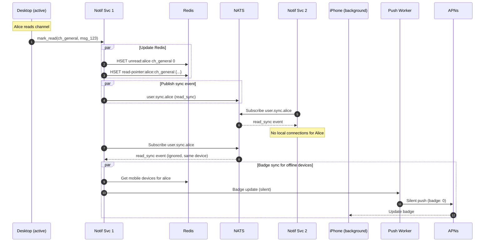

# Multi-Device Synchronization

**Author:** Architecture Team
**Status:** Draft
**Last Updated:** 2026-02-01

---

## Table of Contents

1. [Overview](#1-overview)
2. [Device Model](#2-device-model)
3. [Connection Management](#3-connection-management)
4. [Read State Synchronization](#4-read-state-synchronization)
5. [Badge & Unread Count Sync](#5-badge--unread-count-sync)
6. [Notification Deduplication](#6-notification-deduplication)
7. [Presence Aggregation](#7-presence-aggregation)
8. [Typing Indicator Sync](#8-typing-indicator-sync)
9. [Draft Synchronization](#9-draft-synchronization)
10. [Event Flow](#10-event-flow)
11. [Data Stores](#11-data-stores)
12. [Failure Scenarios](#12-failure-scenarios)

---

## 1. Overview

Users access the platform from multiple devices simultaneously — desktop browsers, desktop apps, mobile phones, and tablets. The system must ensure consistent state across all devices for:

- **Unread counts** — When a message is read on any device, all devices reflect this
- **Badge counts (red dots)** — Mobile app badges stay in sync with actual unread state
- **Read receipts** — Reading on mobile marks as read everywhere
- **Presence** — User shows "online" if ANY device is connected
- **Notifications** — Avoid duplicate notifications across devices

### Design Principles

1. **Consistency** — All devices converge to the same state within 2 seconds
2. **Efficiency** — Sync operations are O(devices) not O(channels)
3. **Offline tolerance** — Devices reconnecting receive accumulated state changes
4. **Battery awareness** — Minimize push notification noise for active users

---

## 2. Device Model

### Device Registration

Each device is assigned a unique `device_id` upon first connection. This ID persists across app restarts.

```
Device ID Format: dev_{platform}_{uuid}
Examples:
  - dev_ios_01HZ4L3K9N7M2P5Q8R...
  - dev_android_01HZ4M7K2N9P3Q5R...
  - dev_web_01HZ4N2K5M8P1Q3R...
  - dev_desktop_01HZ4P5K8N2M4Q1R...
```

### MongoDB Schema: `devices` Collection

```javascript
{
  "_id": "dev_ios_01HZ4L3K9N7M2P5Q8R...",
  "user_id": "usr_alice",
  "platform": "ios",                    // ios | android | web | desktop_mac | desktop_win
  "app_version": "4.2.1",
  "os_version": "iOS 17.4",
  "device_name": "Alice's iPhone 15",   // User-friendly name
  "push_token": "abc123...",            // APNs or FCM token
  "push_enabled": true,

  // Capabilities
  "capabilities": {
    "rich_notifications": true,
    "inline_reply": true,
    "notification_actions": true
  },

  // Activity tracking
  "created_at": "2026-01-15T08:00:00Z",
  "last_active_at": "2026-02-01T10:35:00Z",
  "last_ip": "192.168.1.100",

  // Session info
  "current_session_id": "sess_01HZ4Q...",
  "notification_service_instance": "notif-svc-us-east-3"
}
```

### Device Limits

| Platform | Max Devices per User |
|----------|---------------------|
| iOS | 5 |
| Android | 5 |
| Web | 10 (sessions) |
| Desktop | 3 |
| **Total** | 23 |

When limit is exceeded, oldest inactive device is automatically deregistered.

---

## 3. Connection Management

### Multi-Connection Architecture

```
                              ┌─────────────────────────────────────────┐
                              │            User: Alice                   │
                              │                                          │
    ┌──────────────┐          │  ┌─────────────┐    ┌─────────────┐     │
    │ Notif Svc    │◄─────────┼──│ Desktop Mac │    │  iPhone     │─────┼───►┌──────────────┐
    │ US-East-1    │          │  │ (active)    │    │ (background)│     │    │ Notif Svc    │
    └──────────────┘          │  └─────────────┘    └─────────────┘     │    │ US-East-2    │
                              │                                          │    └──────────────┘
                              │  ┌─────────────┐    ┌─────────────┐     │
    ┌──────────────┐          │  │ iPad        │    │ Web Browser │─────┼───►┌──────────────┐
    │ Notif Svc    │◄─────────┼──│ (sleeping)  │    │ (tab hidden)│     │    │ Notif Svc    │
    │ US-West-1    │          │  └─────────────┘    └─────────────┘     │    │ US-East-3    │
    └──────────────┘          │                                          │    └──────────────┘
                              └─────────────────────────────────────────┘
```

### Redis: Active Connections

Each device's connection is tracked independently:

```
Key: conn:{user_id}:{device_id}
Type: Hash
Value: {
  "instance_id": "notif-svc-us-east-1",
  "connected_at": "2026-02-01T10:30:00Z",
  "client_state": "active",             // active | idle | background
  "focused_channel": "ch_general",      // Currently viewing
  "last_activity": "2026-02-01T10:35:00Z"
}
TTL: 120s (refreshed via heartbeat)
```

### Client State Transitions

```
                      ┌─────────────┐
                      │   active    │ ◄──── User interacting
                      └──────┬──────┘
                             │ 60s no interaction
                             ▼
                      ┌─────────────┐
                      │    idle     │ ◄──── Tab visible, no input
                      └──────┬──────┘
                             │ Tab hidden / app background
                             ▼
                      ┌─────────────┐
                      │ background  │ ◄──── Not visible
                      └──────┬──────┘
                             │ WebSocket closed
                             ▼
                      ┌─────────────┐
                      │disconnected │ ◄──── No connection
                      └─────────────┘
```

### Heartbeat Protocol

Clients send heartbeats every 30 seconds:

```json
{
  "type": "heartbeat",
  "device_id": "dev_ios_01HZ4L...",
  "state": "active",
  "focused_channel": "ch_general",
  "client_timestamp": "2026-02-01T10:35:00Z"
}
```

Server updates Redis TTL and `last_activity` on each heartbeat.

---

## 4. Read State Synchronization

### Problem

When Alice reads messages on her iPhone, her desktop browser must:
1. Clear the unread indicator for that channel
2. Update the badge count in the channel list
3. Not re-notify for messages she already read

### Solution: Cross-Device Read Propagation

```
┌─────────────┐     mark_read      ┌──────────────┐
│   iPhone    │──────────────────►│  Notif Svc   │
│             │                    │  US-East-2   │
└─────────────┘                    └──────┬───────┘
                                          │
                                          │ 1. Update Redis read pointer
                                          │ 2. Publish sync event
                                          ▼
                                   ┌──────────────┐
                                   │    NATS      │
                                   │ user.sync.   │
                                   │ {user_id}    │
                                   └──────┬───────┘
                                          │
              ┌───────────────────────────┼───────────────────────────┐
              │                           │                           │
              ▼                           ▼                           ▼
       ┌──────────────┐           ┌──────────────┐           ┌──────────────┐
       │  Notif Svc   │           │  Notif Svc   │           │  Notif Svc   │
       │  US-East-1   │           │  US-East-3   │           │  US-West-1   │
       └──────┬───────┘           └──────┬───────┘           └──────┬───────┘
              │                           │                           │
              ▼                           ▼                           ▼
       ┌─────────────┐             ┌─────────────┐             ┌─────────────┐
       │Desktop Mac  │             │ Web Browser │             │    iPad     │
       │(clear badge)│             │(clear badge)│             │  (sleeping) │
       └─────────────┘             └─────────────┘             └─────────────┘
```

### NATS Subject: User Sync Events

```
Subject: user.sync.{user_id}
Type: Core NATS (ephemeral, no persistence needed)

Payload: {
  "type": "read_sync",
  "channel_id": "ch_general",
  "last_read_id": "msg_01HZ4L...",
  "last_read_at": "2026-02-01T10:35:00Z",
  "source_device": "dev_ios_01HZ4L...",
  "user_id": "usr_alice"
}
```

### Notification Service: Sync Event Handler

```go
func (ns *NotificationService) handleUserSyncEvent(event UserSyncEvent) {
    // Find all connections for this user EXCEPT the source device
    connections := ns.getLocalConnectionsForUser(event.UserID)

    for _, conn := range connections {
        if conn.DeviceID == event.SourceDevice {
            continue // Don't echo back to originating device
        }

        // Push sync event to device
        conn.Send(WebSocketMessage{
            Type: "sync.read",
            Payload: ReadSyncPayload{
                ChannelID:  event.ChannelID,
                LastReadID: event.LastReadID,
                LastReadAt: event.LastReadAt,
            },
        })
    }
}
```

### Client-Side Handler

```typescript
// When receiving sync.read from another device
websocket.on('sync.read', (payload: ReadSyncPayload) => {
  // Update local state immediately
  channelStore.updateReadState(payload.channelId, {
    lastReadId: payload.lastReadId,
    lastReadAt: payload.lastReadAt,
  });

  // Recalculate unread count
  const unreadCount = channelStore.calculateUnreadCount(payload.channelId);
  channelStore.setUnreadCount(payload.channelId, unreadCount);

  // Update UI (remove red dot if unreadCount === 0)
  notificationBadge.update(payload.channelId, unreadCount);
});
```

---

## 5. Badge & Unread Count Sync

### Unread Count Architecture

```
┌─────────────────────────────────────────────────────────────────────────────┐
│                         Unread Count Sources                                 │
│                                                                              │
│  ┌──────────────────────────────────────────────────────────────────────┐   │
│  │                    Redis: Per-User Unread Tracking                    │   │
│  │                                                                       │   │
│  │  Key: unread:{user_id}                                               │   │
│  │  Type: Hash                                                          │   │
│  │  Fields:                                                             │   │
│  │    ch_general: 5                                                     │   │
│  │    dm_alice_bob: 2                                                   │   │
│  │    ch_engineering: 0                                                 │   │
│  │    _total: 7                                                         │   │
│  │    _mentions: 3                                                      │   │
│  │                                                                       │   │
│  └──────────────────────────────────────────────────────────────────────┘   │
│                                                                              │
│  ┌──────────────────────────────────────────────────────────────────────┐   │
│  │                    Redis: Read Pointers                               │   │
│  │                                                                       │   │
│  │  Key: read-pointer:{user_id}:{channel_id}                            │   │
│  │  Value: { "last_read_id": "msg_01HZ4L...", "last_read_at": "..." }   │   │
│  │                                                                       │   │
│  └──────────────────────────────────────────────────────────────────────┘   │
└─────────────────────────────────────────────────────────────────────────────┘
```

### Unread Increment Flow

When a new message arrives:

```go
func (fw *FanOutWorker) processMessage(msg MessageEvent) {
    members := fw.getChannelMembers(msg.ChannelID)

    for _, memberID := range members {
        // Skip the sender
        if memberID == msg.SenderID {
            continue
        }

        // Increment unread count atomically
        pipe := redis.Pipeline()
        pipe.HIncrBy(ctx, "unread:"+memberID, msg.ChannelID, 1)
        pipe.HIncrBy(ctx, "unread:"+memberID, "_total", 1)

        if msg.MentionsUser(memberID) {
            pipe.HIncrBy(ctx, "unread:"+memberID, "_mentions", 1)
        }
        pipe.Exec(ctx)

        // Route message to user's devices...
    }
}
```

### Unread Decrement Flow (Mark as Read)

```go
func (ns *NotificationService) markChannelRead(userID, channelID, lastReadMsgID string) {
    ctx := context.Background()

    // Get current unread count for this channel
    prevCount, _ := redis.HGet(ctx, "unread:"+userID, channelID).Int()

    // Calculate mentions in the read range
    mentionsCleared := ns.countMentionsInRange(userID, channelID, lastReadMsgID)

    // Atomic update
    pipe := redis.Pipeline()
    pipe.HSet(ctx, "unread:"+userID, channelID, 0)
    pipe.HIncrBy(ctx, "unread:"+userID, "_total", -prevCount)
    pipe.HIncrBy(ctx, "unread:"+userID, "_mentions", -mentionsCleared)

    // Update read pointer
    pipe.HSet(ctx, "read-pointer:"+userID+":"+channelID, map[string]interface{}{
        "last_read_id": lastReadMsgID,
        "last_read_at": time.Now().UTC().Format(time.RFC3339),
    })
    pipe.Exec(ctx)

    // Publish sync event to other devices
    ns.publishUserSync(UserSyncEvent{
        Type:         "read_sync",
        UserID:       userID,
        ChannelID:    channelID,
        LastReadID:   lastReadMsgID,
        SourceDevice: ns.currentDeviceID,
    })
}
```

### Mobile Badge Count Sync

Mobile platforms (iOS/Android) display a badge count on the app icon. This must reflect total unread or mention count.

```
┌─────────────────────────────────────────────────────────────────────────────┐
│                        Badge Count Update Flow                               │
│                                                                              │
│  1. Message arrives → unread count incremented                              │
│  2. Push notification sent with badge count                                 │
│  3. User reads on desktop → unread count decremented                        │
│  4. Silent push sent to mobile to update badge                              │
│                                                                              │
│  ┌─────────────┐    read on desktop    ┌──────────────┐                     │
│  │   Desktop   │───────────────────────│ Notif Svc    │                     │
│  └─────────────┘                       └──────┬───────┘                     │
│                                               │                              │
│                                               │ Silent badge update          │
│                                               ▼                              │
│                                        ┌──────────────┐                     │
│                                        │ Push Worker  │                     │
│                                        └──────┬───────┘                     │
│                                               │                              │
│                         ┌─────────────────────┴─────────────────────┐       │
│                         │                                           │       │
│                         ▼                                           ▼       │
│                  ┌─────────────┐                            ┌─────────────┐ │
│                  │    APNs     │                            │    FCM      │ │
│                  │badge update │                            │badge update │ │
│                  └──────┬──────┘                            └──────┬──────┘ │
│                         │                                           │       │
│                         ▼                                           ▼       │
│                  ┌─────────────┐                            ┌─────────────┐ │
│                  │   iPhone    │                            │   Android   │ │
│                  │ badge: 5→2  │                            │ badge: 5→2  │ │
│                  └─────────────┘                            └─────────────┘ │
└─────────────────────────────────────────────────────────────────────────────┘
```

### Silent Badge Update Payload

**APNs (iOS):**
```json
{
  "aps": {
    "badge": 2,
    "content-available": 1
  },
  "badge_type": "sync",
  "total_unread": 2,
  "total_mentions": 1
}
```

**FCM (Android):**
```json
{
  "data": {
    "type": "badge_sync",
    "badge": "2",
    "total_unread": "2",
    "total_mentions": "1"
  },
  "android": {
    "priority": "normal"
  }
}
```

### Badge Update Trigger

```go
func (ns *NotificationService) triggerBadgeSync(userID string) {
    // Get current total unread
    totalUnread, _ := redis.HGet(ctx, "unread:"+userID, "_total").Int()
    totalMentions, _ := redis.HGet(ctx, "unread:"+userID, "_mentions").Int()

    // Find all mobile devices for user
    devices := ns.getMobileDevices(userID)

    for _, device := range devices {
        // Skip devices with active WebSocket (they're already synced)
        if ns.hasActiveConnection(userID, device.ID) {
            continue
        }

        // Send silent push to update badge
        ns.publishBadgeUpdate(PushEvent{
            UserID:        userID,
            DeviceID:      device.ID,
            PushToken:     device.PushToken,
            Platform:      device.Platform,
            TotalUnread:   totalUnread,
            TotalMentions: totalMentions,
            Silent:        true,
        })
    }
}
```

---

## 6. Notification Deduplication

### Problem

When Alice receives a message, she should NOT get:
- Push notification on iPhone if she's active on Desktop
- Push notification on both iPhone AND iPad
- Multiple notifications for rapid-fire messages

### Active Device Detection

Before sending a push notification, check if user has any active device:

```go
func (pw *PushWorker) shouldSendPush(userID string, event PushEvent) bool {
    // Get all connections for user
    pattern := "conn:" + userID + ":*"
    keys, _ := redis.Keys(ctx, pattern).Result()

    for _, key := range keys {
        conn, _ := redis.HGetAll(ctx, key).Result()

        // User is actively using a device - skip push
        if conn["client_state"] == "active" {
            return false
        }

        // User has idle connection viewing the same channel - skip push
        if conn["client_state"] == "idle" &&
           conn["focused_channel"] == event.ChannelID {
            return false
        }
    }

    // No active or focused connections - send push
    return true
}
```

### Device Priority for Push

When multiple devices are offline, choose the most appropriate device:

```go
type DevicePriority struct {
    DeviceID string
    Score    int
}

func (pw *PushWorker) selectPushDevices(userID string, devices []Device) []Device {
    var priorities []DevicePriority

    for _, device := range devices {
        score := 0

        // Prefer recently active devices
        timeSinceActive := time.Since(device.LastActiveAt)
        if timeSinceActive < 5*time.Minute {
            score += 100
        } else if timeSinceActive < 1*time.Hour {
            score += 50
        }

        // Prefer primary device (user-configured)
        if device.IsPrimary {
            score += 200
        }

        // Prefer mobile over desktop for push
        if device.Platform == "ios" || device.Platform == "android" {
            score += 30
        }

        priorities = append(priorities, DevicePriority{
            DeviceID: device.ID,
            Score:    score,
        })
    }

    // Sort by score descending
    sort.Slice(priorities, func(i, j int) bool {
        return priorities[i].Score > priorities[j].Score
    })

    // Return top device (or top 2 if close scores)
    return pw.selectTopDevices(priorities, devices)
}
```

### Notification Coalescing

Multiple messages in quick succession are collapsed:

```go
// Redis key for coalescing window
// Key: push-coalesce:{user_id}:{channel_id}
// TTL: 5 seconds

func (pw *PushWorker) coalesceNotification(userID, channelID string, msg MessageEvent) {
    key := fmt.Sprintf("push-coalesce:%s:%s", userID, channelID)

    // Try to increment existing coalesce window
    count, err := redis.Incr(ctx, key).Result()
    if err != nil {
        return
    }

    if count == 1 {
        // First message in window - set TTL and schedule delayed push
        redis.Expire(ctx, key, 5*time.Second)
        pw.schedulePush(userID, channelID, 5*time.Second)
    }
    // Subsequent messages just increment counter
}

func (pw *PushWorker) sendCoalescedPush(userID, channelID string) {
    key := fmt.Sprintf("push-coalesce:%s:%s", userID, channelID)
    count, _ := redis.Get(ctx, key).Int()
    redis.Del(ctx, key)

    if count == 1 {
        // Single message - send normal notification
        pw.sendSingleMessagePush(userID, channelID)
    } else {
        // Multiple messages - send summary
        pw.sendPush(userID, PushPayload{
            Title: channelName,
            Body:  fmt.Sprintf("%d new messages", count),
        })
    }
}
```

---

## 7. Presence Aggregation

### Multi-Device Presence

User presence is aggregated across all devices:

```
User Presence = MAX(device_1_state, device_2_state, ..., device_n_state)

Where: active > idle > away > offline
```

### Redis: Aggregated Presence

```
Key: presence:{user_id}
Type: Hash
Value: {
  "status": "online",              // Aggregated: online | idle | away | offline
  "status_text": "In a meeting",   // Custom status message
  "status_emoji": ":calendar:",
  "last_active": "2026-02-01T10:35:00Z",
  "active_device_count": 2
}
TTL: none
```

### Presence Aggregation Logic

```go
func (ns *NotificationService) aggregatePresence(userID string) Presence {
    // Get all device connections
    pattern := "conn:" + userID + ":*"
    keys, _ := redis.Keys(ctx, pattern).Result()

    maxState := "offline"
    activeCount := 0
    var lastActivity time.Time

    for _, key := range keys {
        conn, _ := redis.HGetAll(ctx, key).Result()
        deviceState := conn["client_state"]

        activeCount++

        // Update max state
        if stateRank(deviceState) > stateRank(maxState) {
            maxState = deviceState
        }

        // Track most recent activity
        connActivity, _ := time.Parse(time.RFC3339, conn["last_activity"])
        if connActivity.After(lastActivity) {
            lastActivity = connActivity
        }
    }

    // Map device states to presence
    presence := mapDeviceStateToPresence(maxState, activeCount)

    return Presence{
        Status:            presence,
        LastActive:        lastActivity,
        ActiveDeviceCount: activeCount,
    }
}

func stateRank(state string) int {
    switch state {
    case "active":
        return 3
    case "idle":
        return 2
    case "background":
        return 1
    default:
        return 0
    }
}

func mapDeviceStateToPresence(state string, deviceCount int) string {
    if deviceCount == 0 {
        return "offline"
    }
    switch state {
    case "active":
        return "online"
    case "idle":
        return "idle"
    case "background":
        return "away"
    default:
        return "offline"
    }
}
```

### Presence Change Broadcast

When aggregated presence changes, broadcast to relevant users:

```go
func (ns *NotificationService) onPresenceChange(userID string, oldPresence, newPresence Presence) {
    if oldPresence.Status == newPresence.Status {
        return // No change in aggregated status
    }

    // Publish presence change event
    ns.nats.Publish("presence.changed."+userID, PresenceEvent{
        UserID:     userID,
        Status:     newPresence.Status,
        LastActive: newPresence.LastActive,
    })
}
```

---

## 8. Typing Indicator Sync

### Cross-Device Typing

When Alice starts typing on her phone, her desktop should NOT show a duplicate typing indicator for herself.

```go
func (ns *NotificationService) handleTypingStart(userID, channelID, deviceID string) {
    // Publish typing indicator
    ns.nats.Publish("typing."+channelID, TypingEvent{
        UserID:    userID,
        ChannelID: channelID,
        DeviceID:  deviceID,  // Include source device
        Action:    "start",
    })
}

func (ns *NotificationService) routeTypingIndicator(event TypingEvent) {
    members := ns.getChannelMembers(event.ChannelID)

    for _, memberID := range members {
        connections := ns.getLocalConnectionsForUser(memberID)

        for _, conn := range connections {
            // Don't show self-typing indicator
            if memberID == event.UserID {
                continue
            }

            conn.Send(WebSocketMessage{
                Type:    "typing",
                Payload: event,
            })
        }
    }
}
```

---

## 9. Draft Synchronization

### Problem

User starts composing a message on desktop, wants to continue on mobile.

### Solution: Per-Channel Draft Storage

```
Key: draft:{user_id}:{channel_id}
Type: Hash
Value: {
  "text": "Hey, I was thinking about...",
  "reply_to": "msg_01HZ4L...",           // If replying to a message
  "attachments": ["file_01HZ...", ...],  // Pending attachment IDs
  "updated_at": "2026-02-01T10:35:00Z",
  "device_id": "dev_ios_01HZ..."
}
TTL: 7 days
```

### Draft Sync Flow

```typescript
// Client: Save draft on text change (debounced 2 sec)
const saveDraft = debounce(async (channelId: string, draft: Draft) => {
  await api.put(`/channels/${channelId}/draft`, draft);
}, 2000);

// Server: Broadcast draft update to other devices
func (ns *NotificationService) saveDraft(userID, channelID string, draft Draft) {
    // Save to Redis
    redis.HSet(ctx, "draft:"+userID+":"+channelID, draft)

    // Sync to other devices
    ns.publishUserSync(UserSyncEvent{
        Type:         "draft_sync",
        UserID:       userID,
        ChannelID:    channelID,
        Draft:        draft,
        SourceDevice: ns.currentDeviceID,
    })
}
```

---

## 10. Event Flow

### Complete Multi-Device Event Flow



---

## 11. Data Stores

### Redis Keys Summary

| Key Pattern | Type | Purpose | TTL |
|-------------|------|---------|-----|
| `conn:{user_id}:{device_id}` | Hash | Active WebSocket connection | 120s |
| `unread:{user_id}` | Hash | Per-channel unread counts | None |
| `read-pointer:{user_id}:{channel_id}` | Hash | Last read message | None |
| `presence:{user_id}` | Hash | Aggregated presence | None |
| `draft:{user_id}:{channel_id}` | Hash | Message draft | 7 days |
| `push-coalesce:{user_id}:{channel_id}` | String | Notification coalescing | 5s |

### MongoDB Collections

| Collection | Purpose |
|------------|---------|
| `devices` | Device registration and metadata |
| `user_preferences` | Notification settings, primary device |

### NATS Subjects

| Subject | Type | Purpose |
|---------|------|---------|
| `user.sync.{user_id}` | Core NATS | Cross-device state sync |
| `presence.changed.{user_id}` | Core NATS | Presence broadcasts |
| `typing.{channel_id}` | Core NATS | Typing indicators |

---

## 12. Failure Scenarios

### Scenario 1: Device Disconnect During Read

**Problem:** Desktop disconnects immediately after marking as read, before sync event propagates.

**Solution:** Read pointer is persisted to Redis before sync event is published. On reconnect:
1. Client fetches current read pointer from server
2. Compares with local state
3. Uses server state as source of truth

### Scenario 2: Redis Failover During Unread Update

**Problem:** Redis primary fails mid-transaction.

**Solution:**
- Redis Sentinel automatic failover
- Unread counts are eventually consistent
- Client can request full unread recalculation on demand

### Scenario 3: Push Token Becomes Invalid

**Problem:** User reinstalls app, old push token is invalid.

**Solution:**
- APNs/FCM return token invalid error
- Push Worker marks device as `push_invalid`
- Next app launch registers new token
- Old device entry is updated

### Scenario 4: Stale Badge on Long-Offline Device

**Problem:** Phone was offline for days, badge shows old count.

**Solution:**
- On app launch, fetch current unread count from server
- Update local badge immediately
- Silent push is just an optimization, not required for correctness

---

## Related Documents

- [ADR-008: Hybrid Read Receipts](../adrs/ADR-008-hybrid-receipts.md)
- [Receipts Feature](./receipts.md)
- [Push Notifications Feature](./push-notifications.md)
- [Reconnection Feature](./reconnection.md)
