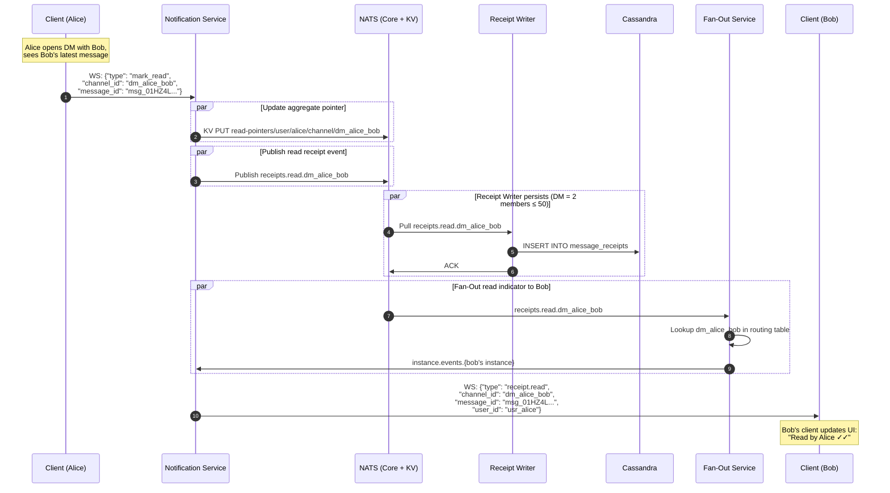

# Read & Delivery Receipts

**Author:** Architecture Team
**Status:** Draft
**Last Updated:** 2026-02-01

---

## Table of Contents

1. [Problem Statement](#1-problem-statement)
2. [Write Amplification Analysis](#2-write-amplification-analysis)
3. [Hybrid Receipt Design](#3-hybrid-receipt-design)
4. [Per-Message Receipts (Small Groups)](#4-per-message-receipts-small-groups)
5. [Aggregate Last-Read Pointer (Large Channels)](#5-aggregate-last-read-pointer-large-channels)
6. [Delivery Receipts](#6-delivery-receipts)
7. [Event Model](#7-event-model)
8. [Sequence Diagram](#8-sequence-diagram)

---

## 1. Problem Statement

Users expect to see "read by" indicators in DMs and small groups, and basic "someone has read up to here" markers in larger channels. However, naively storing a per-user-per-message receipt creates massive write amplification.

---

## 2. Write Amplification Analysis

| Metric | Value |
|--------|-------|
| Global message rate | 50,000 msg/sec |
| Average channel size (weighted) | ~50 members |
| Average read ratio within 1 hour | ~30% of members |
| **Per-message receipt writes** | 50K × 50 × 0.30 = **750K writes/sec** |
| Peak (viral message in 100K channel) | **30K writes/sec for one message** |

At 750K receipt writes/sec, the receipt table alone would generate **more write volume than the message table itself** (~50K writes/sec). This is unsustainable.

---

## 3. Hybrid Receipt Design

| Option | Description | Write Volume | Granularity |
|--------|-------------|--------------|-------------|
| **A: Per-message receipts** | One row per (message, user) | 750K/sec | "Who read message X?" |
| **B: Aggregate pointer** | One pointer per (user, channel) | ~600/sec | "User read up to message Y" |
| **C: Hybrid (chosen)** | Per-message for small groups, aggregate for large | ~10K/sec | Best of both |

**Threshold:** Channels with ≤ 50 members use per-message receipts. Channels with > 50 members use aggregate pointers only.

---

## 4. Per-Message Receipts (Small Groups)

### Cassandra Schema

```sql
CREATE TABLE message_receipts (
    channel_id  text,
    message_id  timeuuid,
    user_id     text,
    receipt_type text,           -- 'delivered' | 'read'
    timestamp   timestamp,
    PRIMARY KEY ((channel_id, message_id), user_id)
) WITH CLUSTERING ORDER BY (user_id ASC)
  AND default_time_to_live = 7776000;  -- 90-day TTL
```

### Write Path

- **`delivered`:** Written by Notification Service when it pushes the message over WebSocket. Published to `receipts.delivered.{channel_id}`
- **`read`:** Written when client sends `{"type": "mark_read", "channel_id": "...", "message_id": "..."}`. Published to `receipts.read.{channel_id}`
- A **Receipt Writer Worker** consumes these events and writes to Cassandra

### Read Path (UI)

```sql
-- "Who read this message?"
SELECT user_id, receipt_type, timestamp
FROM message_receipts
WHERE channel_id = ? AND message_id = ?;
```

### Fan-out for "read" Indicators

When a user reads a message in a small group, the `receipts.read` event is fan-out via the existing channel fan-out path to all other group members. Their clients update the "read by" UI.

---

## 5. Aggregate Last-Read Pointer (Large Channels)

### Redis Key: `read-pointer:{user_id}:{channel_id}`

```
Key: read-pointer:{user_id}:{channel_id}
Type: Hash
Value: {
  "last_read_id": "msg_01HZ4L...",
  "last_read_at": "2026-02-01T10:35:00Z"
}
TTL: none (persistent)
```

### Write Path

- When a user opens a channel or scrolls to the bottom, the client sends: `{"type": "mark_read", "channel_id": "ch_general", "message_id": "msg_01HZ4L..."}`
- The Notification Service updates the Redis pointer. No Cassandra write needed.
- Write volume: one Redis HSET per "channel open" event per user — approximately **600 updates/sec** at 100K online users

**No per-message "read by" UI** for large channels. The UI only shows "X has read up to here" or unread counts.

---

## 6. Delivery Receipts

**Delivery receipts are generated server-side** by the Notification Service, not by the client. When the Notification Service pushes a message over WebSocket, it emits a delivery event:

```
Core NATS: receipts.delivered.{channel_id}
Payload: {"message_id": "msg_01HZ...", "user_id": "usr_alice", "delivered_at": "..."}
```

- **For DMs/small groups:** The Receipt Writer Worker stores this in `message_receipts`
- **For large channels:** Delivery receipts are **not stored** — only the aggregate read pointer matters

---

## 7. Event Model

### New NATS Subjects (Core NATS, Ephemeral)

```
receipts.delivered.{channel_id}   — Server-generated delivery confirmation
receipts.read.{channel_id}        — Client-triggered read confirmation
```

### New JetStream Stream (Small Groups Only)

```
Stream: RECEIPTS
  Subjects: receipts.>
  Retention: WorkQueue (removed after ack)
  Replicas: 3
  Max Age: 7 days

Consumer: receipt-writer-pool
  Type: Pull, Durable
  Filter: receipts.>
```

**Optimization:** The Command Service attaches `channel_member_count` to every message event. The Receipt Writer checks this and only persists receipts for channels ≤ 50 members.

---

## 8. Sequence Diagram



---

## Related ADR

- [ADR-008: Hybrid Read Receipts](../adrs/ADR-008-hybrid-receipts.md)
