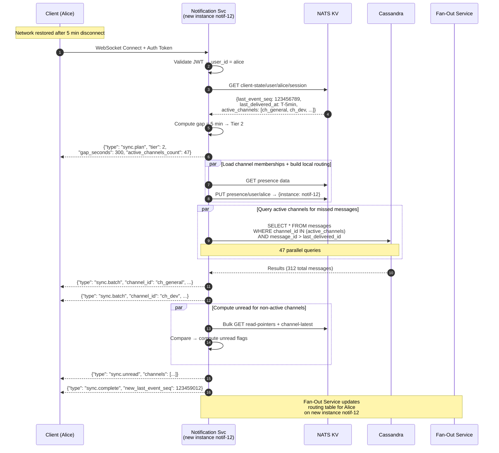

# Client Reconnection Protocol

**Author:** Architecture Team
**Status:** Draft
**Last Updated:** 2026-02-01

---

## Table of Contents

1. [Problem Statement](#1-problem-statement)
2. [Server-Side State](#2-server-side-state)
3. [Tiered Catchup Strategy](#3-tiered-catchup-strategy)
4. [Client-Side Protocol](#4-client-side-protocol)
5. [Sequence Diagram](#5-sequence-diagram)

---

## 1. Problem Statement

When a client disconnects (network failure, app backgrounded, device sleep, etc.) and reconnects:

1. It may reconnect to a **different Notification Service instance** than before
2. It needs to determine **which events it missed** during the disconnection
3. It must **sync its local state** (unread counts, thread updates, presence changes) without overwhelming the server

A user with 100K channel memberships cannot receive full catchup data for all channels on every reconnect — the design must be selective and tiered.

---

## 2. Server-Side State

### NATS KV Bucket: `client-state`

```
Key: user/{user_id}/session
Value: {
  "last_event_seq": 123456789,       // JetStream sequence of last event delivered
  "last_delivered_at": "2026-02-01T10:30:00Z",
  "instance_id": "notif-07",         // which Notification Service instance was serving them
  "active_channels": ["ch_general", "ch_dev", ...],  // top 50 recently active channels
  "active_threads": ["msg_01HZ3K...", ...]  // threads with recent activity
}
TTL: 24 hours
```

**Written by:** Notification Service — updates `last_event_seq` periodically (every 5 seconds or every 100 events) and on clean disconnect.

**Crash handling:** If the Notification Service crashes without writing a final state, the `last_event_seq` may be slightly stale (up to 5 seconds of events could be re-delivered). The client de-duplicates using `message_id`.

---

## 3. Tiered Catchup Strategy

The reconnection protocol uses a tiered approach based on disconnection duration:

| Tier | Gap Duration | Data Source | Cost |
|------|-------------|-------------|------|
| **Tier 1** | < 2 min | JetStream replay | No DB query |
| **Tier 2** | 2 min – 1 hr | Cassandra (active channels only) | ~50 parallel queries |
| **Tier 3** | 1 hr – 24 hr | Unread counts only | KV reads only |
| **Tier 4** | > 24 hr | Full refresh, on demand | REST API |

### Tier 1 — Short Gap (< 2 minutes)

- **Source:** NATS JetStream replay from MESSAGES stream
- **Method:** Notification Service creates a temporary ephemeral consumer starting at `last_event_seq + 1`
- **Filter:** Only events for subjects matching the user's channel memberships
- **Delivery:** Missed events streamed directly over WebSocket
- **Cost:** JetStream seek + filter — no database query. Sub-second catchup.
- **Why 2 minutes?** At 50K msg/sec globally, a 2-minute gap contains ~6M messages. A user in 200 active channels might have missed ~200–2000 messages. JetStream can filter and replay these in < 1 second.

### Tier 2 — Medium Gap (2 minutes – 1 hour)

- **Source:** Cassandra `messages` table
- **Method:** Query the user's **active channels** (from `client-state` KV, top 50) for messages after `last_delivered_at`
- **Optimization:** Batch queries — query multiple channels in parallel
- **Delivery:** Missed messages delivered as a batch:
  ```json
  {"type": "sync.batch", "channel_id": "ch_general",
   "messages": [...], "has_more": false}
  ```
- **For non-active channels:** Skip message catchup; compute unread count only
- **Cost:** 50 parallel Cassandra queries × ~1ms each = ~10–50ms total

### Tier 3 — Long Gap (1 hour – 24 hours)

- **Source:** NATS KV (`channel-latest` + `read-pointers` buckets)
- **Method:** Compute unread status per channel by comparing read pointers with channel latest
- **Delivery:**
  ```json
  {"type": "sync.unread", "channels": [
    {"channel_id": "ch_general", "unread": true, "unread_count": 42,
     "last_message_at": "2026-02-01T10:30:00Z", "last_sender": "usr_bob"},
    {"channel_id": "ch_dev", "unread": true, "unread_count": 7, ...}
  ]}
  ```
- **Client behavior:** Shows unread indicators. Fetches actual messages via REST when user opens a channel.
- **Cost:** NATS KV bulk read — sub-millisecond per key

### Tier 4 — Very Long Gap (> 24 hours)

- **Method:** Full channel list refresh via REST API. No WebSocket-based catchup.
- **Delivery:** Server sends only the channel list with unread flags for the top 100 channels by recent activity. Everything else loads on demand.
- **Rationale:** After 24 hours, the user's local state is too stale for incremental sync.

---

## 4. Client-Side Protocol

### Connection Handshake

```json
// Client → Server: after WebSocket auth succeeds
{"type": "sync.request",
 "last_event_seq": 123456789,
 "disconnected_at": "2026-02-01T10:28:00Z",
 "client_version": "2.0.0"}

// Server → Client: sync plan
{"type": "sync.plan",
 "tier": 2,
 "gap_seconds": 180,
 "active_channels_count": 47,
 "estimated_messages": 312}

// Server → Client: sync data (streamed)
{"type": "sync.batch", "channel_id": "ch_general",
 "messages": [...], "has_more": false}
{"type": "sync.batch", "channel_id": "ch_dev",
 "messages": [...], "has_more": false}

{"type": "sync.unread", "channels": [
  {"channel_id": "ch_old_project", "unread": true, "unread_count": 99}
]}

// Server → Client: sync complete
{"type": "sync.complete", "new_last_event_seq": 123459012}
```

### Client De-duplication

The client maintains a local set of recent `message_id` values (last 1000). During sync, any message already in the local set is skipped. This handles the case where `last_event_seq` in the server-side KV is slightly stale due to crash.

---

## 5. Sequence Diagram



---

## Related ADR

- [ADR-007: Tiered Client Reconnection Strategy](../adrs/ADR-007-tiered-reconnection.md)
