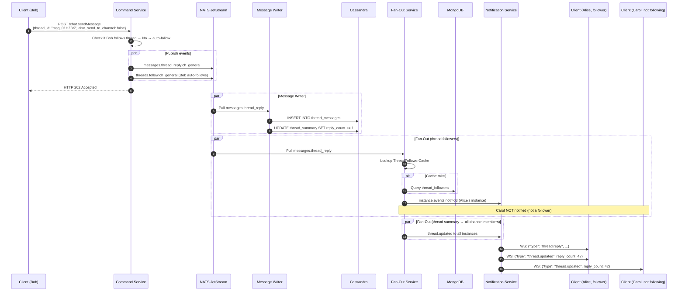

# Thread Support

**Author:** Architecture Team
**Status:** Draft
**Last Updated:** 2026-02-01

---

## Table of Contents

1. [Requirements](#1-requirements)
2. [Data Model — Cassandra](#2-data-model--cassandra)
3. [Thread Followers — MongoDB](#3-thread-followers--mongodb)
4. [Write Path — Dual Write Strategy](#4-write-path--dual-write-strategy)
5. [Event Model Changes](#5-event-model-changes)
6. [Fan-Out Service Changes](#6-fan-out-service-changes)
7. [Query Service Endpoints](#7-query-service-endpoints)
8. [Notification Service Events](#8-notification-service-events)
9. [Sequence Diagram](#9-sequence-diagram)

---

## 1. Requirements

Thread semantics follow the Rocket.Chat / Slack model:

- Any channel message can become a **thread root** when someone replies to it
- Thread replies are shown in a **thread panel** (sidebar)
- Thread replies can optionally be **"also sent to channel"**, appearing in the main channel timeline
- Users who reply to a thread automatically **follow** it (receive notifications for new replies)
- Users can manually follow or unfollow threads
- The thread root displays a denormalized **reply count** and **last reply timestamp**
- Thread replies inherit the channel's permissions

---

## 2. Data Model — Cassandra

Two new tables supplement the existing `messages` table:

### 2.1 `thread_messages` — Thread Reply Storage

```sql
CREATE TABLE thread_messages (
    thread_id     timeuuid,       -- message_id of the thread root message
    bucket        text,           -- daily bucket: YYYY-MM-DD
    message_id    timeuuid,       -- the reply's own message_id (TimeUUID)
    channel_id    text,           -- denormalized for display context
    sender_id     text,
    body          text,
    attachments   list<frozen<attachment_type>>,
    edited_at     timestamp,
    deleted       boolean,
    reactions     map<text, frozen<set<text>>>,
    created_at    timestamp,
    PRIMARY KEY ((thread_id, bucket), message_id)
) WITH CLUSTERING ORDER BY (message_id DESC)
  AND compaction = {'class': 'TimeWindowCompactionStrategy',
                    'compaction_window_size': 1,
                    'compaction_window_unit': 'DAYS'}
  AND default_time_to_live = 0;
```

**Partition design:** `(thread_id, bucket)` keeps thread replies co-located for efficient pagination. Most threads have < 1000 replies.

### 2.2 `thread_summary` — Thread-Level Metadata

```sql
CREATE TABLE thread_summary (
    channel_id      text,
    thread_id       timeuuid,       -- same as root message_id
    root_sender_id  text,
    root_body       text,           -- first 200 chars for preview
    reply_count     int,            -- updated via lightweight transaction
    last_reply_at   timestamp,
    last_reply_by   text,
    follower_count  int,
    PRIMARY KEY ((channel_id), thread_id)
) WITH CLUSTERING ORDER BY (thread_id DESC);
```

**Why not Cassandra counter columns?** Counters cannot coexist with non-counter columns. Using an `int` with CAS-based updates provides the same semantics.

---

## 3. Thread Followers — MongoDB

Thread followers are a mutable, queryable set — ideal for MongoDB:

```javascript
// MongoDB collection: thread_followers
{
  _id: ObjectId,
  thread_id: "msg_01HZ3K4M5N",      // references root message_id
  channel_id: "ch_general",
  user_id: "usr_alice",
  followed_at: ISODate("2026-02-01T10:30:00Z"),
  reason: "replied",                  // "replied" | "mentioned" | "manual"
  muted: false                        // user follows but has muted notifications
}

// Indexes:
// { thread_id: 1, user_id: 1 }  — unique, for follow/unfollow operations
// { user_id: 1, followed_at: -1 } — for "my threads" listing
// { thread_id: 1, muted: 1 }    — for notification routing
```

---

## 4. Write Path — Dual Write Strategy

When a thread reply arrives, the Message Writer performs **two writes**:

1. **Always:** Write to `thread_messages` table (for thread panel queries)
2. **If `also_send_to_channel: true`:** Write to `messages` table (for channel timeline)
3. **Always:** Update `thread_summary` (increment reply_count, update last_reply_at/last_reply_by)

Both writes target different Cassandra partitions and execute in parallel. The Message Writer acknowledges the NATS event only after both writes succeed.

---

## 5. Event Model Changes

### New NATS Subjects (MESSAGES stream)

```
messages.thread_reply.{channel_id}   → ThreadReply event (always published for replies)
messages.send.{channel_id}           → existing; published ADDITIONALLY if also_send_to_channel
```

### New NATS Subjects (META stream)

```
threads.follow.{channel_id}          → ThreadFollowed / ThreadUnfollowed event
```

### Updated Event Envelope for Thread Replies

```json
{
  "event_id": "evt_01HZ3K...",
  "event_type": "message.thread_reply",
  "timestamp": "2026-02-01T10:30:00.123Z",
  "correlation_id": "req_abc123",
  "actor": { "user_id": "usr_bob", "username": "bob" },
  "payload": {
    "message_id": "msg_01HZ4L...",
    "channel_id": "ch_general",
    "thread_id": "msg_01HZ3K...",
    "text": "Great point!",
    "also_send_to_channel": false,
    "attachments": []
  },
  "metadata": { "trace_id": "otel_trace_def" }
}
```

**Auto-follow on reply:** The Command Service checks if the replying user already follows the thread. If not, it also publishes a `threads.follow.{channel_id}` event.

---

## 6. Fan-Out Service Changes

### Problem

Thread replies that are NOT sent to the channel must still reach thread followers. The existing channel-level fan-out would send thread-only replies to ALL channel members instead of just followers.

### Solution: Lazy-loaded Thread Follower Cache

```go
type ThreadFollowerCache struct {
    mu      sync.RWMutex
    threads map[string]*ThreadEntry  // thread_id → entry
    lru     *lru.Cache               // eviction after 30 min inactivity
}

type ThreadEntry struct {
    ChannelID   string
    FollowerIDs map[string]struct{}   // user_ids following this thread
    LoadedAt    time.Time
}
```

### Fan-out Flow for Thread Replies

1. Fan-Out Worker receives the thread reply event
2. Checks `ThreadFollowerCache` for `thread_id`:
   - **Cache hit:** Use cached follower set
   - **Cache miss:** Query MongoDB, cache the result (~1–5ms latency penalty)
3. For each follower: look up their instance in the existing `UserIndex`
4. Publish a `thread.reply` event to each relevant instance inbox
5. The Notification Service routes it to the follower's WebSocket connection

**If `also_send_to_channel: true`:** The `messages.send.{channel_id}` event is ALSO published, triggering normal channel-level fan-out.

**Cache eviction:** LRU with 30-minute inactivity timeout. Memory impact: ~100 bytes per follower per cached thread.

---

## 7. Query Service Endpoints

| Endpoint | Method | Description |
|----------|--------|-------------|
| `/api/v1/chat.getThreadMessages` | GET | Paginated thread replies from `thread_messages` |
| `/api/v1/chat.getThreadsList` | GET | List threads in a channel from `thread_summary` |
| `/api/v1/chat.followThread` | POST | Follow a thread |
| `/api/v1/chat.unfollowThread` | POST | Unfollow a thread |
| `/api/v1/chat.getThreadFollowers` | GET | List followers of a thread |

---

## 8. Notification Service Events

### Server → Client

```json
// New thread reply (sent to thread followers)
{"type": "thread.reply", "channel_id": "ch_general", "thread_id": "msg_01HZ3K...",
 "message": {"message_id": "msg_01HZ4L...", "sender_id": "usr_bob",
 "text": "Great point!", "created_at": "2026-02-01T10:30:00Z"}}

// Thread summary update (sent to all channel members)
{"type": "thread.updated", "channel_id": "ch_general", "thread_id": "msg_01HZ3K...",
 "reply_count": 42, "last_reply_at": "2026-02-01T10:30:00Z",
 "last_reply_by": "usr_bob"}
```

The `thread.updated` event is published to all channel members so they can update the reply count badge on the thread root — even if they don't follow the thread.

---

## 9. Sequence Diagram



---

## Related ADR

- [ADR-006: Thread Storage — Separate Table with Dual Write](../adrs/ADR-006-thread-storage.md)
