# Thread Support

**Author:** Architecture Team
**Status:** Draft
**Last Updated:** 2026-02-01

---

## Table of Contents

1. [Requirements](#1-requirements)
2. [Data Model — Cassandra](#2-data-model--cassandra)
3. [Thread Followers — MongoDB](#3-thread-followers--mongodb)
4. [Write Path — Dual Write Strategy](#4-write-path--dual-write-strategy)
5. [Event Model Changes](#5-event-model-changes)
6. [Fan-Out Service Changes](#6-fan-out-service-changes)
7. [Query Service Endpoints](#7-query-service-endpoints)
8. [Notification Service Events](#8-notification-service-events)
9. [Sequence Diagram](#9-sequence-diagram)
10. [Threads View — Aggregated Thread List](#10-threads-view--aggregated-thread-list)

---

## 1. Requirements

Thread semantics follow the Rocket.Chat / Slack model:

- Any channel message can become a **thread root** when someone replies to it
- Thread replies are shown in a **thread panel** (sidebar)
- Thread replies can optionally be **"also sent to channel"**, appearing in the main channel timeline
- Users who reply to a thread automatically **follow** it (receive notifications for new replies)
- Users can manually follow or unfollow threads
- The thread root displays a denormalized **reply count** and **last reply timestamp**
- Thread replies inherit the channel's permissions

---

## 2. Data Model — Cassandra

Two new tables supplement the existing `messages` table:

### 2.1 `thread_messages` — Thread Reply Storage

```sql
CREATE TABLE thread_messages (
    thread_id     timeuuid,       -- message_id of the thread root message
    bucket        text,           -- daily bucket: YYYY-MM-DD
    message_id    timeuuid,       -- the reply's own message_id (TimeUUID)
    channel_id    text,           -- denormalized for display context
    sender_id     text,
    body          text,
    attachments   list<frozen<attachment_type>>,
    edited_at     timestamp,
    deleted       boolean,
    reactions     map<text, frozen<set<text>>>,
    created_at    timestamp,
    PRIMARY KEY ((thread_id, bucket), message_id)
) WITH CLUSTERING ORDER BY (message_id DESC)
  AND compaction = {'class': 'TimeWindowCompactionStrategy',
                    'compaction_window_size': 1,
                    'compaction_window_unit': 'DAYS'}
  AND default_time_to_live = 0;
```

**Partition design:** `(thread_id, bucket)` keeps thread replies co-located for efficient pagination. Most threads have < 1000 replies.

### 2.2 `thread_summary` — Thread-Level Metadata

```sql
CREATE TABLE thread_summary (
    channel_id      text,
    thread_id       timeuuid,       -- same as root message_id
    root_sender_id  text,
    root_body       text,           -- first 200 chars for preview
    reply_count     int,            -- updated via lightweight transaction
    last_reply_at   timestamp,
    last_reply_by   text,
    follower_count  int,
    PRIMARY KEY ((channel_id), thread_id)
) WITH CLUSTERING ORDER BY (thread_id DESC);
```

**Why not Cassandra counter columns?** Counters cannot coexist with non-counter columns. Using an `int` with CAS-based updates provides the same semantics.

---

## 3. Thread Followers — MongoDB

Thread followers are a mutable, queryable set — ideal for MongoDB:

```javascript
// MongoDB collection: thread_followers
{
  _id: ObjectId,
  thread_id: "msg_01HZ3K4M5N",      // references root message_id
  channel_id: "ch_general",
  user_id: "usr_alice",
  followed_at: ISODate("2026-02-01T10:30:00Z"),
  reason: "replied",                  // "replied" | "mentioned" | "manual"
  muted: false                        // user follows but has muted notifications
}

// Indexes:
// { thread_id: 1, user_id: 1 }  — unique, for follow/unfollow operations
// { user_id: 1, followed_at: -1 } — for "my threads" listing
// { thread_id: 1, muted: 1 }    — for notification routing
```

---

## 4. Write Path — Dual Write Strategy

When a thread reply arrives, the Message Writer performs **two writes**:

1. **Always:** Write to `thread_messages` table (for thread panel queries)
2. **If `also_send_to_channel: true`:** Write to `messages` table (for channel timeline)
3. **Always:** Update `thread_summary` (increment reply_count, update last_reply_at/last_reply_by)

Both writes target different Cassandra partitions and execute in parallel. The Message Writer acknowledges the NATS event only after both writes succeed.

---

## 5. Event Model Changes

### New NATS Subjects (MESSAGES stream)

```
messages.thread_reply.{channel_id}   → ThreadReply event (always published for replies)
messages.send.{channel_id}           → existing; published ADDITIONALLY if also_send_to_channel
```

### New NATS Subjects (META stream)

```
threads.follow.{channel_id}          → ThreadFollowed / ThreadUnfollowed event
```

### Updated Event Envelope for Thread Replies

```json
{
  "event_id": "evt_01HZ3K...",
  "event_type": "message.thread_reply",
  "timestamp": "2026-02-01T10:30:00.123Z",
  "correlation_id": "req_abc123",
  "actor": { "user_id": "usr_bob", "username": "bob" },
  "payload": {
    "message_id": "msg_01HZ4L...",
    "channel_id": "ch_general",
    "thread_id": "msg_01HZ3K...",
    "text": "Great point!",
    "also_send_to_channel": false,
    "attachments": []
  },
  "metadata": { "trace_id": "otel_trace_def" }
}
```

**Auto-follow on reply:** The Command Service checks if the replying user already follows the thread. If not, it also publishes a `threads.follow.{channel_id}` event.

---

## 6. Fan-Out Service Changes

### Problem

Thread replies that are NOT sent to the channel must still reach thread followers. The existing channel-level fan-out would send thread-only replies to ALL channel members instead of just followers.

### Solution: Lazy-loaded Thread Follower Cache

```go
type ThreadFollowerCache struct {
    mu      sync.RWMutex
    threads map[string]*ThreadEntry  // thread_id → entry
    lru     *lru.Cache               // eviction after 30 min inactivity
}

type ThreadEntry struct {
    ChannelID   string
    FollowerIDs map[string]struct{}   // user_ids following this thread
    LoadedAt    time.Time
}
```

### Fan-out Flow for Thread Replies

1. Fan-Out Worker receives the thread reply event
2. Checks `ThreadFollowerCache` for `thread_id`:
   - **Cache hit:** Use cached follower set
   - **Cache miss:** Query MongoDB, cache the result (~1–5ms latency penalty)
3. For each follower: look up their instance in the existing `UserIndex`
4. Publish a `thread.reply` event to each relevant instance inbox
5. The Notification Service routes it to the follower's WebSocket connection

**If `also_send_to_channel: true`:** The `messages.send.{channel_id}` event is ALSO published, triggering normal channel-level fan-out.

**Cache eviction:** LRU with 30-minute inactivity timeout. Memory impact: ~100 bytes per follower per cached thread.

---

## 7. Query Service Endpoints

| Endpoint | Method | Description |
|----------|--------|-------------|
| `/api/v1/chat.getThreadMessages` | GET | Paginated thread replies from `thread_messages` |
| `/api/v1/chat.getThreadsList` | GET | List threads in a channel from `thread_summary` |
| `/api/v1/chat.followThread` | POST | Follow a thread |
| `/api/v1/chat.unfollowThread` | POST | Unfollow a thread |
| `/api/v1/chat.getThreadFollowers` | GET | List followers of a thread |

---

## 8. Notification Service Events

### Server → Client

```json
// New thread reply (sent to thread followers)
{"type": "thread.reply", "channel_id": "ch_general", "thread_id": "msg_01HZ3K...",
 "message": {"message_id": "msg_01HZ4L...", "sender_id": "usr_bob",
 "text": "Great point!", "created_at": "2026-02-01T10:30:00Z"}}

// Thread summary update (sent to all channel members)
{"type": "thread.updated", "channel_id": "ch_general", "thread_id": "msg_01HZ3K...",
 "reply_count": 42, "last_reply_at": "2026-02-01T10:30:00Z",
 "last_reply_by": "usr_bob"}
```

The `thread.updated` event is published to all channel members so they can update the reply count badge on the thread root — even if they don't follow the thread.

---

## 9. Sequence Diagram


---

## 10. Threads View — Aggregated Thread List

The **Threads View** is a virtual room in the client that displays all threads the user follows across all channels, with unread indicators. This provides a centralized place to track ongoing conversations.

### 10.1 Requirements

- Display threads from **all channels** the user follows (not just one channel)
- Group by parent message (thread root)
- Show **preview content**: root message + first reply + last 2 replies
- **Unread indicator** (red dot) on threads with new replies since user last read
- Sort by **last activity** (most recent thread activity first)
- Real-time updates when new replies arrive in any followed thread
- Pagination support for users following many threads

### 10.2 UI Layout

```
┌─────────────────────────────────────────────────────────────────┐
│  Threads                                                    [x] │
├─────────────────────────────────────────────────────────────────┤
│                                                                 │
│  🔴 #general · 2h ago                                          │
│  ┌─────────────────────────────────────────────────────────┐   │
│  │ Alice: Has anyone reviewed the new design specs?        │   │
│  │ ───────────────────────────────────────────────────────  │   │
│  │ Bob: I took a look, seems good overall                  │   │ ← first reply
│  │ ...                                                      │   │
│  │ Carol: @Alice I have some concerns about...             │   │ ← 2nd to last
│  │ Dan: Let's discuss in the meeting tomorrow              │   │ ← last reply
│  │                                          42 replies →    │   │
│  └─────────────────────────────────────────────────────────┘   │
│                                                                 │
│  #engineering · 1d ago                                          │
│  ┌─────────────────────────────────────────────────────────┐   │
│  │ Eve: Production deployment checklist for v2.5           │   │
│  │ ───────────────────────────────────────────────────────  │   │
│  │ Frank: Added the monitoring section                     │   │
│  │ ...                                                      │   │
│  │ Grace: LGTM, ready to deploy                            │   │
│  │                                          15 replies →    │   │
│  └─────────────────────────────────────────────────────────┘   │
│                                                                 │
│  ▼ Load more threads                                            │
└─────────────────────────────────────────────────────────────────┘

Legend:
🔴 = Red dot indicating unread replies
```

### 10.3 Data Model Extensions

#### Cassandra: `thread_preview` — Denormalized Preview Data

Store precomputed preview for efficient Threads View loading:

```sql
CREATE TABLE thread_preview (
    thread_id       timeuuid,
    channel_id      text,
    channel_name    text,           -- denormalized for display

    -- Root message
    root_sender_id  text,
    root_sender_name text,
    root_body       text,           -- first 200 chars
    root_created_at timestamp,

    -- First reply (always shown)
    first_reply_id      timeuuid,
    first_reply_sender  text,
    first_reply_body    text,       -- first 150 chars
    first_reply_at      timestamp,

    -- Last 2 replies (recent context)
    recent_replies      list<frozen<reply_preview>>,  -- max 2 entries

    -- Metadata
    reply_count     int,
    last_reply_at   timestamp,
    last_reply_by   text,

    PRIMARY KEY ((thread_id))
);

-- Custom type for reply preview
CREATE TYPE reply_preview (
    message_id  timeuuid,
    sender_id   text,
    sender_name text,
    body        text,               -- first 150 chars
    created_at  timestamp
);
```

**Updated by:** Message Writer Worker, after writing each thread reply:
1. If first reply → populate `first_reply_*` fields
2. Always update `recent_replies` (keep last 2)
3. Always update `reply_count`, `last_reply_at`, `last_reply_by`

#### MongoDB: Enhanced `thread_followers` Index

Add compound index for efficient "my threads with activity" queries:

```javascript
// Existing indexes
{ thread_id: 1, user_id: 1 }       // unique, follow/unfollow
{ user_id: 1, followed_at: -1 }    // my threads listing

// New index for Threads View
{ user_id: 1, last_activity_at: -1 }  // my threads sorted by activity

// Updated document structure
{
  _id: ObjectId,
  thread_id: "msg_01HZ3K4M5N",
  channel_id: "ch_general",
  user_id: "usr_alice",
  followed_at: ISODate("2026-02-01T10:30:00Z"),
  last_activity_at: ISODate("2026-02-01T14:25:00Z"),  // NEW: updated on each reply
  reason: "replied",
  muted: false
}
```

**Updated by:** Meta Writer Worker, on each `threads.activity` event.

#### Redis: Thread Unread Tracking

Existing key pattern (from unread.md):

```
Key:    thread-read:{user_id}:{thread_id}
Type:   Hash
Value:  {
  "last_read_id": "msg_01HZ4R...",
  "last_read_at": "2026-02-01T10:36:00Z"
}
TTL: 30 days

Key:    thread-latest:{thread_id}
Type:   Hash
Value:  {
  "latest_id": "msg_01HZ5M...",
  "latest_at": "2026-02-01T14:25:00Z",
  "reply_count": 42
}
TTL: none (persistent)
```

### 10.4 Event Model Extensions

#### New NATS Subject (META stream)

```
threads.activity.{channel_id}    → ThreadActivity event (published on each reply)
```

#### ThreadActivity Event

Published by Command Service on each thread reply, consumed by Meta Writer to update `last_activity_at`:

```json
{
  "event_id": "evt_01HZ5N...",
  "event_type": "thread.activity",
  "timestamp": "2026-02-01T14:25:00.123Z",
  "payload": {
    "thread_id": "msg_01HZ3K...",
    "channel_id": "ch_general",
    "last_reply_id": "msg_01HZ5M...",
    "last_reply_by": "usr_dan",
    "reply_count": 42
  }
}
```

### 10.5 Query Service Endpoints

#### `GET /api/v1/chat.getMyThreads` — Aggregated Threads List

**Request:**
```
GET /api/v1/chat.getMyThreads?limit=20&cursor=thread_01HZ3K...
Authorization: Bearer <token>
```

**Response:**
```json
{
  "threads": [
    {
      "thread_id": "msg_01HZ3K4M5N",
      "channel_id": "ch_general",
      "channel_name": "general",
      "has_unread": true,
      "root": {
        "sender_id": "usr_alice",
        "sender_name": "Alice",
        "body": "Has anyone reviewed the new design specs?",
        "created_at": "2026-02-01T09:00:00Z"
      },
      "first_reply": {
        "message_id": "msg_01HZ3L...",
        "sender_id": "usr_bob",
        "sender_name": "Bob",
        "body": "I took a look, seems good overall",
        "created_at": "2026-02-01T09:15:00Z"
      },
      "recent_replies": [
        {
          "message_id": "msg_01HZ5L...",
          "sender_id": "usr_carol",
          "sender_name": "Carol",
          "body": "@Alice I have some concerns about...",
          "created_at": "2026-02-01T14:20:00Z"
        },
        {
          "message_id": "msg_01HZ5M...",
          "sender_id": "usr_dan",
          "sender_name": "Dan",
          "body": "Let's discuss in the meeting tomorrow",
          "created_at": "2026-02-01T14:25:00Z"
        }
      ],
      "reply_count": 42,
      "last_reply_at": "2026-02-01T14:25:00Z"
    }
  ],
  "next_cursor": "thread_01HZ2J...",
  "has_more": true
}
```

**Query Flow:**

```go
func getMyThreads(userID string, limit int, cursor string) (*ThreadsResponse, error) {
    // 1. Get user's followed threads sorted by activity
    followedThreads, err := mongodb.Find("thread_followers", bson.M{
        "user_id": userID,
        "muted":   false,
    }).Sort("-last_activity_at").Limit(limit).After(cursor)

    // 2. Bulk fetch thread previews from Cassandra
    threadIDs := extractThreadIDs(followedThreads)
    previews, err := cassandra.BatchGet("thread_preview", threadIDs)

    // 3. Bulk fetch unread status from Redis
    unreadStatus := bulkCheckThreadUnread(userID, threadIDs)

    // 4. Assemble response
    threads := make([]ThreadView, 0, len(previews))
    for _, preview := range previews {
        threads = append(threads, ThreadView{
            ThreadID:      preview.ThreadID,
            ChannelID:     preview.ChannelID,
            ChannelName:   preview.ChannelName,
            HasUnread:     unreadStatus[preview.ThreadID],
            Root:          preview.Root,
            FirstReply:    preview.FirstReply,
            RecentReplies: preview.RecentReplies,
            ReplyCount:    preview.ReplyCount,
            LastReplyAt:   preview.LastReplyAt,
        })
    }

    return &ThreadsResponse{Threads: threads, NextCursor: nextCursor, HasMore: hasMore}, nil
}

func bulkCheckThreadUnread(userID string, threadIDs []string) map[string]bool {
    result := make(map[string]bool)

    // Pipeline Redis commands for efficiency
    pipe := redis.Pipeline()
    readCmds := make(map[string]*redis.StringStringMapCmd)
    latestCmds := make(map[string]*redis.StringStringMapCmd)

    for _, tid := range threadIDs {
        readCmds[tid] = pipe.HGetAll("thread-read:" + userID + ":" + tid)
        latestCmds[tid] = pipe.HGetAll("thread-latest:" + tid)
    }
    pipe.Exec()

    for _, tid := range threadIDs {
        readPointer := readCmds[tid].Val()
        latest := latestCmds[tid].Val()

        if len(latest) == 0 {
            result[tid] = false
            continue
        }

        if len(readPointer) == 0 {
            result[tid] = true  // never read → has unread
            continue
        }

        result[tid] = latest["latest_id"] > readPointer["last_read_id"]
    }

    return result
}
```

#### `POST /api/v1/chat.markThreadRead` — Mark Thread as Read

**Request:**
```json
{
  "thread_id": "msg_01HZ3K4M5N",
  "last_read_id": "msg_01HZ5M..."
}
```

**Response:**
```json
{
  "success": true
}
```

Updates `thread-read:{user_id}:{thread_id}` in Redis and publishes cross-device sync event.

### 10.6 Real-Time Updates

#### New WebSocket Events

**Server → Client:**

```json
// New thread reply in a followed thread (sent to Threads View)
{
  "type": "threads_view.reply",
  "thread_id": "msg_01HZ3K...",
  "channel_id": "ch_general",
  "channel_name": "general",
  "reply": {
    "message_id": "msg_01HZ5N...",
    "sender_id": "usr_eve",
    "sender_name": "Eve",
    "body": "One more thing to consider...",
    "created_at": "2026-02-01T14:30:00Z"
  },
  "reply_count": 43,
  "last_reply_at": "2026-02-01T14:30:00Z"
}

// Thread read status synced from another device
{
  "type": "threads_view.read",
  "thread_id": "msg_01HZ3K...",
  "last_read_id": "msg_01HZ5N...",
  "last_read_at": "2026-02-01T14:31:00Z"
}
```

**Client → Server:**

```json
// User opens Threads View
{"type": "threads_view.focus"}

// User closes Threads View
{"type": "threads_view.blur"}

// User opens a specific thread
{"type": "thread.focus", "thread_id": "msg_01HZ3K..."}

// User closes a specific thread
{"type": "thread.blur", "thread_id": "msg_01HZ3K..."}
```

### 10.7 Fan-Out Service: Threads View Routing

The Fan-Out Service routes `threads_view.reply` events to users who:
1. Follow the thread
2. Are NOT currently focused on that specific thread (to avoid duplicate notifications)

```go
func (f *FanOutService) handleThreadReply(event ThreadReplyEvent) {
    // Get thread followers
    followers := f.getThreadFollowers(event.ThreadID)

    for _, follower := range followers {
        // Skip if user is focused on this thread (they get thread.reply instead)
        if f.isUserFocusedOnThread(follower.UserID, event.ThreadID) {
            continue
        }

        // Check if user has Threads View open
        if f.isUserInThreadsView(follower.UserID) {
            // Send threads_view.reply event
            f.routeToUser(follower.UserID, ThreadsViewReplyEvent{
                ThreadID:    event.ThreadID,
                ChannelID:   event.ChannelID,
                ChannelName: event.ChannelName,
                Reply:       event.Reply,
                ReplyCount:  event.ReplyCount,
                LastReplyAt: event.Timestamp,
            })
        }
    }
}
```

### 10.8 Sequence Diagram — Threads View Flow

```mermaid
sequenceDiagram
    autonumber
    participant Client as Client (Alice)
    participant NotifSvc as Notification Service
    participant QuerySvc as Query Service
    participant MongoDB as MongoDB
    participant Cassandra as Cassandra
    participant Redis as Redis
    participant FanOut as Fan-Out Service

    Note over Client: Alice opens Threads View

    Client->>NotifSvc: WS: {"type": "threads_view.focus"}
    NotifSvc->>NotifSvc: Mark Alice as in Threads View

    Client->>QuerySvc: GET /api/v1/chat.getMyThreads?limit=20

    par Fetch data
        QuerySvc->>MongoDB: Find thread_followers for Alice<br/>sorted by last_activity_at
        QuerySvc->>Cassandra: Batch get thread_preview
        QuerySvc->>Redis: Pipeline: thread-read + thread-latest
    end

    QuerySvc-->>Client: ThreadsResponse with has_unread flags

    Note over Client: Alice sees threads with 🔴 unread indicators

    Note over Client,FanOut: Meanwhile, Bob replies to a thread Alice follows

    FanOut->>FanOut: Check: Alice follows thread? Yes
    FanOut->>FanOut: Check: Alice focused on thread? No
    FanOut->>FanOut: Check: Alice in Threads View? Yes

    FanOut->>NotifSvc: threads_view.reply event

    NotifSvc->>Client: WS: {"type": "threads_view.reply", ...}

    Note over Client: Client updates thread in list,<br/>moves to top, shows 🔴

    Note over Client: Alice clicks thread to read it

    Client->>NotifSvc: WS: {"type": "thread.focus", "thread_id": "..."}
    Client->>QuerySvc: GET /api/v1/chat.getThreadMessages

    Note over Client: Alice reads messages

    Client->>NotifSvc: WS: {"type": "mark_read", "thread_id": "...", "last_read_id": "..."}

    NotifSvc->>Redis: HSET thread-read:alice:thread_01HZ3K

    Note over Client: Client removes 🔴 indicator
```



### 10.9 Performance Considerations

| Operation | Data Source | Expected Latency |
|-----------|-------------|------------------|
| Load Threads View (20 threads) | MongoDB + Cassandra + Redis | ~50ms |
| Check unread for 20 threads | Redis pipeline | ~5ms |
| Real-time update (new reply) | Fan-Out → WebSocket | ~20ms |
| Mark thread as read | Redis | ~2ms |

**Optimization: Client-Side Caching**

The client caches thread previews locally. On Threads View focus:
1. Display cached data immediately
2. Fetch fresh data in background
3. Update only changed threads

**Optimization: Incremental Updates**

Rather than re-fetching the full list, the client:
1. Receives `threads_view.reply` events
2. Updates the specific thread in the local list
3. Re-sorts to move active thread to top

---

## Related ADR

- [ADR-006: Thread Storage — Separate Table with Dual Write](../adrs/ADR-006-thread-storage.md)
