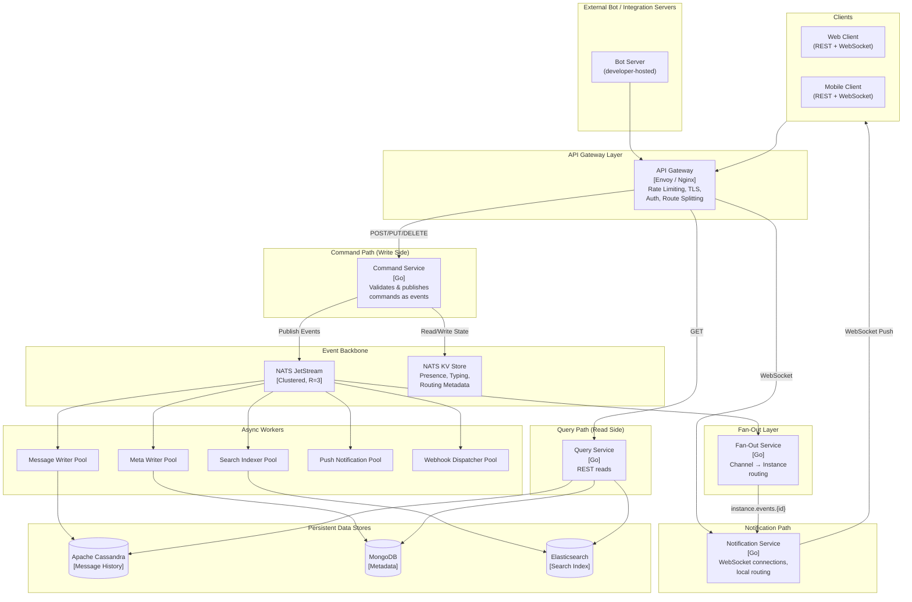

# Architecture Overview

**Author:** Architecture Team
**Status:** Draft
**Last Updated:** 2026-02-01
**Version:** 3.0

---

## Table of Contents

1. [Executive Summary](#1-executive-summary)
2. [Problem Statement](#2-problem-statement)
3. [Goals](#3-goals)
4. [Non-Goals](#4-non-goals)
5. [Success Metrics](#5-success-metrics)
6. [Background](#6-background)
7. [High-Level Architecture](#7-high-level-architecture)
8. [Core Design Principles](#8-core-design-principles)

---

## 1. Executive Summary

This document outlines the architectural transformation from a monolithic, MongoDB Oplog-dependent architecture to a high-performance **Event-Driven Architecture (EDA)**.

**Core Objectives:**

- Eliminate the Oplog Amplification Effect (O(N) CPU usage per message)
- Achieve true horizontal scalability using NATS JetStream
- Implement polyglot persistence (splitting metadata and message history)
- Support users in 100,000+ channels without performance degradation
- Enable cross-region low latency via edge computing (future)

**Key Innovation:** The **instance-level fan-out architecture** reduces NATS subscription count from O(users × channels) — potentially billions — to O(instances), approximately 121 system-wide subscriptions.

---

## 2. Problem Statement

The current backend is tightly coupled to Meteor.js and MongoDB's Oplog Tailing / CDC (Change Data Capture) mechanism for real-time updates. This architecture creates four critical bottlenecks:

### 2.1 Vertical Scaling Ceiling

MongoDB Oplog Tailing requires every application instance to independently read the same oplog stream. As instances increase, oplog contention becomes a throughput bottleneck — the database is both the persistence layer _and_ the real-time event bus.

### 2.2 Tight Coupling

Business logic is entangled with the database layer. A "send message" operation simultaneously writes data, triggers oplog events, and pushes updates to clients — all through a single MongoDB transaction boundary.

### 2.3 Monolithic Data Model

All data (messages, user profiles, channel settings, permissions, file metadata) is stored in MongoDB, preventing independent optimization of read/write patterns for different data types.

### 2.4 Subscription Explosion

The current per-channel subscription model breaks down when users belong to hundreds of thousands of channels. Each Meteor.js instance must track every user's subscriptions and independently process oplog events against them, creating O(instances × users × channels) overhead.

---

## 3. Goals

- **Decouple the real-time event bus** from the database layer using NATS JetStream
- **Achieve independent horizontal scaling** of command processing, query serving, and notification delivery
- **Support users in 100K+ channels** without subscription explosion
- **Reduce per-message delivery cost** from O(online_members) to O(notification_instances)
- **Enable specialized storage engines** for different data categories (metadata vs. message history)
- **Achieve message replay and state reconstruction** from the event stream (event sourcing capability)

---

## 4. Non-Goals

- Full rewrite of client applications
- DDP protocol compatibility — clients will migrate to a lightweight WebSocket JSON protocol
- Replacing MongoDB entirely — it remains appropriate for metadata
- Multi-region active-active replication (Phase 2 concern)

---

## 5. Success Metrics

| Metric | Current (Estimated) | Target |
|--------|---------------------|--------|
| Message send latency (p95) | ~150ms (write + oplog propagation) | < 50ms (async publish) |
| Horizontal scale limit | ~8–12 instances before oplog contention | 50+ stateless workers per service |
| Message throughput | ~5,000 msg/sec | 50,000+ msg/sec |
| Notification delivery latency (p95) | ~200ms (oplog → client) | < 100ms (NATS → WebSocket) |
| NATS subscriptions per Notification Service instance | N/A (oplog-based) | 1 (single instance inbox) |
| Max channels per user | ~1,000 (practical limit) | 100,000+ (no degradation) |
| Per-message NATS fan-out (1M-member channel) | N/A | ~100 publishes (instance-level), not 1M |
| Recovery time from event stream | N/A | Full replay capability from JetStream |

---

## 6. Background

### 6.1 Current State (Meteor.js + MongoDB Oplog)

```
┌──────────────────────────────────────────────────────────────────┐
│                     Current Architecture                          │
│                                                                   │
│  ┌─────────┐   DDP/WS     ┌──────────────────────┐               │
│  │ Client  │◄────────────►│  Meteor.js App       │               │
│  │ (Web/   │   REST       │  Instance (Monolith) │               │
│  │  Mobile)│◄────────────►│                      │               │
│  └─────────┘              │  ┌──────────────────┐│               │
│                           │  │ Business Logic   ││               │
│                           │  │ + DB Write       ││               │
│                           │  │ + Oplog Watch    ││               │
│                           │  │ + Client Push    ││               │
│                           │  └────────┬─────────┘│               │
│                           └───────────┼──────────┘               │
│                                       │                          │
│                                       ▼                          │
│                            ┌────────────────────┐                │
│                            │     MongoDB        │                │
│                            │  (ALL data + Oplog)│                │
│                            │                    │                │
│                            │  Messages ─────┐   │                │
│                            │  Users    ─────┤   │                │
│                            │  Channels ─────┤   │                │
│                            │  Permissions ──┘   │                │
│                            └────────────────────┘                │
└──────────────────────────────────────────────────────────────────┘
```

**Pain Points:**

- Every Meteor instance opens its own oplog cursor against MongoDB. At 10 instances, that is 10 independent oplog readers parsing the same stream.
- Message writes and notification delivery are synchronously coupled within a single request lifecycle.
- MongoDB serves as both an OLTP database and a real-time event bus — roles with fundamentally different scaling characteristics.
- Each Meteor instance maintains per-user subscription state for every connected user's channels. A user in 100K channels means 100K active subscriptions tracked in that instance's memory.

### 6.2 Motivation for Change

- Chat volume is growing faster than MongoDB's oplog can scale vertically
- Operational incidents show that oplog lag during traffic spikes causes delayed message delivery across all clients
- The monolithic architecture prevents teams from independently deploying and scaling different components
- Users with high channel counts (100K+) cause disproportionate memory and CPU usage on Meteor instances

### 6.3 Prior Art

| System | Architecture | Lesson Learned |
|--------|--------------|----------------|
| Slack | PHP monolith → decomposed microservices with Kafka | Event bus decouples write and read paths |
| Discord | Elixir + Cassandra + Rust services, guild-based fan-out | Wide-column DB excels for message history; instance-level routing eliminates per-user subscriptions |
| WhatsApp | Erlang + custom protocols | Dedicated message routing layer for delivery |
| Zulip | Django + PostgreSQL + Tornado (async) | Separate sync API from async event delivery |

---

## 7. High-Level Architecture

### 7.1 Architectural Pattern: CQRS + Event-Driven Architecture

The core design principle is **Command Query Responsibility Segregation (CQRS)** backed by an **event-driven architecture** with NATS JetStream as the event backbone.

**Key Insight:** By separating the _command path_ (accepting and validating operations) from the _query path_ (serving data to clients) and the _notification path_ (pushing real-time updates), each path can scale independently and use storage engines optimized for its access pattern.

### 7.2 Architecture Diagram



### 7.3 Component Summary

| Component | Technology | Responsibility |
|-----------|------------|----------------|
| **API Gateway** | Envoy / Nginx | TLS, JWT validation, rate limiting, route splitting |
| **Command Service** | Go | Validate writes, publish events to NATS (never writes to DB) |
| **Query Service** | Go | Serve REST reads from Cassandra, MongoDB, Elasticsearch |
| **Fan-Out Service** | Go | Route channel events to Notification Service instance inboxes |
| **Notification Service** | Go | Manage WebSocket connections, local event routing |
| **Message Writer** | Go, Pull Consumer | Persist messages to Cassandra |
| **Meta Writer** | Go, Pull Consumer | Persist metadata to MongoDB |
| **Search Indexer** | Go, Pull Consumer | Index messages to Elasticsearch |
| **Push Worker** | Go, Pull Consumer | Deliver push notifications (APNs, FCM) |
| **Webhook Dispatcher** | Go, Pull Consumer | Deliver outgoing webhooks with retry |

### 7.4 Data Stores

| Store | Purpose | Data |
|-------|---------|------|
| **NATS JetStream** | Event backbone, durable streaming | All domain events with 30-day retention |
| **NATS KV** | Ephemeral state | Presence, typing indicators, routing metadata, permissions cache |
| **Apache Cassandra** | Message history | Messages partitioned by (channel_id, daily_bucket) |
| **MongoDB** | Metadata | Users, channels, permissions, settings, webhook registrations |
| **Elasticsearch** | Full-text search | Message content index with daily ILM |

---

## 8. Core Design Principles

### 8.1 Command-Query Separation

The Command Service **never writes directly to databases**. It validates requests and publishes events to NATS JetStream, returning `HTTP 202 Accepted` immediately. Database persistence happens asynchronously via worker consumers.

### 8.2 Instance-Level Fan-Out

Instead of per-user-per-channel subscriptions (O(users × channels)), the Fan-Out Service maintains a routing table mapping channels to Notification Service instances. Each instance subscribes to exactly **one** NATS subject — its own inbox.

### 8.3 Polyglot Persistence

Different data types use storage engines optimized for their access patterns:
- **Messages:** Cassandra (write-optimized, time-series partitioning)
- **Metadata:** MongoDB (flexible schema, rich queries)
- **Search:** Elasticsearch (full-text indexing)

### 8.4 Event Sourcing Capability

NATS JetStream retains events for 30 days, enabling:
- Database reconstruction via event replay
- New consumer creation (e.g., analytics) without changing the write path
- Fan-Out Service recovery from stateless cold start

---

## Next Steps

- [Detailed Design](./detailed-design.md) — Component specifications and implementation details
- [C4 Diagrams](./diagrams/c4-diagrams.md) — System context, container, and component views
- [ADRs](./adrs/) — Architecture decision records explaining key choices
